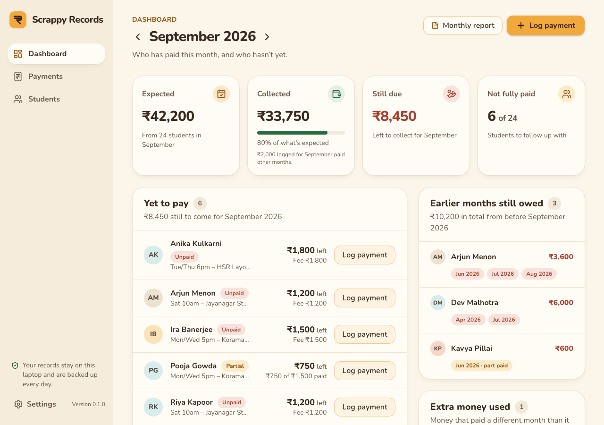
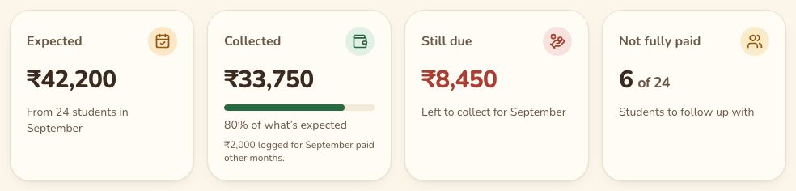
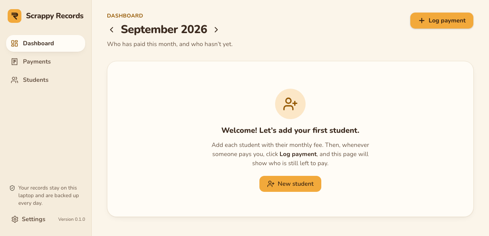
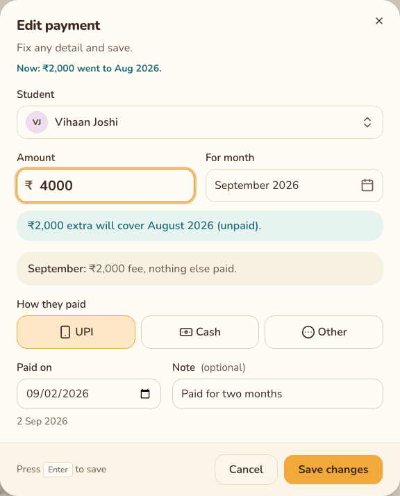
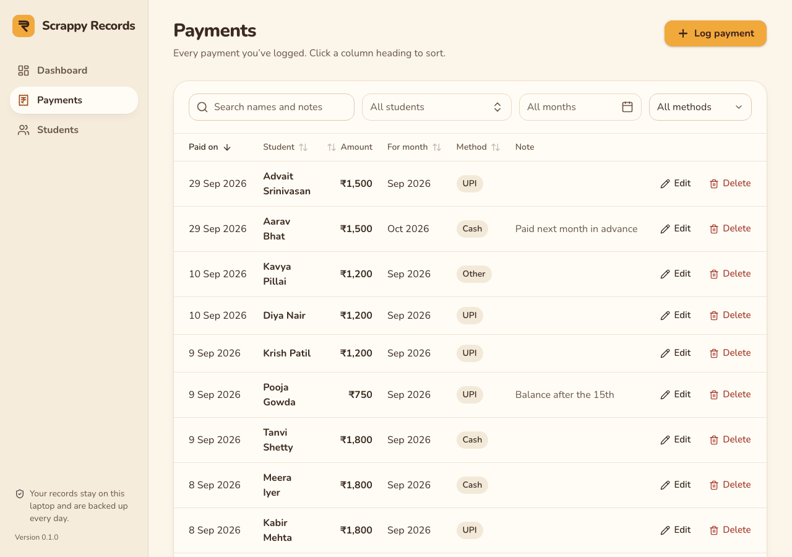
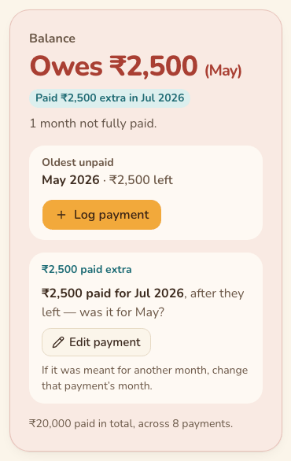

# Scrappy Records feature guide

Scrappy Records is a small, private app for anyone who runs classes, such as dance, music or
tuition, and collects a monthly fee. It answers one question at a glance: **who has paid for
which month, and who is still left to pay?** Everything stays on your own laptop, and it works
without the internet.

## How to use this guide

- **Just want the everyday steps?** Read [Using Scrappy Records](runbooks/daily-use.md). It's
  the short how-to.
- **This guide is the full reference.** It goes through every screen, explains every number,
  word and button, and ends with [Everyday situations](#everyday-situations), step by step.
- Each screen has the same parts: **What it's for**, **What you'll see**, **What you can do**
  and **Good to know**. A folded **For developers** box at the end of each screen lists the
  code, the API and the tests behind it. You can skip those.
- The pictures use made-up demo students, so the names and numbers are only examples. "Today"
  in the pictures is 15 September 2026.

## Contents

1. [Getting around](#getting-around)
2. [Dashboard](#dashboard)
3. [Log payment and Edit payment](#log-payment-and-edit-payment)
4. [Payments page](#payments-page)
5. [Students page](#students-page)
6. [New student and Edit student](#new-student-and-edit-student)
7. [Student profile](#student-profile)
8. [What the words and colours mean](#what-the-words-and-colours-mean)
9. [Everyday situations](#everyday-situations)
10. [Your data and safety](#your-data-and-safety)
11. [For developers: feature map](#for-developers-feature-map)
12. [Keeping this guide up to date](#keeping-this-guide-up-to-date)

---

## Getting around

### What it's for

Opening the app, moving between its three pages, and knowing that what you see is up to date.

### What you'll see

**Opening the app.** On Windows, double-click **Scrappy Records** on your Desktop (an orange
circle with a ₹ on it). On a Mac, open **Scrappy Records** from the *Applications* folder in
your home folder. The app opens in your web browser within a few seconds, always on the
Dashboard. No black window appears: the app runs quietly in the background until you switch
the laptop off.

**The side menu** runs down the left of every page:

- **Scrappy Records**, with its marigold logo. Click it to go back to the Dashboard.
- **Dashboard**, **Payments** and **Students**: the three pages. The page you're on is shown
  as a white, raised button.
- At the bottom: *"Your records stay on this laptop and are backed up every day."*
- Under that, **the version**, for example *Version 0.1.0*. Whoever looks after the app may
  ask you for it.

On a narrow window (for example, if you drag the browser to half the screen), the menu moves to
a bar across the top, and the backup line and version are hidden. Everything else still works.

 

**The "+ Log payment" button** is the marigold button at the top right of **every page**. Click
it whenever someone pays you. See [Log payment](#log-payment-and-edit-payment).

**Messages that pop up.** When you save, change or delete something, a short message appears at
the top of the screen for a few seconds, for example *"Payment saved"* or *"Changes saved"*.
After logging a payment, the message has an **Undo** button.

**"Can't reach Scrappy Records."** If the app in the background stops answering (for example,
the laptop was restarted while the browser tab stayed open), a red banner appears at the top of
every page within about 15 seconds:

The numbers under it are the last ones the page received, so don't rely on them until the
banner goes away.

### What you can do

**Move between pages**
1. Click **Dashboard**, **Payments** or **Students** in the side menu.
2. Your browser's **Back** button works too. The Dashboard remembers which month you were
   looking at, the Payments page remembers its student, month and method filters, and the
   Students page remembers its tab.

**Fix "Can't reach Scrappy Records"**
1. Close the browser tab.
2. Double-click **Scrappy Records** on the Desktop again.
3. If the banner comes back, restart the laptop and try once more. Still stuck? See
   [troubleshooting](runbooks/troubleshooting.md).

### Good to know

- The banner goes away by itself as soon as the app answers again.
- You can bookmark the app in your browser (Ctrl + D). The bookmark only works while the app
  is running, so the Desktop shortcut is the surest way in.
- If you ever land on **Page not found** (for example from an old bookmark), click the link
  back to the Dashboard.
- If a list can't load, you'll see *"This didn't load."* with a **Try again** button.

For developers

- **Routes:** every page sits inside `AppShell`. `/` Dashboard, `/payments`, `/students`,
  `/students/:id`, and `*` for Page not found (`frontend/src/routes.tsx`). The backend serves
  `index.html` for every non-`/api` path (`backend/app/main.py`).
- **Components:** `frontend/src/components/layout/app-shell.tsx` (side menu, `AppVersion`,
  `UnreachableBanner`), `components/layout/page-header.tsx` (title row and the
  `LogPaymentButton` on every page), `components/states.tsx` (`EmptyState`, `ErrorState`,
  `ListSkeleton`), `pages/not-found-page.tsx`, `components/ui/sonner.tsx` (the pop-up messages,
  "toasts").
- **API:** `GET /api/health` (`getHealth`). `useHealth()` reads the version once.
  `useServerReachable()` pings it every 15 s (and on window focus) with no retries; any failure
  shows the banner. The wording is `UNREACHABLE_MESSAGE` in `src/lib/errors.ts`, which also
  turns 502–504 and network errors into it.
- **Freshness:** every create, edit or delete calls `invalidateRecords()`
  (`src/api/queries.ts`), which refetches students, payments and the dashboard.
- **Launcher:** `backend/app/launcher.py`, see [architecture](architecture.md#the-launcher).
  The app's address is `http://127.0.0.1:8765` (`SCRAPPY_PORT`).
- **PRD:** UX principles ("+ Log payment on every page", the name everywhere).
- **Tests:** `frontend/src/App.test.tsx` (name, navigation, Log payment button on every page,
  version); `pages/dashboard-page.test.tsx` → "when the app can't be reached";
  `backend/tests/test_health.py`, `test_spa.py`, `test_launcher.py`.

---

## Dashboard

### What it's for

Seeing, for one month, who has paid, who hasn't yet, what's still owed from earlier months, and
who paid too much. It opens on **this month**.

### What you'll see

**The month switcher.** At the top: the month's name (for example **September 2026**) with an
arrow on each side. Under it, one line:

- this month: *"Who has paid this month, and who hasn't yet."*
- an earlier month: *"Looking back at an earlier month."* and a **Back to September 2026**
  link;
- a later month: *"Looking ahead: October isn't due yet."* and the same **Back to …** link.

**The four summary boxes** are all about the month at the top.

| Box | What the number means | How it's worked out |
|---|---|---|
| **Expected** | What everyone enrolled that month should pay in total | Each student's fee for that month, added up, for everyone enrolled that month. "From 24 students in September" says how many of them have a fee that month (someone on a month off, or with a free place, isn't counted) |
| **Collected** | What has come in for that month so far | Every payment logged *for* that month, added up, whatever day it was paid on. The bar and percentage compare it with Expected (the bar stops at 100%) |
| **Still due** | What's still left to collect for that month | For each enrolled student, their fee minus what they've paid for that month (never below ₹0), added up. Red while anything is left, green at ₹0 |
| **Not fully paid** | How many students haven't paid that month in full | The number of names in *Yet to pay*, "of" the number of students with a fee that month. Green with "Everyone has paid" at 0 |

> Example: Pooja's fee is ₹1,500 and she has paid ₹750 for September, so she adds ₹750 to
> **Still due**. Someone who paid ₹2,500 against a ₹2,000 fee adds ₹0, not −₹500: extra
> money in one place never hides money owed somewhere else.

**Yet to pay** lists everyone enrolled that month who hasn't paid it in full, A to Z. The
number next to the heading is how many there are, and the line under it says how much is still
to come.

Each row shows:
- their name (click it to open their profile; hover to see a long name in full);
- **Unpaid** (red: nothing paid for that month) or **Partial** (amber: some paid);
- their class or batch, if you entered one;
- **₹X left**, and under it either their fee (*Fee ₹1,200*) or what they've paid so far
  (*₹750 of ₹1,500 paid*);
- a note such as *Paid ₹500 extra in Jul 2026*, if they also paid too much for some month (so
  you can check whether that payment was meant for this month);
- a **Log payment** button.

**Earlier months still owed** lists everyone who still owes for any month *before* the one at
the top, including students who have since left. The line under the heading is the total.

Each row shows the total they owe from those months and one label per month: red for a month
with nothing paid, amber with *"· part paid"* for a month partly paid. Hover over a label to see
what's left on it (*June 2026: ₹1,200 left*). Click a row to open the student's profile.

**Paid too much** lists every month, up to the one at the top, where someone paid more than
their fee: *July 2026 · paid ₹2,500, fee ₹2,000*, and the extra (**+₹500**) in teal. It includes
payments logged for a month the student wasn't enrolled in (before they joined, or after they
left), because nothing was due then. Click a row to open the profile and fix it.

When a section has nobody in it, it says so calmly with a green tick: *"Nothing owed from
earlier months."*, *"No one has paid more than their fee."*

**A month that hasn't started yet** (click the right arrow past this month) is shown calmly,
because nothing is owed until the month comes:

- **Collected** becomes **Paid ahead**: money already paid for that month in advance.
- **Still due** becomes **Not due yet**, in grey.
- **Not fully paid** becomes **Not paid ahead**, with *"Nothing to follow up yet"*.
- **Yet to pay** becomes **Not paid ahead yet**, with grey **Not due yet** labels (or teal
  **Part paid ahead**), and amounts marked *due* instead of *left*.
- **Earlier months still owed** and **Paid too much** stop at this month, because later months
  can't be owed or overpaid yet.

**The celebration.** When everyone enrolled that month has paid in full, *Yet to pay* shows a
🎉 and *"Everyone's paid for March!"* with how much was collected:

For a month still to come it says *"Everyone's paid ahead for October!"*. For a month with no
students enrolled it says *"No students were coming in …"*, and the last box shows **—**.

**The very first time**, before you've added anyone, the Dashboard shows a welcome instead:

### What you can do

**Look at another month**
1. Click the **left arrow** for the month before, or the **right arrow** for the month after.
2. To come back, click **Back to** *this month* under the month name.

**Log a payment for someone in Yet to pay**
1. Click **Log payment** on their row.
2. The form opens with the student, that month and what's left already filled in. Check the
   amount and how they paid.
3. Click **Save payment**. If that paid the month in full, their row disappears from the list.

**Open a student's profile**
1. Click their name in *Yet to pay*, or anywhere on their row in *Earlier months still owed*
   or *Paid too much*.

**Add your first student**
1. On the welcome card, click **New student**. See [New student](#new-student-and-edit-student).

### Good to know

- "This month" is the laptop's current month. The Dashboard always opens on it.
- **Earlier months still owed** is always about months *before* the one at the top. So on this
  month's Dashboard it shows the old debts, and *Yet to pay* shows this month's.
- **Collected** counts every payment logged for that month, even one from a student who wasn't
  enrolled then (that one also appears in *Paid too much*). So Collected can be more than
  Expected.
- Looking back at an earlier month shows it **as it stands today**: someone who paid June's fee
  late, in August, no longer appears in June's *Yet to pay*.
- A student whose last month has passed isn't counted in later months at all.
- Changes you make anywhere in the app show on the Dashboard straight away.

For developers

- **Route:** `/`, with `?month=YYYY-MM` for any month other than the server's current one
  (`setMonth` drops the parameter for the current month).
- **Components:** `frontend/src/pages/dashboard-page.tsx` (`MonthSwitcher`, `SummaryCards`,
  `YetToPay`, `Backlog`, `Overpaid`, `FirstRun`), `components/panel.tsx`,
  `components/status.tsx` (`StatusPill`, `ExtraPaidNote`), `components/student-avatar.tsx`.
- **API:** `GET /api/dashboard?month=` (`getDashboard`) → `DashboardResponse`;
  `GET /api/students?status=all` (`listStudents`), only to detect the first run.
- **Backend:** `routers/dashboard.py` → `services/dashboard.get_dashboard` →
  `services/ledger.build_dashboard`. "Future" means `month > current_month` from the
  response, never the browser's clock.
- **PRD:** ledger rules 1–5 and 10, and "Dashboard for a selected month M" (the *Backlog*
  section is labelled **Earlier months still owed**, *Overpaid* is **Paid too much**). Stories
  D1–D5.
- **Tests:** `frontend/src/pages/dashboard-page.test.tsx`; `backend/tests/test_api_dashboard.py`;
  `backend/tests/test_ledger.py` (`test_dashboard_*`, `test_dashboard_entries_carry_credit`);
  `frontend/e2e/records.spec.ts` → "add a student, see them in Yet to pay, log their payment,
  and the dashboard updates".

---

## Log payment and Edit payment

### What it's for

Recording money a student has paid you, in a few seconds, and fixing a payment later. Both use
the same form.

### What you'll see

The form is titled **Log a payment** (*"Record money you've received from a student."*) or,
when fixing one, **Edit payment** (*"Fix any detail and save."*).

**Student.** Click the box, or just start typing a name. A list opens with a search box
(*Type a name…*):

- It finds students whose name, parent's name, class or phone number contains every word you
  type, in any order, ignoring capitals and accents: *menon arjun* finds *Arjun Menon*, and
  *emile* finds *Émile*. Apostrophes and hyphens in names don't matter (*obrien* finds
  *O'Brien*, *dsouza* finds *D'Souza*). A phone number can be typed with or without its
  spaces, and with or without *+91* in front (*9000000006* finds *90000 00006*). It's the same
  search as on the [Students page](#students-page).
- Current students are listed under **Students**. Students who have left are listed last,
  under **Left**, because they sometimes pay off an old month.
- Use the arrow keys and **Enter**, or click a name.

**Amount** (in ₹) and **For month** fill themselves in once you've chosen the student, with the
month they should pay next:

| What the hint says | When | What's filled in |
|---|---|---|
| **Oldest unpaid: June 2026** | They still owe for an earlier month | That month, and what's left on it |
| **Due now: September 2026** | The only month they owe is this month | This month, and what's left on it |
| **All paid up. Next due: October 2026** | They owe nothing yet | The first later month with a fee that they haven't paid (usually next month, or the month after what they've paid ahead), and its fee. A month with no fee (a month off, say) is skipped |
| **All paid up. Nothing is owed right now.** | They've left and paid everything, paid two years ahead, or have no fee (a free place) | Nothing: choose the month and amount yourself |

 

Under the hint, one line says what's already recorded for the chosen month, for example:
- *"September: ₹1,200 due, nothing paid yet."*
- *"June: ₹600 of ₹1,200 paid, ₹600 left."*
- *"June: already fully paid (₹1,200)."* (in green), so you notice before paying it twice;
- *"May: before they joined, so no fee is due."* or *"… after they left, so no fee is due."*

When the form was opened for a later month while an older one is still owed (as from the
Dashboard's *Yet to pay*), the hint points it out with a **Pay June instead** button (see the
first picture).

**For month** opens a small calendar of the year's months. This month has a marigold outline;
the chosen month is filled in marigold. Use the arrows at the top for other years.

Months you can't choose are **greyed out**: those before the student joined, after their last
month (if they've left), and more than two years ahead. A note under the calendar says why, for
example *"Months before August 2026 are greyed out. Change their Joined month with Edit on their
profile."*

**How they paid:** three big buttons, **UPI** (chosen at first), **Cash** and **Other**.

**Paid on:** the date they paid. It starts as today, and the line under it spells the date out
(*Today, 15 Sep 2026*), because the box itself follows the laptop's date settings.

**Note (optional):** anything you want to remember, for example *"paid by grandmother"*.

**The large-amount check.** If the amount is **three times the month's fee or more**, a gentle
amber line asks *"That's much more than the ₹1,500 fee. Is it right?"*, in case of an extra
zero. It never stops you saving.

**The amount rules.** You can type the amount the way you'd write it:

| Accepted | Not accepted, and what the form says |
|---|---|
| `1500`, `1,500`, `1,50,000`, `150,000` | Nothing typed: *"Enter the amount."* |
| Paise, up to 2 decimals: `1500.50`, `.5` | Commas in odd places (`15,00`), letters, spaces inside the number (`1500 50`), 3 decimals: *"Enter an amount like 1500 or 1,500."* |
| A ₹, Rs or INR in front: `₹ 1,500`, `Rs. 200` | `0`: *"The amount must be more than ₹0."* |
| The Indian `/-` at the end: `₹1,500/-` | More than ₹10,00,000: *"The most you can enter is ₹10,00,000."* |

₹10,00,000 is the most a single payment (or a monthly fee) can be. It's there to catch a slip
of the finger, not as a rule about your fees. However it's typed (`20,00,000`, `₹20,00,000/-`),
an amount over the limit gets *"The most you can enter is ₹10,00,000."*

**At the bottom:** *"Press Enter to save"*, **Cancel**, and **Save payment** (or **Save
changes** when editing). While saving, the button says *Saving…*.

### What you can do

**Log a payment from anywhere**
1. Click **+ Log payment** at the top right.
2. Type the first letters of the student's name, then pick them with the arrow keys and
   **Enter**, or click them.
3. Check **Amount** and **For month**. Change them if needed.
4. Choose **UPI**, **Cash** or **Other**.
5. Change **Paid on** if they paid on another day, and add a **Note** if you like.
6. Press **Enter**, or click **Save payment**.

**Log a payment already filled in for someone.** The form opens with the student chosen and the
cursor in **Amount**, so you can check it and press **Enter**. It opens this way from:
- the Dashboard's *Yet to pay* (**Log payment** on a row): that month and what's left;
- a student's profile (**+ Log payment** at the top): their next month, as in the table above;
- a profile's *Oldest unpaid* box, or a month's **Log payment** in *Month by month*: that month
  and what's left.

**Undo a payment you just saved**
1. Right after saving, a message appears at the top: *"Payment saved — ₹1,500 from Ira Banerjee
   for September 2026"*.
2. Click **Undo** within 10 seconds. The payment is removed and you'll see *"Payment removed"*.

**Edit a payment**
1. Find it on the [Payments page](#payments-page) or in a student's profile, and click
   **Edit** (or **Edit payment** next to a month that was paid too much).
2. Change the student, amount, month, method, date or note.
3. Click **Save changes**. You'll see *"Payment updated"*.

When editing, the line about the month leaves out the payment you're editing (*"July: ₹2,000
fee, nothing else paid."*), so you can see what the month will look like with your change.

### Good to know

- **Enter saves.** Pressing Enter in the amount, date or note box saves the payment. So does
  Enter right after clicking **UPI**, **Cash** or **Other**, with the method you clicked. (The
  arrow keys still move between those three; Enter then saves with the one you're on.) On the
  student box, Enter also saves once a student is chosen: it never switches to someone else.
  Only typing letters there opens the list again.
- Pressing Enter twice, or clicking Save twice, still saves only one payment.
- If something is missing, the form says what, next to that box, when you try to save:
  *"Choose who paid."*, *"Pick the month this payment is for."*, *"Enter the date they paid."*,
  *"This date is in the future."*
- **One payment is for one month.** If a parent pays for two months at once, log two payments
  (see [Everyday situations](#a-parent-pays-for-two-months-at-once)). Splitting one payment
  across months automatically isn't built yet; see
  [smarter handling of extra money](product/future-features.md#2b-smarter-handling-of-extra-money)
  in the future features.
- A payment for a month that hasn't started is fine: it shows as **Paid ahead**.
- The calendar greys out months before they joined and after they left, so you can't log a
  payment for those. One can still end up there if **Joined in** or **Left in month** is
  changed later (or they're marked as left) after a payment was logged. It then counts as paid
  too much, because no fee was due that month.
- Undo is only offered right after logging a new payment. To take back an edit, edit it again.
- Pressing **Esc**, clicking **Cancel** or the **×** closes the form without saving.

For developers

- **Component:** `frontend/src/components/log-payment.tsx`: `LogPaymentProvider` renders the
  one app-wide dialog; `useLogPayment().openLogPayment({ studentId, forMonth, amountPaise,
  focusAfterSave })` and `openEditPayment(payment)`; `PaymentForm`, `MonthFacts`. Also
  `components/student-combobox.tsx` (the Enter rules, "Left" group, word matching),
  `components/month-picker.tsx` (arrow keys, greyed months), `lib/search.ts`
  (`studentMatches`, shared with the Students page), `lib/amount.ts` (`amountProblem`, which
  reads the amount with `parseRupees` to tell "too big" from "not an amount") and
  `lib/format.ts` (`rupeesToPaise`, `MAX_AMOUNT_PAISE`, `MONTHS_AHEAD`). Enter on a method
  button is `onMethodKeyDown`.
- **API:** `GET /api/students/{id}/suggest-payment` (`suggestPayment`) → `SuggestedPayment`
  (`reason`: `owed` / `next_unpaid` / `all_paid`); `GET /api/students/{id}` (`getStudent`) for
  the month facts, the fee and the month limits; `GET /api/students?status=all`
  (`listStudents`) for the list; `POST /api/payments` (`createPayment`);
  `PATCH /api/payments/{id}` (`updatePayment`); Undo is `DELETE /api/payments/{id}`
  (`deletePayment`).
- **Backend:** `services/students.suggest_payment` → `ledger.suggest_payment`;
  `services/payments.create_payment` / `update_payment`; limits in `services/bounds.py` (month
  at most 24 months ahead, `paid_on` from 2000-01-01 to tomorrow); the amount cap is
  `MAX_AMOUNT_PAISE` in `app/schemas.py`. A 422's `loc` field is shown next to the matching box
  (`SERVER_FIELDS`).
- **Rules:** the suggestion is PRD ledger rule 9; the 3× check is `LARGE_AMOUNT_FACTOR`; the
  suggestion never overwrites what was typed or what the caller prefilled for that student.
- **PRD:** stories P1, P2, P4, D5; ledger rules 3, 4, 5 and 9.
- **Tests:** `frontend/src/components/log-payment.test.tsx` ("saves with Enter after
  clicking a method button…", "finds a student the same way as the Students page");
  `frontend/src/lib/format.test.ts`, `lib/amount.test.ts` (amount parsing and the cap),
  `lib/search.test.ts`; `backend/tests/test_api_payments.py`, `test_api_bounds.py`,
  `test_api_students.py` (`test_suggest_payment*`), `test_ledger.py` (`test_suggest_*`);
  `frontend/e2e/records.spec.ts` → "Enter never switches the student…", "Undo removes the
  payment just saved", "pressing Enter or clicking Save twice saves only one payment", "moving a
  payment to another month…"; `frontend/e2e/fixes.spec.ts` → "clicking Cash then pressing Enter
  saves exactly one payment", "an amount over the cap written with "/-" says the cap".

---

## Payments page

### What it's for

Seeing every payment you've ever logged, finding any one of them, and fixing mistakes.

### What you'll see

**Filters** across the top:
- **Search names and notes**: finds payments whose student name or note contains what you
  type, ignoring capitals and accents (*emile* finds *Émile*). The list updates as you type.
- **All students**: pick one student to see only their payments.
- **All months**: pick a month to see only payments *for* that month.
- **All methods**: UPI, Cash or Other.
- **Clear filters** appears once any filter is on.

**The table:**

| Column | What it shows |
|---|---|
| **Paid on** | The day the money was paid, like *9 Sep 2026* |
| **Student** | Their name. Click it to open their profile |
| **Amount** | The amount in ₹ |
| **For month** | The month the payment counts towards, like *Sep 2026* |
| **Method** | UPI, Cash or Other |
| **Note** | The note, if any (hidden on a narrow window, so Edit and Delete stay visible) |

At first the newest payment is at the top. **The last row** shows how many payments are listed
and their **total**, for whatever filters are on:

### What you can do

**Sort the list**
1. Click a column heading: **Paid on**, **Student**, **Amount**, **For month** or **Method**.
   An arrow shows which way it's sorted.
2. Click the same heading again to reverse the order. A third click goes back to newest first.
   **Paid on** starts newest first, so its first click shows the oldest first, and the next
   click goes back to newest first.

**Find a payment**
1. Type part of the student's name or the note into the search box, and/or choose a student,
   month or method.
2. To see everything again, click **Clear filters**.

**See the payments for a month, or in cash**
1. Choose the month under **All months** (and **Cash** under **All methods**, if you like).
2. Read the total in the last row.

The month filter goes by the month a payment is **for**, not the day it was paid. So
"September" plus "Cash" is the cash paid *for* September, even if some of it came in October,
and it leaves out cash paid in September for other months. It isn't a count of the cash you
received during September.

**Fix a payment**
1. Click **Edit** on its row. The [Edit payment](#log-payment-and-edit-payment) form opens.
2. Change what's wrong, and click **Save changes**.

**Delete a payment**
1. Click **Delete** on its row.
2. The app asks first, and says exactly what will go: *"₹1,800 from Tanvi Shetty for September
   2026, paid on 9 Sep 2026 by Cash, will be deleted. This can't be undone."*
3. Click **Delete payment** to confirm, or **Cancel**. You'll see *"Payment deleted"*.

### Good to know

- **Amount** sorts largest first on the first click. **Student** sorts A to Z, and **Method**
  sorts Cash, Other, UPI.
- The browser's **Back** button remembers the student, month and method you picked, but not
  the search text.
- *"No payments match these filters."* means nothing fits; click **Clear filters**. *"No
  payments yet."* means nothing has been logged at all.
- A deleted payment can't be brought back from inside the app. If you delete one by mistake,
  just log it again (or see [backups](runbooks/backup-and-restore.md)).

For developers

- **Route:** `/payments`, with `?student=<id>&month=YYYY-MM&method=upi|cash|other` (and an
  optional starting `?q=`).
- **Components:** `frontend/src/pages/payments-page.tsx` (filters; the search is debounced
  250 ms and lives in page state), `components/payments-table.tsx` (TanStack Table v9 sorting,
  total footer, Edit/Delete, `ConfirmDialog`; **Paid on** has `sortDescFirst`, so its first
  click turns the starting newest-first order round), `components/confirm-dialog.tsx`.
- **API:** `GET /api/payments?student_id=&month=&q=` (`listPayments`, default
  `sort=paid_on&order=desc`); `DELETE /api/payments/{id}` (`deletePayment`); Edit uses
  `updatePayment`. The **method** filter and the column **sorting** run in the browser over the
  list already loaded.
- **Backend:** `routers/payments.py` → `services/payments.list_payments` (accent- and
  case-insensitive `q` via `services/text.py`), `delete_payment`.
- **PRD:** stories P3, P4; ledger rule 3.
- **Tests:** `frontend/src/pages/payments-page.test.tsx` ("shows oldest first on the first
  click on Paid on…"); `frontend/e2e/fixes.spec.ts` → "the first click on "Paid on" shows the
  oldest payment first"; `backend/tests/test_api_payments.py`
  (`test_sorting`, `test_filters_and_search`, `test_default_sort_is_newest_paid_on_first`),
  `test_api_bounds.py` (`test_search_and_sort_ignore_case_and_accents`),
  `test_query_counts.py`.

---

## Students page

### What it's for

Seeing everyone in your classes, whether each of them is up to date, and how long they've been
with you.

### What you'll see

**The tabs**, each with how many students are in it:
- **Active**: everyone still coming, including someone whose last month is this month or later.
- **Left**: everyone whose last month has passed.
- **All**: both.

**The search box** (*Search name, phone or parent*) narrows the list as you type. It also finds
a class or batch, and ignores capitals.

**The table**, sorted A to Z:

| Column | What it shows |
|---|---|
| **Name** | Their name, and *Parent: …* if you entered one. Click anywhere on the row to open their profile |
| **Class or batch** | What you typed for their class, or — |
| **Monthly fee** | Their fee this month (for someone who hasn't started yet, the fee they'll start on), or **No fee**. If a different fee is already set for a later month, a second line says so, e.g. *₹1,000 from Dec 2026* under *No fee* for someone coming back in December |
| **Status** | How they stand overall (see below) |
| **Member for** | How long they've been coming (see below) |

**Status** is one coloured label, sometimes with a small note under it:
- **Owes ₹4,800** (red): some month up to this one isn't fully paid. The amount is what's left
  on all of those months together.
- **Credit ₹500** (teal): nothing is owed, but some month was paid more than its fee.
- **Up to date** (green, with a tick): nothing owed, nothing extra.
- Under it, a teal **Paid ahead ₹1,500** if they've paid for months still to come, and a teal
  **₹500 paid extra** if they owe but also paid too much somewhere (so you can check whether
  that payment went to the wrong month).

**Member for:**
- **8 mo** or **1 yr 4 mo**, with *Since Jan 2026* under it: whole months since the month they
  joined. Someone who joined in August is "1 mo" in September.
- **New this month**: they joined this month.
- **Starts November 2026**: they join in a later month.
- **Leaving after Sep 2026** (under the time): they've been marked as leaving, and that month
  hasn't passed yet.
- **Left May 2026** (on the Left tab): their last month, the last one they owed for.

### What you can do

**Open a student's profile**
1. Click their name, or anywhere on their row.

**Find a student**
1. Type part of their name, phone number, parent's name or class into the search box. The
   words can be in any order (*menon arjun*), capitals, accents, apostrophes and hyphens don't
   matter (*emile* finds *Émile*, *obrien* finds *O'Brien*), and a phone number can be typed
   with or without its spaces or *+91*.
2. Choose **All** if you're not sure whether they've left.

**See who has left**
1. Click the **Left** tab.

**Add a student**
1. Click **New student** at the top. See [New student](#new-student-and-edit-student).

### Good to know

- The **Status** is about all months up to this one, not just this month. To see only this
  month, use the Dashboard.
- Paying ahead or paying extra for one month never hides a month that's still owed: a student
  shows **Owes** until every due month is paid.
- A student marked as leaving stays on the **Active** tab until their last month has passed,
  then moves to **Left** by themselves.
- The search is the same as the student list in [Log payment](#log-payment-and-edit-payment):
  whoever one finds, the other finds too.
- *"No students match …"*, *"No one has left."* and *"No active students."* mean the tab or the
  search has nothing in it. *"No students yet."* means nobody has been added.

For developers

- **Route:** `/students`, with `?tab=left|all` (Active is the default).
- **Components:** `frontend/src/pages/students-page.tsx`; `components/status.tsx`
  (`BalanceChip`, `PaidAheadNote`, `ExtraPaidNote`); `lib/status.ts` (`standingLabel`,
  `balanceTone`); `lib/labels.ts` (`tenureLabel`, `formatMonthCount`).
- **API:** `GET /api/students?status=all` (`listStudents`) once; the tabs (`is_active`) and the
  search are filtered in the browser. The search is `studentMatches` in `lib/search.ts`, the
  same one the Log payment student list uses: every word must appear in the name, guardian,
  batch or phone, ignoring case and accents, and digits-only words also match the phone's
  digits without spaces or punctuation. The server's own `status` and `q` filters aren't used
  by this page.
- **Backend:** `services/students.list_students` → `ledger.student_ledger` (`standing_status`,
  `owed`, `credit`, `paid_ahead`, `tenure_months`, `has_left`, `current_fee`).
- **PRD:** scope item 6; ledger rules 6, 8 and 10; `tenure_months` in
  [data model](data-model.md#ledger-computation).
- **Tests:** `frontend/src/pages/students-page.test.tsx` ("searches like Log payment…"),
  `lib/search.test.ts`; `frontend/e2e/fixes.spec.ts` → "Students search: phone without spaces,
  accents, and words in any order"; `backend/tests/test_api_students.py`
  (`test_list_filters_search_and_sorting`, `test_active_until_the_left_month_has_passed`,
  `test_leaving_after_december_moves_to_left_in_january`); `test_ledger.py`
  (`test_tenure_months`, `test_balance_and_status`); `frontend/e2e/records.spec.ts` → "mark as
  left moves the student to the Left tab".

---

## New student and Edit student

### What it's for

Adding a student with their fee and joining month, and changing their details later, including
a new fee from a chosen month, or the month they leave.

### What you'll see

**New student** (*"Only the name, fee and joining month are needed. You can add the rest
later."*):

| Box | Needed? | Notes |
|---|---|---|
| **Name** | Yes | |
| **Monthly fee** | Yes | ₹0 is allowed (for a free place). Same typing rules as a payment amount, up to ₹10,00,000 |
| **Joined in** | Yes | The first month they owe. Starts as this month; can be up to two years ahead |
| **Phone** | No | |
| **Parent or guardian** | No | |
| **Class or batch** | No | Free text, e.g. *Tue/Thu 5pm – Indiranagar* |
| **Notes** | No | |

**Edit student** (*"Change any detail and save."*) has the same boxes, filled in, plus:

- **Left in month** (optional): *"The last month they should pay for. Leave empty while they're
  still coming."* It shows **Still coming** when empty, and its calendar has a **Still coming**
  button to empty it again. Once their last month has passed, it can only be moved
  **earlier** here: later months are greyed out, the **Still coming** button isn't there, and
  the line says *"The last month they paid for. It can only move earlier here. If they've come
  back, use Mark as coming again on their profile."* That asks which month they're back from,
  so the months away aren't owed.
- **New fee applies from**: this appears, in a marigold box, as soon as you type a fee different
  from their current one. It's also there whenever they have a fee change that hasn't started
  yet (and once you've typed in the fee box, whenever they've had more than one fee), so you
  can set a fee from any month, even today's fee from a later month:

It starts on this month, and says in plain words what will happen, from their real fee
history:
- *"From September 2026 they'll owe ₹2,100 a month. Months before September 2026 don't
  change."*
- If a fee change is already set for a later month, the new fee lasts only until then:
  *"From September 2026 they'll owe ₹2,100 a month, until November 2026, when ₹2,000 (already
  scheduled) starts."* (In the picture, Kabir has a raise to ₹2,000 set for November.)
- If a fee is already set for the chosen month, it's replaced: *"It replaces the ₹2,000 already
  set for November 2026."*
- An earlier month changes past months too: *"… don't change, but the months since then do."*
- If the fee you typed is already their fee in the chosen month: *"That's already their fee in
  September 2026, so nothing changes."* Nothing is saved for the fee then.

### What you can do

**Add a student**
1. Go to **Students** and click **New student** (or, the first time, **New student** on the
   Dashboard).
2. Type their **Name** and **Monthly fee**.
3. Check **Joined in**. Change it if they started in another month.
4. Fill in anything else you like.
5. Click **Add student**. You'll see *"Ananya Rao added — ₹1,500 a month from September 2026"*.

**Change their details**
1. Open their profile and click **Edit**.
2. Change what you need.
3. Click **Save changes**. You'll see *"Changes saved"*.

**Change their fee from a certain month**
1. Open their profile and click **Edit**.
2. Type the new **Monthly fee**.
3. In **New fee applies from**, choose the first month of the new fee.
4. Read the sentence under it: it says from when, and until when if another fee is already set.
5. Click **Save changes**.

**Take back a fee change that hasn't started yet**
1. On their profile, find it in **Details → Fee history** (marked *not started yet*).
2. Click **Remove** next to it, and **Remove fee change** to confirm. See
   [Student profile](#student-profile).

**Set the month they leave** (the same as [Mark as left](#student-profile) on the profile)
1. Open their profile and click **Edit**.
2. In **Left in month**, choose the last month they should pay for.
3. Click **Save changes**.

**Say they're staying after all**
1. Before their last month has passed: on their profile, click **Mark as staying**. Or:
   **Edit**, open **Left in month**, click **Still coming**, and **Save changes**.
2. Once it has passed, click **Mark as coming again** on their profile instead. It asks which
   month they're back from (see [Student profile](#student-profile)).

### Good to know

- **Earlier months keep their fee.** The new fee applies from the "applies from" month until
  the next fee change you've already set for a later month, if there is one; that later change
  stays as it is, and the form's sentence names it. Their profile's *Details → Fee history*
  lists each fee and when it starts.
- Choosing an **earlier** month for a new fee changes those past months too. A month that was
  paid at the old fee then shows as **Partial** (if the fee went up) or **Paid extra** (if it
  went down).
- Changing **Joined in** changes which months they owe. Moving it later than a payment makes
  that payment "paid too much"; moving it earlier adds months they owe.
- **Joined in** can't move to or past a later fee change: *"The joined month can't be on or
  after a later fee change (April 2026). Change that fee first."*
- The form checks before saving and explains next to the box: *"Enter their name."*, *"Pick the
  month they joined."*, *"This can't be before the month they joined."*, *"The new fee can't
  start before the month they joined."*
- To cancel a raise you set for a later month, either **Remove** it from *Fee history* on the
  profile, or type today's fee here and choose that later month in **New fee applies from**.
- Months can be set at most two years ahead. Anything later is refused as a likely typo:
  *"… can't be later than September 2028 (two years from now)"*.
- You can't set a leaving month while adding a student; add them first, then **Edit**.

For developers

- **Components:** `frontend/src/components/student-form.tsx` (`StudentFormDialog`,
  `StudentForm`; `showFeeFrom` decides when "applies from" shows, `feeChanged` whether a fee
  change is sent), `lib/fees.ts` (`feeAt`, `newFeeSentence`: the sentence, from
  `fee_history`), `components/month-picker.tsx`, `lib/amount.ts`. Opened from
  `pages/students-page.tsx`, `pages/dashboard-page.tsx` (first run) and
  `pages/student-profile-page.tsx` (Edit).
- **API:** `POST /api/students` (`createStudent`); `PATCH /api/students/{id}`
  (`updateStudent`), sending only changed fields; a fee change is `monthly_fee_paise` +
  `fee_effective_month`, sent only when the fee differs from the one in effect in that
  month; "Still coming" is `left_month: null` (not offered once `left_month` has passed). The
  current month comes from the student (`current_month`) or `useServerMonth()`
  (`getDashboard`).
- **Backend:** `services/students.create_student` (inserts the first fee change at
  `joined_month`), `update_student` and `_set_fee_from` (upsert; nothing recorded if that fee is
  already in effect); limits in `services/bounds.py`. The edit rules are in
  [data model](data-model.md#api-all-under-api) ("Editing a student").
- **PRD:** stories S1, S2, S3; ledger rules 1, 2, 7 and 8.
- **Tests:** `frontend/src/pages/students-page.test.tsx` ("creates a student"),
  `pages/student-profile-page.test.tsx` ("changes the fee from a chosen month…", "with a fee
  change already scheduled", "doesn't offer "Still coming" in Edit once they have left", "shows
  the server's reason inline…", "marks a student as left"), `lib/fees.test.ts`;
  `backend/tests/test_api_students.py` (`test_patch_*`, `test_moving_joined_month_*`,
  `test_archive_and_unarchive`); `frontend/e2e/records.spec.ts` → "a new fee applies from the
  chosen month…", "a change the server refuses shows its reason next to the field";
  `frontend/e2e/fixes.spec.ts` → "a scheduled fee change shows in the message…", "a month off
  set in advance…".

---

## Student profile

### What it's for

Everything about one student in one place: whether they owe, month by month what was due and
what came in, every payment, and the buttons to edit, mark as left or delete them.

### What you'll see

**At the top:** **All students** (back to the list), their name, their class, and a grey label
if they're leaving (**Leaving after September 2026**) or have left (**Left after May 2026**).

**The Balance card** is coloured by how they stand. The big headline is one of:

| Headline | Colour | When |
|---|---|---|
| **Owes ₹4,800 (Jun–Sep)** | Red | Some month up to this one isn't fully paid. The brackets say which: up to three months by name (*Jul, Aug*), a longer run as *Jun–Sep*, otherwise *(5 months)* |
| **Credit ₹500** | Teal | Nothing is owed, but some month was paid more than its fee |
| **Up to date** | Green | Nothing owed, nothing extra |

Under the headline:
- small teal notes: **Paid ahead to Oct 2026** (every month up to then is paid in full;
  otherwise **Paid ahead ₹X**), and, if they owe, **Paid ₹500 extra in Jul 2026** (so you can
  match the extra money to the month that's missing);
- one plain sentence: *"4 months not fully paid."*, *"Paid ₹500 more than was due."*,
  *"Everything due is paid, and ahead to October 2026."* or *"Everything due so far has been
  paid."*;
- if they owe, an **Oldest unpaid** box (*June 2026 · ₹1,200 left*) with **Log payment**;
- if some month was paid too much, a list of those months (*July 2026 · ₹2,500 paid for a
  ₹2,000 fee*), each with **Edit payment**, and *"If it was meant for another month, change that
  payment's month."* A payment for a month **after they left** is always in this list, because
  nothing is owed then: *"₹2,500 paid for Jul 2026, after they left — was it for May?"* (the
  question names the oldest month they still owe, if any);
- at the bottom, everything they've ever paid: *"₹8,400 paid in total, across 7 payments."*, or
  *"No payments yet."*

 

**The Details card:** **Monthly fee** (this month's, and the next one if it's already set:
*₹1,800, then ₹2,000 from November 2026*, or *No fee until December 2026, then ₹1,000*),
**Joined** (*October 2025 · member for 11 mo*, or *new this month*, *starts …*, or *left after
May 2026 (8 mo)*, counting both the first and the last month), **Fee history** (when their
fee has ever changed), **Class or batch**, **Phone**, **Parent or guardian** and **Notes**
(*Not set* or *None* when empty).

**Fee history** lists every fee and the month it starts, oldest first. *No fee* means ₹0 (a
month off, or the months away before they came back). A fee that starts after this month is
marked *(not started yet)*, with a **Remove** button, in case it was set by mistake or plans
changed. Their first fee, and any fee that has already started, can't be removed; change those
with **Edit**.

**Month by month** (*"What was due each month, and what came in."*): one row per month, newest
first, from the month they joined to this month (and any later month they've paid ahead for).

| Column | What it shows |
|---|---|
| **Month** | The month |
| **Fee** | The fee for that month (— if none was due) |
| **Paid** | Everything paid for that month (— if nothing) |
| **Status** | A label (below), plus *₹600 left* for a part-paid month or *₹500 extra* for an overpaid one |
| *(button)* | **Log payment** on a month still owed; **Edit payment** on a month paid too much |

The labels:
- **Paid** (green tick), **Partial** (amber), **Unpaid** (red): for this month and earlier.
- **Paid extra** (teal +): more than the fee was paid, in any month (even one still to come),
  or anything was paid for a month with no fee (after they left, or while they were away); the
  row is tinted teal.
- **Paid ahead** or **Part paid ahead** (teal ▸▸): a later month already paid, up to its fee
  (or part of it), while they're still enrolled.
- **Not due yet** (grey): a later month not paid yet. It isn't owed.
- **No fee** (grey): a month with a ₹0 fee and nothing paid, such as a month off or the months
  away before they came back. It's never owed.

**Payments:** every payment from this student, with the same columns, sorting, total, **Edit**
and **Delete** as the [Payments page](#payments-page) (without the Student column). The number
by the heading is how many there are.

**The buttons at the top:**
- **Edit**: opens [Edit student](#new-student-and-edit-student).
- **Mark as left** (while they're coming), **Mark as staying** (marked as leaving, but that
  month hasn't passed) or **Mark as coming again** (after they've left; it asks which month
  they're back from).
- **Delete** (in red).
- **+ Log payment**, already filled in for this student.

### What you can do

**Log a payment for them**
1. Click **+ Log payment** at the top (their next month is filled in), **Log payment** in the
   *Oldest unpaid* box, or **Log payment** on a month in *Month by month*.
2. Check the amount and click **Save payment**.

**Fix a month that was paid too much**
1. Click **Edit payment** next to that month (in the Balance card or in *Month by month*).
2. If there's one payment for that month, it opens straight away. If there are several, the
   *Payments* list below shows just that month's payments (click **Edit** on the right one; click
   **Show all** to see everything again).
3. Change the amount, or the **For month** if it was meant for another month, and save.

**Mark them as left**
1. Click **Mark as left**.
2. Choose the **last month they should pay for** (this month is filled in).
3. Click **Mark as left**. You'll see *"Ananya Rao marked as left — Last month they pay for:
   September 2026"*.

**Change your mind before they leave**
1. Click **Mark as staying** (their last month hasn't passed yet). They're a regular student
   again: *"… is staying"*.

**Mark them as coming again, after they've left**
1. Click **Mark as coming again**.
2. **Which month are they back from?** This month is filled in. You can pick any month after the
   one they left, up to two years ahead.
3. **Monthly fee from then** shows the fee they'll owe from that month: usually the fee they
   paid when they left (or a new fee you'd already set for a month while they were away).
   Change it if they're coming back on a different fee.
4. Read what will happen: the months away get **no fee**, so nothing is owed for them, and
   from the month they're back they owe that fee. If they had paid for a month while they were
   away, it says that payment will show as paid extra.
5. Click **Mark as coming again**. You'll see *"Rohan Desai is coming again — From September
   2026. Nothing is owed for June–August 2026."* Clicking twice still does it once.

Afterwards, *Month by month* shows the months away as **No fee** (grey), never as unpaid, and
*Fee history* shows *No fee from Jun 2026* and their fee again from the month they're back:

If you pick the month right after they left, nothing is skipped: every month counts, as if
they never left (use this if they were marked as left by mistake).

If they come back in a later month, the profile's **Monthly fee** says so until then: *"No fee
until December 2026, then ₹1,000"*, and the Students page shows *No fee* with *₹1,000 from Dec
2026* under it.

**Remove a fee change that hasn't started yet**
1. In **Details → Fee history**, click **Remove** next to it.
2. The app says what their fee will be instead: *"After this, from November 2026 they'll owe
   ₹1,800 a month. Nothing else changes."* If removing it would leave them with no fee from then
   on (the fee that ends a month off, or the fee they come back on), it warns: *"After this,
   they'll have no fee from December 2026 onwards, with no end."*
3. Click **Remove fee change**. You'll see *"Fee change removed"*.

**Delete them** (only for someone added by mistake)
1. Click **Delete**.
2. The app says what will go with them: *"This also deletes 12 payments (₹18,000). This can't
   be undone."*, and suggests **Mark as left** instead if they've just stopped coming.
3. Click **Delete student** to confirm. You'll see *"… deleted"* and go back to the Students
   page.

### Good to know

- **Owes always comes first.** If any due month is short, the headline says **Owes**, however
  much was paid ahead or extra elsewhere. Payments are always kept exactly as you typed them;
  the app never moves money between months by itself.
- **Mark as coming again** never makes the months away owed: they get a ₹0 fee (**No fee**),
  and their fee carries on from the month they're back. It's usually the fee they paid when
  they left. If a new fee had already been set for a month while they were away, they come back
  on that one. A fee change already set for after they're back stays as it is.
- **Paid ahead is good news**, not a problem: nothing to fix.
- **Delete** removes the student and all their payments for good. **Mark as left** keeps
  everything, and is almost always what you want.
- Months after they left with nothing paid aren't listed in *Month by month*. A month after they
  left that *has* a payment is listed, marked **Paid extra**, with **Edit payment**: it was
  probably meant for an earlier month.
- If a profile's address points at someone who was deleted, you'll see **Student not found**
  and a link to the Students page.

For developers

- **Route:** `/students/:id`.
- **Components:** `frontend/src/pages/student-profile-page.tsx` (`Profile`, `BalanceCard`,
  `DetailsCard`, `FeeHistory`, `MonthHistory`, `fixMonth`), `components/mark-left-dialog.tsx`,
  `components/come-back-dialog.tsx` (`ComeBackDialog`; the fee box starts from
  `lib/fees.ts` `returnFee`, which skips an earlier return's ₹0 months), `components/fee-now.tsx`
  ("No fee until …, then …", from `next_fee_change`),
  `components/confirm-dialog.tsx`, `components/payments-table.tsx` (`showStudent={false}`),
  `components/status.tsx` (`MonthStatusBadge`, `PaidAheadNote`, `ExtraPaidNote`),
  `lib/status.ts`, `lib/labels.ts` (`tenurePhrase`).
- **API:** `GET /api/students/{id}` (`getStudent`) → `StudentDetail` (`months[]`,
  `fee_history[]`, `payment_count`, `total_paid_paise`); `GET /api/payments?student_id=`
  (`listPayments`); `PATCH /api/students/{id}` (`updateStudent`) for Mark as left and Mark as
  staying (`left_month`); `POST /api/students/{id}/return` (`returnStudent`, body
  `{from_month}`) for Mark as coming again; `DELETE /api/students/{id}/fee-changes/{fee_change_id}`
  (`deleteFeeChange`) for Remove in Fee history; `DELETE /api/students/{id}`
  (`deleteStudent`).
- **Backend:** `services/students.get_student` / `student_detail` → `ledger.student_ledger`
  (`history_range`, `month_line`, `standing_status`, `owed`, `credit`, `paid_ahead`);
  `services/students.return_student` (one transaction that takes the write lock first,
  `app.db.lock_for_writing`, so a double click can't apply it twice: a ₹0 fee change after
  `left_month`,
  the gap's fee changes removed, the fee carried on from `from_month`, `left_month` cleared;
  see [data model](data-model.md#coming-back-after-leaving)), `delete_fee_change` (never the
  first fee, never one that has started), `delete_student` (payments cascade).
- **Display rules:** the headline comes from `status` + `owed_paise` / `credit_paise`, never
  `balance_paise`. "Paid ahead to …" is the last contiguous fully-paid month after the current
  one, before `left_month`. A month after `left_month` with a payment counts as due for the
  badge and the extra-money list (`afterLeft`), matching `ledger.credit`.
- **PRD:** stories S2, S3, S4, S5, S6; ledger rules 4, 5, 6, 7, 10 and 11.
- **Tests:** `frontend/src/pages/student-profile-page.test.tsx` ("Mark as coming again", "lists
  the fee history and removes a scheduled change…", "can come back on a different fee…"),
  `lib/fees.test.ts` (`returnFee`); `backend/tests/test_api_fee_schedule.py`,
  `test_api_fee_schedule_edges.py` (leaving and coming back twice, two clicks at once, a
  clash is a 409);
  `frontend/e2e/fixes.spec.ts` → "coming back after leaving asks the month…", "a scheduled fee
  change shows in the message and can be removed…";
  `backend/tests/test_api_students.py` (`test_detail_ledger_with_payments`,
  `test_balance_status_credit`, `test_delete_cascades_to_payments`); `test_ledger.py`
  (`test_paying_ahead_never_hides_months_owed`,
  `test_paying_a_month_twice_never_hides_the_month_missed`); `frontend/e2e/records.spec.ts` →
  "money paid too much is shown as extra…", "deleting a student asks first…", "a month paid
  twice instead of the next one still shows as owed", "moving the joined month past a payment
  shows owes…", "a payment for a month after leaving is flagged, never paid ahead";
  `backend/tests/test_ledger.py::test_a_payment_for_a_month_after_leaving_is_credit_not_paid_ahead`.

---

## What the words and colours mean

The same word always has the same colour, everywhere in the app.

| Word | Colour | Where you'll see it | Exactly when |
|---|---|---|---|
| **Paid** | Green, with a tick | Profile, *Month by month* | This month or an earlier one, and exactly the fee was paid |
| **Partial** | Amber | Dashboard *Yet to pay*; *Earlier months still owed* (as "· part paid"); profile | This month or an earlier one, and some but not all of the fee was paid |
| **Unpaid** | Muted red | Dashboard *Yet to pay*; *Earlier months still owed* (a red month label); profile | This month or an earlier one, a fee was due, and nothing was paid |
| **Overpaid** | — | Not shown as a word. The app says **Paid extra** or **Paid too much** instead | More was paid for a month than its fee (the rules' name for it) |
| **Paid extra** | Teal, with a + | Profile *Month by month*; "Paid ₹500 extra in Jul 2026" notes on the Dashboard and profile; "₹500 paid extra" on the Students page | Any month, even one still to come, where more than the fee was paid, or anything was paid for a month with no fee (before they joined, after they left, while they were away) |
| **Paid too much** | Teal amounts (+₹500) | The Dashboard section of that name | The list of every such month up to the one you're looking at |
| **Paid ahead** | Teal, with ▸▸ | Profile *Month by month* and Balance card ("Paid ahead to Oct 2026"); Students page ("Paid ahead ₹1,500"); the Dashboard's second box for a later month | Money paid for a month that hasn't started yet, while they're still enrolled then, up to that month's fee. Anything above the fee is **Paid extra** instead. **Part paid ahead** means only part of that month's fee |
| **Owes ₹X** | Muted red | Students page *Status*; profile Balance headline | Any month up to this one is Unpaid or Partial. ₹X is what's left on all of them |
| **Credit ₹X** | Teal | Students page; profile Balance headline | Nothing is owed, but some month was paid more than its fee, or something was paid for a month with no fee (after they left, or while they were away). ₹X is the extra. It is never used up automatically for later months: to count it, edit that payment's month |
| **Up to date** | Green, with a tick | Students page; profile Balance headline | Nothing owed and nothing extra |
| **Not due yet** | Grey | Profile *Month by month*; Dashboard for a later month (labels and the third box) | A month that hasn't started, not paid yet. Nothing is owed until it comes |
| **No fee** | Grey | Profile *Month by month* and *Fee history* | A month whose fee is ₹0, with nothing paid: a free place, a month off, or the months away before they came back. Never owed |
| **Active** | — (a tab) | Students page | Still coming: no leaving month, or it's this month or later |
| **Left** | Grey | Students page tab; "Left May 2026" under *Member for*; "Left after May 2026" on the profile; the **Left** group when choosing a student | Their last month has passed. They owe nothing after it, and their history is kept |
| **Leaving after …** | Grey | Profile label; under *Member for* | They've been marked as leaving, and that last month hasn't passed yet. They still show as Active |
| **New this month** | — (plain text) | Students page *Member for*; profile *Joined* ("new this month") | They joined this month |
| **Starts …** | — (plain text) | Students page *Member for*; profile *Joined* | They join in a later month |

**The colours themselves:** green for paid, amber for partly paid, a soft muted red for owed,
teal for extra or ahead, and grey for anything not due. Marigold is the app's own colour, used
for the main buttons and highlights, never for a status.

**The hints in the Log payment form** (*Oldest unpaid*, *Due now*, *All paid up*) are explained
in [Log payment](#log-payment-and-edit-payment).

---

## Everyday situations

### A new student joins

1. Go to **Students** and click **New student**.
2. Type their **Name** and **Monthly fee**. **Joined in** is this month; change it if they
   started earlier.
3. Add their phone, parent's name and class if you like.
4. Click **Add student**. They now appear in the Dashboard's *Yet to pay* for their first month.

### A parent pays by UPI or cash

1. Click **+ Log payment** (or **Log payment** next to the student in the Dashboard's *Yet to
   pay*).
2. Type the student's name and press **Enter** (skip this if it's already filled in).
3. Check the **Amount** and **For month**. The form picks the oldest month they owe.
4. Click **UPI** or **Cash**.
5. Press **Enter** (or click **Save payment**). Made a slip? Click **Undo** in the message at
   the top.

### A parent pays for two months at once

Log **two payments**, one for each month:
1. Log the first payment as usual, for the first month and its fee.
2. Click **+ Log payment** again and choose the same student. The form now suggests the next
   month. Check it, and click **Save payment**.

If you've already logged it as one big payment for one month, that month shows **Paid extra** and
the other shows as owed, with a note like *"Paid ₹1,500 extra in Aug 2026"*. Fix it by editing
that payment down to one month's fee, then logging the second month. (Splitting one payment
automatically isn't built yet; see
[smarter handling of extra money](product/future-features.md#2b-smarter-handling-of-extra-money).)

### A parent pays part now and part later

1. Log what they paid now, for that month. The month shows **Partial**, and the student stays
   in *Yet to pay* with what's left (*₹750 left, ₹750 of ₹1,500 paid*).
2. When they pay the rest, click **Log payment** on their row. The rest is filled in.
3. Click **Save payment**. The month is now **Paid**, and they leave the list.

Tip: a **Note** such as *"Balance after the 15th"* helps you remember.

### I typed the wrong month or amount

- **Just now?** Click **Undo** in the *"Payment saved"* message (it stays for 10 seconds), and
  log it again.
- **Later?**
  1. Go to **Payments**, find it (search the name, or choose the month), and click **Edit**.
  2. Fix the **Amount** or **For month**.
  3. Click **Save changes**.

### A payment was logged against the wrong student

1. Go to **Payments**, find the payment and click **Edit**.
2. Click the **Student** box and choose the right student.
3. Check **For month** (it isn't changed for you), and click **Save changes**. Both students'
   pages update straight away.

### The fee goes up from next month

1. Open the student's profile (**Students** → their name) and click **Edit**.
2. Type the new **Monthly fee**.
3. In **New fee applies from**, choose **next month**.
4. Click **Save changes**. This month and earlier keep the old fee. *Details → Fee history*
   now shows both fees, for example *₹1,500 from Oct 2025* and *₹1,800 from Oct 2026 (not
   started yet)*.

Changed your mind before it starts? Click **Remove** next to it in *Fee history*.

Doing this for many students means repeating it for each one; there's no "raise everyone's fee"
button yet.

### A student stops coming, or said they'd stop but is staying

**They're stopping:**
1. Open their profile and click **Mark as left**.
2. Choose the **last month they should pay for**, and click **Mark as left**.
3. Until that month has passed, their profile says *Leaving after …* and they stay on the
   **Active** tab. After it, they move to **Left**. They still appear in *Earlier months still
   owed* if they left owing something.

**They changed their mind before leaving:** open their profile and click **Mark as staying**.

**They came back after leaving:**
1. Open their profile (Students → **Left** tab → their name) and click **Mark as coming
   again**.
2. Choose the month they're back from (this month is filled in), and click **Mark as coming
   again**.
3. The months they were away show **No fee** and are never owed. They owe their fee again from
   the month they're back, and they're on the **Active** tab.

### A student added by mistake

1. Open their profile and click **Delete** (in red).
2. Read what will be deleted (their payments go too), and click **Delete student**.

If they were a real student who has stopped coming, use **Mark as left** instead, so their
history is kept.

### Checking who hasn't paid last month

1. On the **Dashboard**, click the **left arrow** once.
2. *Yet to pay* lists everyone who still hasn't paid that month in full, with how much is left.
3. Click **Back to** *this month* to return.

Or stay on this month and look at **Earlier months still owed**: it lists every earlier month
still owed, by student.

### Seeing a student's full history

1. Go to **Students** and click their name (choose the **All** tab if they've left).
2. **Month by month** shows every month since they joined: the fee, what was paid and the
   status.
3. **Payments** at the bottom lists every payment, with the day paid, amount, month, method and
   note.

To see their payments alongside everyone else's, go to **Payments** and choose them under **All
students**.

### A student takes a month off

**There's no "on a break" button yet**; it's planned (see
["Excused / on break" months](product/future-features.md#1-business-structure-locations--batches--students)
in the future features). Until then, set their fee to ₹0 for the month off, with two fee
changes. This works before the month off, during it, or after it:

1. Open their profile and click **Edit**.
2. Type **0** as the **Monthly fee**, set **New fee applies from** to the month off, and click
   **Save changes**. (The form warns *"They'll have no fee from December 2026 onwards, with no
   end."* Step 3 gives it an end.)
3. Click **Edit** again. Type their usual **Monthly fee** (it may already be there), set **New
   fee applies from** to the month after the break, and check the sentence: *"From January 2027
   they'll owe ₹1,500 a month."* Click **Save changes**.
4. Check **Details → Fee history**: *No fee from Dec 2026*, then *₹1,500 from Jan 2027*.

The month off now shows **No fee**, and every other month keeps its fee. Don't skip step 3:
until it's done, they have no fee from the month off onwards. Made a mistake with a month that
hasn't started yet? **Remove** it from *Fee history* and start again.

If they had already paid for the month off, that payment shows as **Paid extra**: edit it and
move its **For month** to the month they're back.

Or simply leave the month as it is and add a note (**Edit** → **Notes**, e.g. *"No fee for
December, away"*); the month then keeps showing as owed.

(This is for a break while they're still coming. For someone who was marked as **left** and has
come back, use **Mark as coming again** instead: it does this for you.)

### It says someone owes but I know they paid

Open their profile and look at **Month by month** to see which month shows as owed, then:

1. **Was the payment logged for the wrong month?** A common one: the same month paid twice
   (it shows **Paid extra**) while the next month shows **Unpaid**. Or a student was marked as
   left (or their **Left in month** was changed) after a payment was logged for a later month:
   the profile then says *"… after they left — was it for May?"*. Click **Edit payment** on the
   extra month and change its **For month**.
2. **Was it logged for someone else?** Search their name on the **Payments** page. If it isn't
   there, search the other student's name, then **Edit** the payment and change the **Student**.
3. **Was the amount typed wrong?** Edit it on the **Payments** page.
4. **Is the fee right?** Check **Details → Monthly fee** and **Fee history**. A fee change from
   an earlier month than meant can make old months **Partial**.
5. **Did they leave and come back?** If they were marked as left and the months away show as
   owed, check *Fee history*: after **Mark as coming again** those months have *No fee*.
6. **Is the joined month right?** If **Joined** is earlier than they really started, the first
   months show as owed. **Edit** → **Joined in**.
7. **Not logged at all?** Log it now with the right **Paid on** date.

---

## Your data and safety

- **Everything stays on this laptop.** Your records are kept in one file on the laptop itself
  (the [backups page](runbooks/backup-and-restore.md) says where). Nothing is sent anywhere, and
  no account is needed.
- **It works offline.** After installing, the app never needs the internet. Only installing
  and updating download something.
- **Automatic backups.** A copy is saved every day to **Documents\ScrappyRecords Backups**
  (Documents/ScrappyRecords Backups on a Mac), and the last 30 days are kept. Another copy is
  saved before every update and before the app upgrades its records to a new layout. Those are
  kept until you delete them.
- **Restoring a backup** (after a big mistake, or on a new laptop) is a few steps in File
  Explorer. See [Backups and restore](runbooks/backup-and-restore.md).
- **Updating.** Paste the same one line you installed with. The installer closes the app, saves
  a backup, swaps in the new version and opens it. Your data is never touched, and if the new
  version needs to upgrade the records it takes one more backup first. See
  [Updating](runbooks/update.md). The version you have is at the bottom of the side menu.
- **Deleting is for good.** Deleted payments and students can't be brought back from inside
  the app, which is why it always asks first. The daily backup is the safety net: see
  [troubleshooting](runbooks/troubleshooting.md#i-deleted-something-by-mistake).
- **Something wrong?** See [troubleshooting](runbooks/troubleshooting.md).
- **For whoever looks after the app:** the [real-laptop release check](runbooks/release-acceptance-test.md)
  walks through installing, the Desktop shortcut, backups, a restart and an update on a real
  Windows laptop. It's done before the first install, and after any release that changes the
  installer, the launcher or backups.

---

## For developers: feature map

| Feature | UI files (`frontend/src/`) | API endpoint (operationId) | Backend service | Tests |
|---|---|---|---|---|
| App shell, version, unreachable banner | `components/layout/app-shell.tsx`, `lib/errors.ts` | `GET /api/health` (`getHealth`) | `routers/health.py` | `App.test.tsx`, `pages/dashboard-page.test.tsx`, `backend/tests/test_health.py` |
| + Log payment on every page | `components/layout/page-header.tsx`, `components/log-payment.tsx` | — | — | `App.test.tsx` |
| Dashboard summary and lists | `pages/dashboard-page.tsx` | `GET /api/dashboard` (`getDashboard`) | `services/dashboard.get_dashboard` → `ledger.build_dashboard` | `pages/dashboard-page.test.tsx`, `test_api_dashboard.py`, `test_ledger.py` |
| First run | `pages/dashboard-page.tsx` (`FirstRun`) | `GET /api/students` (`listStudents`) | `services/students.list_students` | `pages/dashboard-page.test.tsx` |
| Log payment prefill and hints | `components/log-payment.tsx` | `GET /api/students/{id}/suggest-payment` (`suggestPayment`), `GET /api/students/{id}` (`getStudent`) | `services/students.suggest_payment` → `ledger.suggest_payment` | `components/log-payment.test.tsx`, `test_ledger.py`, `test_api_students.py` |
| Save, edit, undo a payment | `components/log-payment.tsx` | `POST /api/payments` (`createPayment`), `PATCH /api/payments/{id}` (`updatePayment`), `DELETE /api/payments/{id}` (`deletePayment`) | `services/payments.create_payment`, `update_payment`, `delete_payment`; `services/bounds.py` | `components/log-payment.test.tsx`, `test_api_payments.py`, `test_api_bounds.py`, `e2e/records.spec.ts` |
| Amount rules and ₹10,00,000 cap | `lib/format.ts` (`rupeesToPaise`, `parseRupees`), `lib/amount.ts` | (all amount fields) | `app/schemas.py` (`MAX_AMOUNT_PAISE`) | `lib/format.test.ts`, `lib/amount.test.ts`, `test_api_payments.py::test_amount_cap` |
| Payments list, filters, sort, total | `pages/payments-page.tsx`, `components/payments-table.tsx` | `GET /api/payments` (`listPayments`) | `services/payments.list_payments` | `pages/payments-page.test.tsx`, `test_api_payments.py` |
| Students list, tabs, status, tenure | `pages/students-page.tsx`, `components/status.tsx`, `lib/status.ts`, `lib/labels.ts` | `GET /api/students` (`listStudents`) | `services/students.list_students` → `ledger.student_ledger` | `pages/students-page.test.tsx`, `test_api_students.py` |
| Student search (Students page and Log payment) | `lib/search.ts` (`studentMatches`), `pages/students-page.tsx`, `components/student-combobox.tsx` | — (in the browser) | — | `lib/search.test.ts`, `pages/students-page.test.tsx`, `components/log-payment.test.tsx`, `e2e/fixes.spec.ts` |
| New / edit student, fee change | `components/student-form.tsx`, `lib/fees.ts` | `POST /api/students` (`createStudent`), `PATCH /api/students/{id}` (`updateStudent`) | `services/students.create_student`, `update_student`, `_set_fee_from` | `pages/students-page.test.tsx`, `pages/student-profile-page.test.tsx`, `lib/fees.test.ts`, `test_api_students.py`, `e2e/fixes.spec.ts` |
| Fee history, remove a fee change that hasn't started | `pages/student-profile-page.tsx` (`FeeHistory`), `components/confirm-dialog.tsx` | `DELETE /api/students/{id}/fee-changes/{fee_change_id}` (`deleteFeeChange`) | `services/students.delete_fee_change` | `pages/student-profile-page.test.tsx`, `test_api_fee_schedule.py`, `e2e/fixes.spec.ts` |
| Profile balance, month by month | `pages/student-profile-page.tsx` | `GET /api/students/{id}` (`getStudent`), `GET /api/payments?student_id=` (`listPayments`) | `services/students.get_student` → `ledger.student_ledger` | `pages/student-profile-page.test.tsx`, `test_api_students.py`, `test_ledger.py` |
| Mark as left / staying | `components/mark-left-dialog.tsx`, `pages/student-profile-page.tsx` | `PATCH /api/students/{id}` (`updateStudent`) | `services/students.update_student`; `ledger.has_left` | `pages/student-profile-page.test.tsx`, `test_api_students.py`, `e2e/records.spec.ts` |
| Mark as coming again ("Which month are they back from?") | `components/come-back-dialog.tsx`, `pages/student-profile-page.tsx` | `POST /api/students/{id}/return` (`returnStudent`) | `services/students.return_student` | `pages/student-profile-page.test.tsx`, `test_api_fee_schedule.py`, `e2e/fixes.spec.ts` |
| Delete student | `pages/student-profile-page.tsx`, `components/confirm-dialog.tsx` | `DELETE /api/students/{id}` (`deleteStudent`) | `services/students.delete_student` | `pages/student-profile-page.test.tsx`, `test_api_students.py`, `e2e/records.spec.ts` |

Test paths without a folder are in `frontend/src/` (`*.tsx`, `*.ts`) or `backend/tests/`
(`test_*.py`); end-to-end tests are in `frontend/e2e/records.spec.ts` and
`frontend/e2e/fixes.spec.ts`.

### How a number is calculated: "Still due"

Following the red **₹8,450** in the Dashboard's *Still due* box from the database to the screen:

1. **Stored.** Only facts are stored: `students` (with `joined_month`, `left_month`),
   `fee_changes` (a fee from a month on) and `payments` (amount, `for_month`). Nothing derived
   is stored, so nothing can drift out of sync ([data model](data-model.md)).
2. **Loaded.** `GET /api/dashboard?month=2026-09` (`getDashboard`) →
   `routers/dashboard.py` → `services/dashboard.get_dashboard`, which loads every student and
   turns each into a pure `ledger.StudentRecord` (`services/students.to_record`).
3. **Calculated** in `services/ledger.build_dashboard`, for each student:
   - `is_active(M)`: `joined_month ≤ M` and no `left_month`, or `M ≤ left_month` (PRD rule 1);
   - `month_line(student, M)`: `expected` is the fee in effect for M (rule 2), `paid` is the
     sum of payments with `for_month = M` (rule 3), and `remaining = max(0, expected − paid)`;
   - `still_due += remaining` for every active student. (Being `max(0, …)`, one student's extra
     money can't reduce another's, or their own other months.)
4. **Sent** as `summary.still_due_paise` (integer paise, e.g. `845000`) in `DashboardResponse`.
5. **Shown** by `useDashboard()` (`src/api/queries.ts`) → `SummaryCards` in
   `pages/dashboard-page.tsx` → `formatRupees(845000)` = **₹8,450** (`src/lib/format.ts`), red
   while above 0. After any change, `invalidateRecords()` refetches it.

With the demo data: Anika ₹1,800 + Arjun ₹1,200 + Ira ₹1,500 + Pooja (₹1,500 − ₹750) ₹750 +
Riya ₹1,200 + Siddharth ₹2,000 = ₹8,450, the same six students listed in *Yet to pay*.

The other headline numbers follow the same path: a student's **Owes** is `ledger.owed` (the
same `remaining`, summed over every due month), **Credit** is `ledger.credit` (the sum of
`max(0, paid − expected)` over due months), and **Paid ahead** is `ledger.paid_ahead` (payments
for months after the current one). The current month always comes from the server
(`app.clock`), never from the browser.

### Open questions found while writing this guide

The four found while writing this guide (the first click on **Paid on**, the Students
search, setting a scheduled fee back, and the months away after **Mark as coming again**) were
fixed before v0.1.0, along with Enter after clicking a method button and the cap message for
amounts written with `/-`. So was the Dashboard counting someone with no fee that month in
*"from 24 students"*. None are open now.

---

## Keeping this guide up to date

*For developers.* This guide describes what's really built, so it has to change with the app.

- **Any PR that changes what the user sees or can do** (screens, wording, flows, or API
  behaviour the UI shows) must update this guide in the same PR, including the pictures when a
  screen changed noticeably. See [CONTRIBUTING](../CONTRIBUTING.md#keep-the-feature-guide-up-to-date).
- **CI checks it.** The *Feature guide updated* check (a required check) fails a PR that
  changes the screens (`frontend/src/` other than tests and mocks, `frontend/index.html`,
  `frontend/public/`), the API (`backend/app/routers/`, `services/`, `schemas.py`), startup,
  backups or the date (`main.py`, `launcher.py`, `backup.py`, `clock.py`, `months.py`) or the
  installers, without changing this file. A PR that only regenerates `schema.d.ts` or only
  touches `components/ui/` passes. A PR that truly doesn't affect the user (a refactor, a
  speed-up) can carry the `no-guide-change` label instead. The list is in
  `scripts/ci/check_feature_guide.py`.
- **Pictures:** `make guide-screenshots` retakes every picture in `images/feature-guide/`
  against the real app with fresh demo data, and shrinks them. "Today" is frozen at
  15 September 2026 (`GUIDE_TODAY` in `frontend/scripts/feature-guide-screenshots.mjs`, applied
  to the server by `scripts/guide_server.py` and to the browser by Playwright), so the pictures
  and the numbers quoted in this guide don't drift. If you change that date or the demo data
  (`backend/app/seed.py`), refresh the numbers in the text too. Look through the diff and commit
  the pictures that changed. Keep each under about 150 KB.
- **Keep the parts in step:** a new screen gets its own section with the same five headings; a
  new word or colour goes in [the table](#what-the-words-and-colours-mean); a new everyday task
  goes in [Everyday situations](#everyday-situations) and, if it's common, in
  [daily-use.md](runbooks/daily-use.md); and the [feature map](#for-developers-feature-map)
  gets a row.
