# Scrappy Records feature guide

Scrappy Records is a small, private app for anyone who runs classes, such as dance, music or
tuition, and collects a monthly fee. It answers one question at a glance: **who has paid for
which month, and who is still left to pay?** Everything stays on your own laptop, and it works
without the internet.

## How to use this guide

- **Just want the everyday steps?** Read [Using Scrappy Records](runbooks/daily-use.md). It's
  the short how-to.
- **This guide is the full reference.** It goes through every screen, explains every number,
  word and button, and ends with [Everyday situations](#everyday-situations), step by step.
- Each screen has the same parts: **What it's for**, **What you'll see**, **What you can do**
  and **Good to know**. A folded **For developers** box at the end of each screen lists the
  code, the API and the tests behind it. You can skip those.
- The pictures use made-up demo students, so the names and numbers are only examples. "Today"
  in the pictures is 15 September 2026.

## Contents

1. [Getting around](#getting-around)
2. [Dashboard](#dashboard)
3. [Monthly report](#monthly-report)
4. [Log payment and Edit payment](#log-payment-and-edit-payment)
5. [Payments page](#payments-page)
6. [Students page](#students-page)
7. [Batches](#batches)
8. [New student and Edit student](#new-student-and-edit-student)
9. [Student profile](#student-profile)
10. [Downloading and uploading Excel](#downloading-and-uploading-excel)
11. [Unassigned payments](#unassigned-payments)
12. [What the words and colours mean](#what-the-words-and-colours-mean)
13. [Everyday situations](#everyday-situations)
14. [Your data and safety](#your-data-and-safety)
15. [For developers: feature map](#for-developers-feature-map)
16. [Keeping this guide up to date](#keeping-this-guide-up-to-date)

---

## Getting around

### What it's for

Opening the app, moving between its three pages, and knowing that what you see is up to date.

### What you'll see

**Opening the app.** On Windows, double-click **Scrappy Records** on your Desktop (an orange
circle with a ₹ on it). On a Mac, open **Scrappy Records** from the *Applications* folder in
your home folder. The app opens in your web browser within a few seconds, always on the
Dashboard. No black window appears: the app runs quietly in the background until you switch
the laptop off.

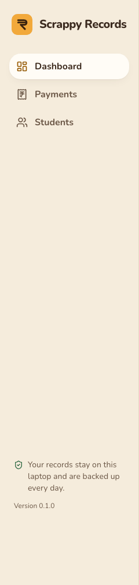

**The side menu** runs down the left of every page:

- **Scrappy Records**, with its marigold logo. Click it to go back to the Dashboard.
- **Dashboard**, **Payments** and **Students**: the three pages. The page you're on is shown
  as a white, raised button.
- At the bottom, under **Your data**: **Download everything**, which saves every student,
  fee and payment in one Excel file (see
  [Downloading and uploading Excel](#downloading-and-uploading-excel)).
- Under that: *"Your records stay on this laptop and are backed up every day."*
- Under that, **the version**, for example *Version 0.1.0*. Whoever looks after the app may
  ask you for it.

On a narrow window (for example, if you drag the browser to half the screen), the menu moves to
a bar across the top, and *Your data*, the backup line and the version are hidden. Everything
else still works.

 

**The "+ Log payment" button** is the marigold button at the top right of **every page**. Click
it whenever someone pays you. See [Log payment](#log-payment-and-edit-payment).

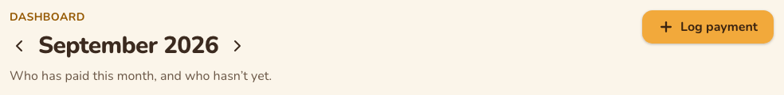

**Messages that pop up.** When you save, change or delete something, a short message appears at
the top of the screen for a few seconds, for example *"Payment saved"* or *"Changes saved"*.
After logging a payment, the message has an **Undo** button.

**"Can't reach Scrappy Records."** If the app in the background stops answering (for example,
the laptop was restarted while the browser tab stayed open), a red banner appears at the top of
every page within about 15 seconds:

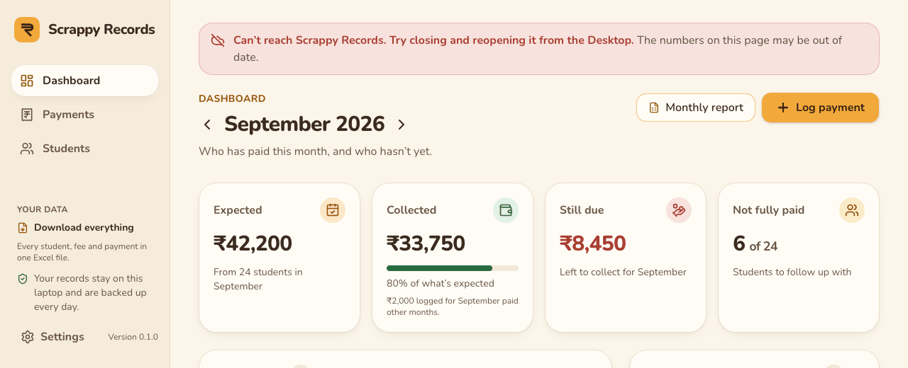

The numbers under it are the last ones the page received, so don't rely on them until the
banner goes away.

### What you can do

**Move between pages**
1. Click **Dashboard**, **Payments** or **Students** in the side menu.
2. Your browser's **Back** button works too. The Dashboard remembers which month you were
   looking at, the Payments page remembers its student, month and method filters, and the
   Students page remembers which batch's tab was open.

**Fix "Can't reach Scrappy Records"**
1. Close the browser tab.
2. Double-click **Scrappy Records** on the Desktop again.
3. If the banner comes back, restart the laptop and try once more. Still stuck? See
   [troubleshooting](runbooks/troubleshooting.md).

### Good to know

- The banner goes away by itself as soon as the app answers again.
- You can bookmark the app in your browser (Ctrl + D). The bookmark only works while the app
  is running, so the Desktop shortcut is the surest way in.
- If you ever land on **Page not found** (for example from an old bookmark), click the link
  back to the Dashboard.
- If a list can't load, you'll see *"This didn't load."* with a **Try again** button.

For developers

- **Routes:** every page sits inside `AppShell`. `/` Dashboard, `/report` (the monthly
  report, opened from the Dashboard), `/payments`, `/students`, `/students/batch/:batchId` (a
  batch's tab, `none` for No batch), `/students/:id`, and `*` for
  Page not found (`frontend/src/routes.tsx`). The backend serves
  `index.html` for every non-`/api` path (`backend/app/main.py`).
- **Components:** `frontend/src/components/layout/app-shell.tsx` (side menu, `AppVersion`,
  `UnreachableBanner`), `components/layout/page-header.tsx` (title row and the
  `LogPaymentButton` on every page), `components/states.tsx` (`EmptyState`, `ErrorState`,
  `ListSkeleton`), `pages/not-found-page.tsx`, `components/ui/sonner.tsx` (the pop-up messages,
  "toasts").
- **API:** `GET /api/health` (`getHealth`). `useHealth()` reads the version once.
  `useServerReachable()` pings it every 15 s (and on window focus) with no retries; any failure
  shows the banner. The wording is `UNREACHABLE_MESSAGE` in `src/lib/errors.ts`, which also
  turns 502–504 and network errors into it.
- **Freshness:** every create, edit or delete calls `invalidateRecords()`
  (`src/api/queries.ts`), which refetches students, payments, the dashboard, the report and batches.
- **Printing:** the side menu, the banner and each page's buttons carry `print:hidden`, so
  only the page itself prints (see [Monthly report](#monthly-report)).
- **Launcher:** `backend/app/launcher.py`, see [architecture](architecture.md#the-launcher).
  The app's address is `http://127.0.0.1:8765` (`SCRAPPY_PORT`).
- **PRD:** UX principles ("+ Log payment on every page", the name everywhere).
- **Tests:** `frontend/src/App.test.tsx` (name, navigation, Log payment button on every page,
  version); `pages/dashboard-page.test.tsx` → "when the app can't be reached";
  `backend/tests/test_health.py`, `test_spa.py`, `test_launcher.py`.

---

## Dashboard

### What it's for

Seeing, for one month, who has paid, who hasn't yet, what's still owed from earlier months, and
where money paid above a fee went. It opens on **this month**.

### What you'll see

**The month switcher.** At the top: the month's name (for example **September 2026**) with an
arrow on each side. Under it, one line:

- this month: *"Who has paid this month, and who hasn't yet."*
- an earlier month: *"Looking back at an earlier month."* and a **Back to September 2026**
  link;
- a later month: *"Looking ahead: October isn't due yet."* and the same **Back to …** link.

At the top right, next to **+ Log payment**, the **Monthly report** button opens the
[report](#monthly-report) for the month shown: every student in one table, to read, download
or print.

**The four summary boxes** are all about the month at the top.

| Box | What the number means | How it's worked out |
|---|---|---|
| **Expected** | What everyone enrolled that month should pay in total | Each student's fee for that month, added up, for everyone enrolled that month. "From 24 students in September" says how many of them have a fee that month (someone on a month off, or with a free place, isn't counted) |
| **Collected** | What has come in for that month so far | What pays that month, added up, whatever day it was paid on: payments logged *for* that month (up to each fee), plus money paid above the fee in another month that went to this one (see [extra money](#extra-money-pays-the-months-still-owed)). The bar and percentage compare it with Expected (the bar stops at 100%). When that differs from what was logged for the month, a small line under it says why: *"Includes ₹1,500 of extra money from other months' payments."*, *"₹1,500 logged for September paid other months."* |
| **Still due** | What's still left to collect for that month | For each enrolled student, their fee minus what pays it (never below ₹0), added up. Red while anything is left, green at ₹0 |
| **Not fully paid** | How many students haven't paid that month in full | The number of names in *Yet to pay*, "of" the number of students with a fee that month. Green with "Everyone has paid" at 0 |

> Example: Pooja's fee is ₹1,500 and she has paid ₹750 for September, so she adds ₹750 to
> **Still due**. Someone who paid ₹2,500 against a ₹2,000 fee adds ₹0, not −₹500: the extra
> ₹500 goes to the oldest month they still owe, and is counted there.

**Yet to pay** lists everyone enrolled that month who hasn't paid it in full, A to Z. The
number next to the heading is how many there are, and the line under it says how much is still
to come.

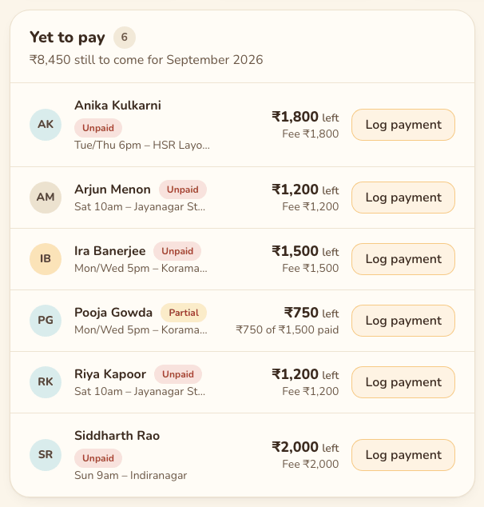

Each row shows:
- their name (click it to open their profile; hover to see a long name in full);
- **Unpaid** (red: nothing paid for that month) or **Partial** (amber: some paid);
- their batch (or, for someone not in a batch yet, the class label typed for them before
  batches);
- **₹X left**, and under it either their fee (*Fee ₹1,200*) or what's paid so far
  (*₹750 of ₹1,500 paid*, counting any extra money from another month's payment);
- a **Log payment** button.

**Earlier months still owed** lists everyone who still owes for any month *before* the one at
the top, including students who have since left. The line under the heading is the total.

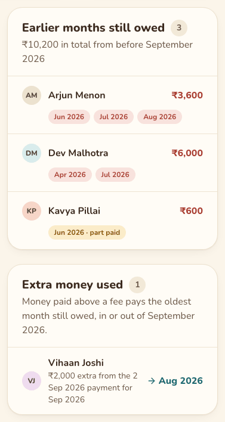

Each row shows the total they owe from those months and one label per month: red for a month
with nothing paid, amber with *"· part paid"* for a month partly paid. Hover over a label to see
what's left on it (*June 2026: ₹1,200 left*). Click a row to open the student's profile.

**Extra money used** (*"Money that paid a different month than it was logged for."*) appears
when money paid above a fee went to another month, in or out of the month at the top (see
[extra money](#extra-money-pays-the-months-still-owed)). There is one row per payment, however
many months it paid; months in a row are shown as a range. Each row says whose, how much, and
which payment it came from: *Vihaan Joshi · ₹2,000 extra from the 2 Sep 2026 payment for Sep
2026 → **Aug 2026***. In the picture, Vihaan paid ₹4,000 for September and nothing for August:
August is paid with September's extra, so he isn't in *Earlier months still owed*. Click a row
to open the profile.

A payment that pays **4 or more months ahead** (months not due yet), or has money **no month
needs**, gets an amber line saying why, in case it's a slip of the finger: *"Check: this
₹45,000 payment pays up to Sep 2028 — 24 months ahead; ₹7,500 isn't needed by any month"* (with
*→ Oct 2026 to Sep 2028* on the right). Paying months still owed (a catch-up, a quarterly
payment, a top-up of a part-paid month) never gets one. If it's right, there's nothing to
do.

**Extra kept as credit** appears only when someone paid more than every fee they owe, so no
month needed the money (usually someone who has left): *May 2026 · paid ₹2,500, fee ₹2,000*,
and the extra (**+₹500**) in teal. On this month's Dashboard (or a later one) it lists every
such month, so every *Credit* on the Students page can be found here. Click a row to open the
profile and fix the payment if it was a mistake.

When *Earlier months still owed* has nobody in it, it says so calmly with a green tick:
*"Nothing owed from earlier months."*

**A month that hasn't started yet** (click the right arrow past this month) is shown calmly,
because nothing is owed until the month comes:

- **Collected** becomes **Paid ahead**: what pays that month in advance, up to each student's
  fee (a payment logged for it, or extra money from another month's payment).
- **Still due** becomes **Not due yet**, in grey.
- **Not fully paid** becomes **Not paid ahead**, with *"Nothing to follow up yet"*.
- **Yet to pay** becomes **Not paid ahead yet**, with grey **Not due yet** labels (or teal
  **Part paid ahead**), and amounts marked *due* instead of *left*.
- **Earlier months still owed** stops at this month, because later months can't be owed yet.
  **Extra kept as credit** also lists later months.

**The celebration.** When everyone enrolled that month has paid in full, *Yet to pay* shows a
🎉 and *"Everyone's paid for March!"* with how much was collected:

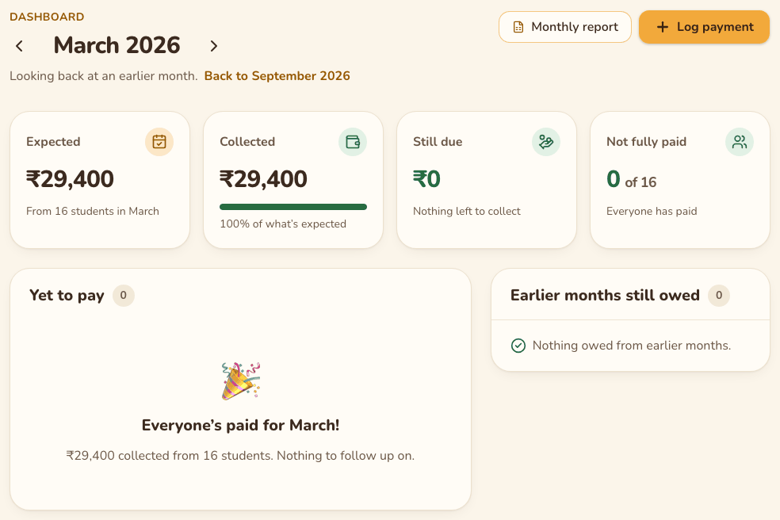

For a month still to come it says *"Everyone's paid ahead for October!"*. For a month with no
students enrolled it says *"No students were coming in …"*, and the last box shows **—**.

**Payments waiting for a student.** When an uploaded file had payments the app couldn't match
to a student, a line at the top says so, for example *"2 payments (₹3,000) are waiting to be
assigned to a student."*, with **Assign them →**. See
[Unassigned payments](#unassigned-payments). They aren't counted in any of the boxes below.

**The very first time**, before you've added anyone, the Dashboard shows a welcome instead:

### What you can do

**Look at another month**
1. Click the **left arrow** for the month before, or the **right arrow** for the month after.
2. To come back, click **Back to** *this month* under the month name.

**See everyone for the month in one list, download it or print it**
1. Click **Monthly report** at the top right. It opens for the month the Dashboard is showing.
   See [Monthly report](#monthly-report).

**Log a payment for someone in Yet to pay**
1. Click **Log payment** on their row.
2. The form opens with the student, that month and what's left already filled in. Check the
   amount and how they paid.
3. Click **Save payment**. If that paid the month in full, their row disappears from the list.

**Open a student's profile**
1. Click their name in *Yet to pay*, or anywhere on their row in *Earlier months still owed*,
   *Extra money used* or *Extra kept as credit*.

**Add your first student**
1. On the welcome card, click **New student**. See [New student](#new-student-and-edit-student).

### Good to know

- "This month" is the laptop's current month. The Dashboard always opens on it.
- **Earlier months still owed** is always about months *before* the one at the top. So on this
  month's Dashboard it shows the old debts, and *Yet to pay* shows this month's.
- **Collected** counts what pays that month: a payment above its fee counts ₹X for its own
  month and the rest where it went. So Collected is never more than Expected, and it can differ
  from the [Payments page](#payments-page)'s total for that month, which adds up payments as
  they were logged.
- Looking back at an earlier month shows it **as it stands today**: someone who paid June's fee
  late, in August, no longer appears in June's *Yet to pay*.
- A student whose last month has passed isn't counted in later months at all.
- Changes you make anywhere in the app show on the Dashboard straight away.

For developers

- **Route:** `/`, with `?month=YYYY-MM` for any month other than the server's current one
  (`setMonth` drops the parameter for the current month).
- **Components:** `frontend/src/pages/dashboard-page.tsx` (`SummaryCards`,
  `YetToPay`, `Backlog`, `CreditMoves` ("Extra money used", from `credit_moves`), `Credit`
  ("Extra kept as credit", from `overpaid`), `FirstRun`, and the **Monthly report** link to
  `/report?month=`), `components/month-switcher.tsx` (`MonthSwitcher`, `MonthNote`, shared
  with the report), `components/panel.tsx`,
  `components/status.tsx` (`StatusPill`), `components/student-avatar.tsx`.
- **API:** `GET /api/dashboard?month=` (`getDashboard`) → `DashboardResponse`;
  `GET /api/students?status=all` (`listStudents`), only to detect the first run.
- **Backend:** `routers/dashboard.py` → `services/dashboard.get_dashboard` →
  `services/ledger.build_dashboard`. "Future" means `month > current_month` from the
  response, never the browser's clock.
- **PRD:** ledger rules 1–5 and 10, and "Dashboard for a selected month M" (the *Backlog*
  section is labelled **Earlier months still owed**, *Credit moves* is **Extra money used**,
  *Overpaid* is **Extra kept as credit**). Stories D1–D5.
- **Tests:** `frontend/src/pages/dashboard-page.test.tsx`; `backend/tests/test_api_dashboard.py`;
  `backend/tests/test_ledger.py` (`test_dashboard_*`, `test_dashboard_entries_carry_credit`),
  `test_allocation.py` (`test_the_real_case_september_paid_double_august_unpaid`);
  `frontend/e2e/records.spec.ts` → "add a student, see them in Yet to pay, log their payment,
  and the dashboard updates"; `frontend/e2e/credit.spec.ts` → "the real case: this month paid
  double while last month was unpaid".

---

## Monthly report

### What it's for

One list with **every student for one month**: their status, whether they've paid, how much
they paid, any extra money, how much is short, and what they still owe. Read it on screen,
download it as an Excel file, or print it, for example at the end of the month.

### What you'll see

Open it from the Dashboard with **Monthly report** (top right). It opens for the month the
Dashboard was showing.

![The Monthly report for September 2026: a link back to the Dashboard, the month between two arrows, 'Every student this month: what they paid, and what's still owed.', Download Excel and Print buttons, a search box, an 'Everyone (24)' list, and a table with the columns Student, Status, Fee, Paid for this month, Short, Total owed now, Paid from another payment's extra, Extra sent elsewhere and Owed from earlier months. It starts with Anika Kulkarni, Arjun Menon, Ira Banerjee, Riya Kapoor and Siddharth Rao, each Unpaid, then Pooja Gowda (Partial) and the students who have paid.](images/feature-guide/report.png)

**The month switcher** works like the Dashboard's: the arrows go a month back or forward, and
**Back to** *this month* comes back. The line under the month says whether it is this month, an
earlier one, or one that isn't due yet. **← Dashboard · Monthly report** at the top goes back
to the Dashboard, on the same month.

**It goes by the month a payment is *for*,** not the day it was paid: ₹1,500 paid on 2 October
*for* September counts in September's report. The page says so under the table.

**Who is on it.** Every student who:
- is enrolled that month (joined by then, and hadn't left), including anyone with no fee that
  month (a month off, a free place, the months away);
- or had money logged for that month, or money from another payment that paid it;
- or still owes for an earlier month, even if they have since left (the same people as the
  Dashboard's *Earlier months still owed*);
- or has money kept as credit from that month or an earlier one (the Dashboard's *Extra kept
  as credit*);
- and, on this month's report (and later ones), anyone with money kept as credit or paid
  ahead, even if they left long ago.

So this month's report lists everyone the Students page shows as owing, with credit, or paid
ahead, and its totals of those match the Students page.

It starts with whom to follow up: **Unpaid** first, then **Partial**, **Not due yet**, **Paid
(from extra)**, **Paid**, **No fee** and **Left**, and A to Z within each.

**The columns**, the answers first:

| Column | What it means |
|---|---|
| **Student** | Their name. Click it to open their profile. It stays on the left while you scroll the table sideways. A very long name is cut short with *…*; point at it to see it in full (it prints in full) |
| **Status** | One word for that month (see below) |
| **Fee** | Their fee for that month. **—** when there is none (not enrolled then, or a ₹0 fee) |
| **Paid for this month** | Everything logged *for* that month, exactly as typed, even if it's more than the fee. A payment that looks like a slip of the finger gets the Dashboard's amber note under it: *"Check: this ₹15,000 payment pays up to Jun 2027 — 9 months ahead"* |
| **Short** | What's still left to pay for that month. Red for Unpaid, amber for Partial |
| **Total owed now** | Everything they owe today, all months together: the same as *Owes* on the Students page |
| **Paid from another payment's extra** | Money paid above the fee in *another* month that paid this one (see [extra money](#extra-money-pays-the-months-still-owed)), with which payment it came from: *"from the 2 Sep 2026 payment (for Sep 2026)"* |
| **Extra sent elsewhere** | The part of this month's money above its fee that paid other months, with where it went: *"→ Aug 2026"*, or a run of months at once: *"→ Oct 2026–Jun 2027 (9 months)"*. Money no month needed says *"₹500 kept as credit"* under it |
| **Owed from earlier months** | What they still owe for months *before* this one, with those months under it. A run of months is kept short: *"Jan–Jun 2026 (6 months)"* |
| **Kept as credit / paid ahead** | Money no month needs (*"₹500 kept as credit"*), and money that pays months after this one (*"₹1,500 paid ahead"*), as on their profile |
| **Class/batch**, **Phone** | Their batch (or, if they aren't in one, the class label typed for them before batches), and their phone, as entered |

A **—** always means nothing (₹0).

**The status**

| Status | When |
|---|---|
| **Unpaid** (red) | The month has come, a fee is due, and nothing pays it |
| **Partial** (amber) | Some, but not all, of the fee is paid |
| **Not due yet** (grey) | A month that hasn't started yet, not fully paid ahead |
| **Paid (from extra)** (green) | The fee is fully paid, some of it by money paid above the fee in another month |
| **Paid** (green) | The fee is fully paid by money logged for that month. For a month that hasn't started, that means paid ahead |
| **No fee** (grey) | The fee that month is ₹0. The line under it says why when it can: **Away** (the months away before they came back), or **Not joined yet** (the month is before they joined). Otherwise it's a month off or a free place |
| **Left** (grey) | They had already left by that month; the line under it says when (*"after May 2026"*). They're listed because they still owe, have credit, or money was paid for this month after they left |

In the demo data, Vihaan paid ₹4,000 for September against a ₹2,000 fee, and nothing for August.
September's row shows **Paid**, ₹4,000 paid and ₹2,000 *→ Aug 2026*. August's report shows
where that came from:

**The totals row** at the bottom adds up the students shown: the fee, what was paid, what's
short, what's owed, the extra money, and *"6 of 24 not fully paid"*. Under it, **Collected**
is the Dashboard's headline for the same students: *"Collected for September 2026: ₹33,750 =
₹35,750 paid for this month, less ₹2,000 sent to other months, as on the Dashboard."* In words:
**Collected = paid for this month − extra sent elsewhere − extra kept as credit + paid from
other payments' extra**. With nobody filtered out it matches the Dashboard: Fee ₹42,200 is
**Expected**, Short ₹8,450 is **Still due**, *6 of 24* is **Not fully paid**, and Collected is
**Collected**. For a month that hasn't started, it says **Paid ahead** instead.

**Payments waiting for a student.** If an uploaded file had payments for this month that no
student could be matched to ([Unassigned payments](#unassigned-payments)), a line under
Collected says so: *"Also ₹4,500 of payments not yet matched to a student (2 payments for
September 2026 from an upload): not counted above."*, with **Give them to a student**. It's
printed too, and in the Excel file it's a note under the totals.

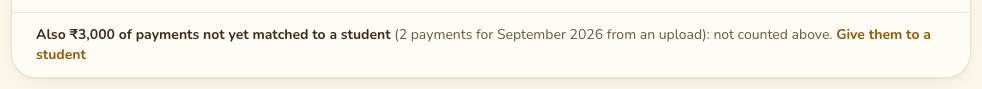

**A wide table.** On a laptop screen the answers (Status to Total owed now) are always in view;
the details are to the right. Scroll the table sideways (with the trackpad, Shift and the mouse
wheel, or the scroll bar under it); the names stay on the left. Only the table scrolls, never
the page.

### What you can do

**Find whom to chase, or a group**
1. Choose from the list next to the search box:
   - **Owes anything**: everyone who owes money today, for this month or any earlier one
     (*Total owed now* above ₹0). **This is the list to chase.** Looking back at an earlier
     month, it's called **Still owes for Aug 2026 or earlier** (with that month) and lists who
     still owes for that month or before it, as of today; money owed only for later months
     doesn't count there.
   - **Short this month**: only those with something left to pay for *this* month (Unpaid,
     Partial and Not due yet).
   - **Everyone**, or one status. The number next to each is how many students have it.
2. Or type in **Search by name**: a name, a batch or a phone number, as in the Students page.
3. Or choose a batch in the **Batch** list (each with how many students it has in the report,
   and **No batch**): only that batch's students.
4. The line under them says *"Showing 8 of 24 students"*, and the totals row and Collected add
   up only those (*"Total of the 8 shown"*). Print and Download Excel then have just those
   too. Click **Clear filters** to see everyone again.

**See it batch by batch**
1. Choose **Group by: Batch**. Each batch's students come under a heading with its name and
   how many (A to Z, numbers in number order, **No batch** last), and end with a **Subtotal**
   row for that batch; inside each, the usual order or the column you sorted by. The total at
   the bottom stays the total of everyone shown.
2. Print and Download Excel are grouped the same way (in Excel, a shaded heading row before
   each batch and a subtotal row of `SUBTOTAL` formulas after it, which the total leaves out),
   and their title says *"grouped by batch"*.

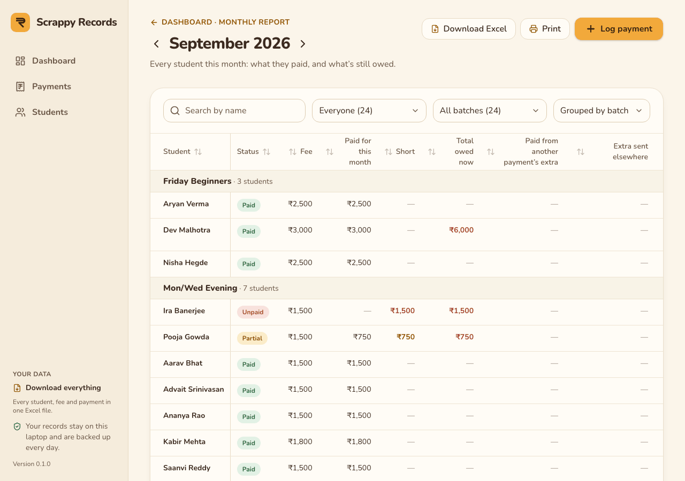

**Sort by a column**
1. Click a column heading (Student, Status, Fee, Short, Total owed now, …). Amounts start with
   the largest; names and classes start A to Z; Status starts with Unpaid.
2. Click it again for the other way round, and a third time to go back to the usual order.

**Download it as an Excel file**
1. Click **Download Excel** (top right).
2. Your browser saves *scrappy-records-report-2026-09.xlsx* (the month is in the name) in your
   Downloads folder. Open it in Excel or Google Sheets.

The file has **the students on screen**, in the same order (ties too) and with the same
columns: if you
chose a status, searched or sorted, so does the file, and its title says so (*"Scrappy Records
— Fees report, September 2026 · Owes anything · sorted by Total owed now, largest first"*). The
second row is the date. The headings stay in view as you scroll, and have Excel's filter
buttons. Amounts are real numbers (so you can add them up), shown in ₹ with Indian commas like
the app (*₹1,50,000*). The bold **Total** row adds up the rows Excel is showing (it follows
Excel's own filter too), and the line under it is **Collected**, worked out the same way as on
screen. The notes from the screen have their own columns: *Came from*, *Went to*, *Earlier
months owed* and *Check*; *Extra kept as credit* (this month's money no month needed), *Kept as
credit, all months* and *Paid ahead* are each a column.

**Print it**
1. Click **Print** (top right). Your browser's print window opens.
2. Choose your printer (or *Save as PDF*) and click **Print**.

The printed page is **A4, sideways (landscape)**. It has only the report: the title
*"Scrappy Records — Fees report, September 2026"*, *"Printed on 15 Sep 2026"*, the table, its
totals and the Collected line. The menu, buttons and search box aren't printed, a row is never
split between two pages, and the headings repeat at the top of each page. If you chose a status
or searched, it prints only those students, and says so under the title (*"Showing 8 of 24
students: Owes anything"*).

**Open a student's profile**
1. Click their name.

**Log a payment**
1. Click **+ Log payment** at the top right. The report updates as soon as it's saved.

### Good to know

- Every number is worked out the same way as on the Dashboard and the profiles, so they always
  agree. Looking back at an earlier month shows it **as it stands today**: a month paid late
  shows as paid.
- **Total owed now** and **Kept as credit / paid ahead** are about today, whichever month
  you're looking at. The other columns are about the month at the top.
- The screen, the printout and the Excel file always show the same students.
- The report doesn't change anything: it only shows what you've logged.

For developers

- **Route:** `/report?month=YYYY-MM` (the Dashboard's link always sets `month`; without one, the
  server's current month), `&status=` for the status list (`owes`, `short` or a
  `ReportStatus`; `all` isn't written). The search and the sort live in the page only.
- **Components:** `frontend/src/pages/report-page.tsx` (`ReportPage`, `ReportTable`, `Row`,
  `Collected`, `MoneyCell`, `CreditCell`, `SortButton`), `components/month-switcher.tsx`,
  `lib/report.ts` (statuses and their words, `statusDetail`, `filterRows`, `sortRows`, `sumRows`
  for the totals row, `formatMonthRuns`, `reportDownloadUrl`, `reportTitle`), `lib/credit.ts`
  (`creditFromText`, `creditSourceText`, `checkText`).
- **Print:** `window.print()`. The `@media print` rules at the end of `src/index.css` (`@page`
  A4 landscape, 10 mm margins; `.report-sheet` table with `break-inside: avoid` rows, a
  repeated `thead`, and no sideways scrolling) plus `print:hidden` / `print:block` classes on
  the shell, the page header and the report's controls.
- **API:** `GET /api/report?month=` (`getReport`) → `ReportResponse` (`rows[]` of `ReportRow`
  with `checks[]`, `no_fee_reason`, `left_month`; `totals` (`ReportTotals`); `today`);
  `GET /api/report.xlsx?month=&status=&q=&sort=&order=` (`downloadReport`), a download named
  `scrappy-records-report-YYYY-MM.xlsx` with the rows the page shows
  (`services/report.shown`, the same filter, search and sort as `lib/report.ts`).
- **Backend:** `routers/report.py` → `services/report.get_report` →
  `services/ledger.build_report` (`report_status`, `needs_check`), from each month's
  `month_line` (the profile's `LedgerMonth` fields); the Excel file is `services/report_xlsx.py`
  (openpyxl; totals are `SUBTOTAL(109, …)`; money uses the Indian-grouping formats `RUPEES` and
  `RUPEES_PAISE`, explained in that file).
- **PRD:** "Monthly report" and ledger rules 1–6 and 10.
- **Tests:** `backend/tests/test_report.py` (`assert_reconciles`: every row and total against
  the dashboard, the profiles and the students list (owed, credit and paid ahead for the
  current month), for 15 months, on each scenario and on the demo data; the Excel content,
  totals, filters, words and number formats); `frontend/src/lib/report.test.ts`,
  `pages/report-page.test.tsx`; `frontend/e2e/report.spec.ts` (from the dashboard, filter,
  search, the Excel download read back (filtered too), the print layout, the wide table, and
  the answers in view at 800 px).

---

## Log payment and Edit payment

### What it's for

Recording money a student has paid you, in a few seconds, and fixing a payment later. Both use
the same form.

### What you'll see

The form is titled **Log a payment** (*"Record money you've received from a student."*) or,
when fixing one, **Edit payment** (*"Fix any detail and save."*).

**Student.** Click the box, or just start typing a name. A list opens with a search box
(*Type a name…*):

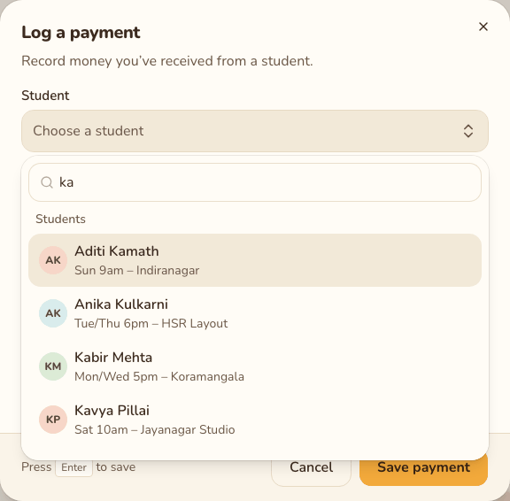

- Each student shows their **batch** under their name (and, once chosen, next to it in the
  box), so two students with the same name can be told apart.
- It finds students whose name, parent's name, batch (or old class label) or phone number
  contains every word you type, in any order, ignoring capitals and accents: *menon arjun* finds *Arjun Menon*, and
  *emile* finds *Émile*. Apostrophes and hyphens in names don't matter (*obrien* finds
  *O'Brien*, *dsouza* finds *D'Souza*). A phone number can be typed with or without its
  spaces, and with or without *+91* in front (*9000000006* finds *90000 00006*). It's the same
  search as on the [Students page](#students-page).
- Current students are listed under **Students**. Students who have left are listed last,
  under **Left**, because they sometimes pay off an old month.
- Use the arrow keys and **Enter**, or click a name.

**Amount** (in ₹) and **For month** fill themselves in once you've chosen the student, with the
month they should pay next:

| What the hint says | When | What's filled in |
|---|---|---|
| **Oldest unpaid: June 2026** | They still owe for an earlier month | That month, and what's left on it |
| **Due now: September 2026** | The only month they owe is this month | This month, and what's left on it |
| **All paid up. Next due: October 2026** | They owe nothing yet | The first later month with a fee that they haven't paid (usually next month, or the month after what they've paid ahead), and its fee. A month with no fee (a month off, say) is skipped |
| **All paid up. Nothing is owed right now.** | They've left and paid everything, paid two years ahead, or have no fee (a free place) | Nothing: choose the month and amount yourself |

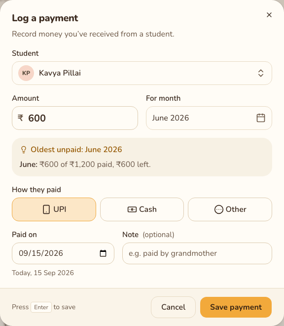 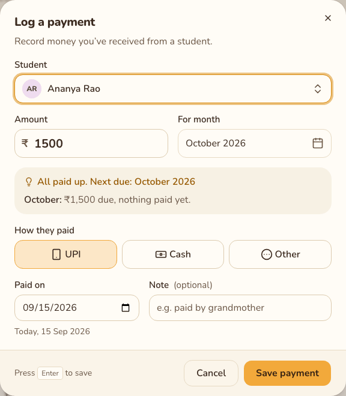

Under the hint, one line says what's already recorded for the chosen month, for example:
- *"September: ₹1,200 due, nothing paid yet."*
- *"June: ₹600 of ₹1,200 paid, ₹600 left."*
- *"June: already fully paid (₹1,200)."* (in green), so you notice before paying it twice;
- *"May: before they joined, so no fee is due."* or *"… after they left, so no fee is due."*

If some of it was paid by extra money from another payment, a teal line says which: *"Includes
₹2,000 credit from the 2 Sep 2026 payment (for Sep 2026)."*

When the form was opened for a later month while an older one is still owed (as from the
Dashboard's *Yet to pay*), the hint points it out with a **Pay June instead** button (see the
first picture).

**For month** opens a small calendar of the year's months. This month has a marigold outline;
the chosen month is filled in marigold. Use the arrows at the top for other years.

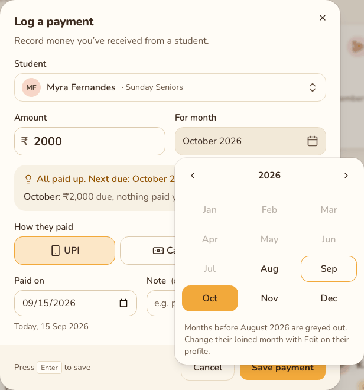

Months you can't choose are **greyed out**: those before the student joined, after their last
month (if they've left), and more than two years ahead. A note under the calendar says why, for
example *"Months before August 2026 are greyed out. Change their Joined month with Edit on their
profile."*

**How they paid:** three big buttons, **UPI** (chosen at first), **Cash** and **Other**.

**Paid on:** the date they paid. It starts as today, and the line under it spells the date out
(*Today, 15 Sep 2026*), because the box itself follows the laptop's date settings.

**Note (optional):** anything you want to remember, for example *"paid by grandmother"*.

**Where extra money will go.** If the amount is more than what's left of the month's fee, a
teal line under the amount says what this payment's extra will pay, before you save (see
[extra money](#extra-money-pays-the-months-still-owed)): *"₹1,200 more than the September fee:
it will pay June 2026 (unpaid)."* It names each month, oldest first: *(unpaid)* or *(part
paid)* for a month owed, then months *ahead*. A long run is shortened (*"9 months ahead
(November 2026 to July 2027)"*). If nothing is owed anywhere, it says the money *"will be kept
as credit"*. The amounts are exactly what the payment's row will say once saved. It never stops
you saving.

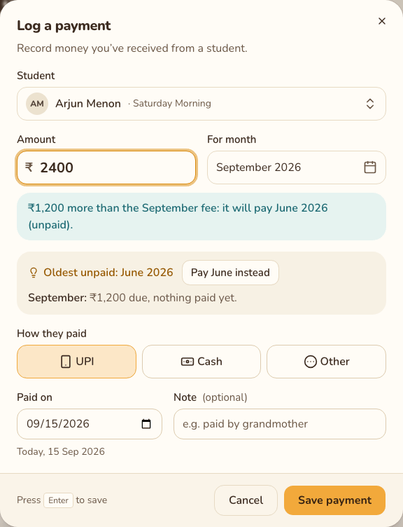

**The large-amount check.** If the amount is **three times the month's fee or more**, the same
line starts, in amber, *"That's much more than the ₹1,500 fee. Is it right?"*, in case of an
extra zero, and then says where the extra would go. It never stops you saving. If it's saved
anyway, the profile and the Dashboard ask you to check it once more (see
[Student profile](#student-profile)).

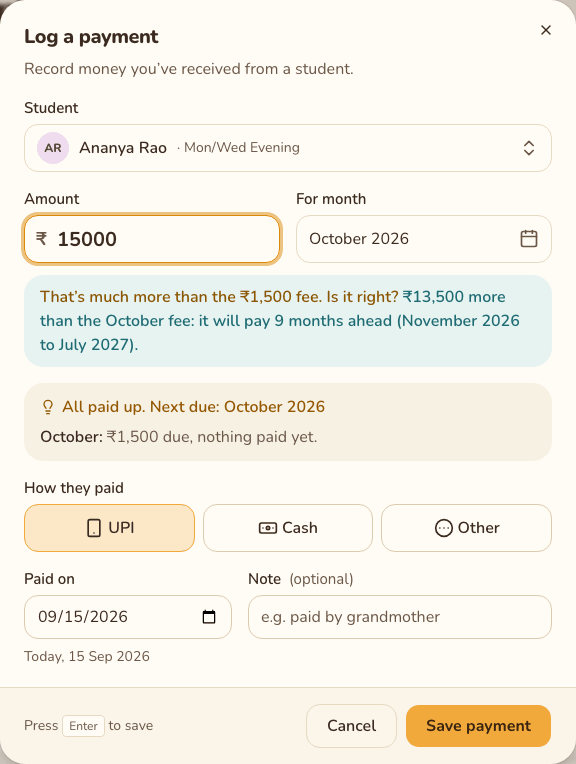

**The amount rules.** You can type the amount the way you'd write it:

| Accepted | Not accepted, and what the form says |
|---|---|
| `1500`, `1,500`, `1,50,000`, `150,000` | Nothing typed: *"Enter the amount."* |
| Paise, up to 2 decimals: `1500.50`, `.5` | Commas in odd places (`15,00`), letters, spaces inside the number (`1500 50`), 3 decimals: *"Enter an amount like 1500 or 1,500."* |
| A ₹, Rs or INR in front: `₹ 1,500`, `Rs. 200` | `0`: *"The amount must be more than ₹0."* |
| The Indian `/-` at the end: `₹1,500/-` | More than ₹10,00,000: *"The most you can enter is ₹10,00,000."* |

₹10,00,000 is the most a single payment (or a monthly fee) can be. It's there to catch a slip
of the finger, not as a rule about your fees. However it's typed (`20,00,000`, `₹20,00,000/-`),
an amount over the limit gets *"The most you can enter is ₹10,00,000."*

**At the bottom:** *"Press Enter to save"*, **Cancel**, and **Save payment** (or **Save
changes** when editing). While saving, the button says *Saving…*.

### What you can do

**Log a payment from anywhere**
1. Click **+ Log payment** at the top right.
2. Type the first letters of the student's name, then pick them with the arrow keys and
   **Enter**, or click them.
3. Check **Amount** and **For month**. Change them if needed.
4. Choose **UPI**, **Cash** or **Other**.
5. Change **Paid on** if they paid on another day, and add a **Note** if you like.
6. Press **Enter**, or click **Save payment**.

**Log a payment already filled in for someone.** The form opens with the student chosen and the
cursor in **Amount**, so you can check it and press **Enter**. It opens this way from:
- the Dashboard's *Yet to pay* (**Log payment** on a row): that month and what's left;
- a student's profile (**+ Log payment** at the top): their next month, as in the table above;
- a profile's *Oldest unpaid* box, or a month's **Log payment** in *Month by month*: that month
  and what's left.

**Undo a payment you just saved**
1. Right after saving, a message appears at the top: *"Payment saved — ₹1,500 from Ira Banerjee
   for September 2026"*.
2. Click **Undo** within 10 seconds. The payment is removed and you'll see *"Payment removed"*.

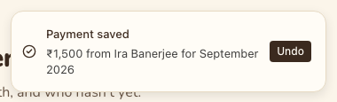

**Edit a payment**
1. Find it on the [Payments page](#payments-page) or in a student's profile, and click
   **Edit** (or **Edit payment** next to a month with money kept as credit).
2. Change the student, amount, month, method, date or note.
3. Click **Save changes**. You'll see *"Payment updated"*.

When editing, a teal line under the title says what the payment does now, if some of it pays
another month (*"Now: ₹2,000 went to Aug 2026."*). The line about the month leaves out the
payment you're editing (*"September: ₹2,000 fee, nothing else paid."*), and the line under the
amount says where the extra would go with your change, so you can see the effect before
saving.

### Good to know

- **Enter saves.** Pressing Enter in the amount, date or note box saves the payment. So does
  Enter right after clicking **UPI**, **Cash** or **Other**, with the method you clicked. (The
  arrow keys still move between those three; Enter then saves with the one you're on.) On the
  student box, Enter also saves once a student is chosen: it never switches to someone else.
  Only typing letters there opens the list again.
- Pressing Enter twice, or clicking Save twice, still saves only one payment.
- If something is missing, the form says what, next to that box, when you try to save:
  *"Choose who paid."*, *"Pick the month this payment is for."*, *"Enter the date they paid."*,
  *"This date is in the future."*
- **Money above the fee is never lost.** A payment is logged for one month; whatever is more
  than that month's fee pays the oldest month still owed (then later months ahead). So if a
  parent pays for two months at once, just log it once (see
  [Everyday situations](#a-parent-pays-for-two-months-at-once)). The payment itself is kept
  exactly as you typed it.
- A payment for a month that hasn't started is fine: it shows as **Paid ahead**. It pays that
  month only (up to its fee), never an older one.
- The calendar greys out months before they joined and after they left, so you can't log a
  payment for those. One can still end up there if **Joined in** or **Left in month** is
  changed later (or they're marked as left) after a payment was logged. No fee was due that
  month, so all of it is extra, and it pays the oldest month still owed.
- Undo is only offered right after logging a new payment. To take back an edit, edit it again.
- Pressing **Esc**, clicking **Cancel** or the **×** closes the form without saving.

For developers

- **Component:** `frontend/src/components/log-payment.tsx`: `LogPaymentProvider` renders the
  one app-wide dialog; `useLogPayment().openLogPayment({ studentId, forMonth, amountPaise,
  focusAfterSave })` and `openEditPayment(payment)`; `PaymentForm`, `MonthFacts`. Also
  `components/student-combobox.tsx` (the Enter rules, "Left" group, word matching),
  `components/month-picker.tsx` (arrow keys, greyed months), `lib/search.ts`
  (`studentMatches`, shared with the Students page), `lib/amount.ts` (`amountProblem`, which
  reads the amount with `parseRupees` to tell "too big" from "not an amount") and
  `lib/format.ts` (`rupeesToPaise`, `MAX_AMOUNT_PAISE`, `MONTHS_AHEAD`). Enter on a method
  button is `onMethodKeyDown`. The extra-money line is `previewPayment` in `lib/allocation.ts`
  (a copy of `ledger.allocate`, run with the new payment added; it reports that payment's own
  `extra_sent` and credit, as its row will say once saved) and `previewText` in
  `lib/credit.ts`; the month line comes from the same allocation, without the payment being
  edited. The profile and dashboard "Check: …" lines come from `needs_check` /
  `payment_needs_check` (`ledger.needs_check`) and `checkText`.
- **API:** `GET /api/students/{id}/suggest-payment` (`suggestPayment`) → `SuggestedPayment`
  (`reason`: `owed` / `next_unpaid` / `all_paid`); `GET /api/students/{id}` (`getStudent`) for
  the month facts, the fee and the month limits; `GET /api/students?status=all`
  (`listStudents`) for the list; `GET /api/payments?student_id=` (`useStudentPayments`) for the
  extra-money line; `POST /api/payments` (`createPayment`);
  `PATCH /api/payments/{id}` (`updatePayment`); Undo is `DELETE /api/payments/{id}`
  (`deletePayment`).
- **Backend:** `services/students.suggest_payment` → `ledger.suggest_payment`;
  `services/payments.create_payment` / `update_payment`; limits in `services/bounds.py` (month
  at most 24 months ahead, `paid_on` from 2000-01-01 to tomorrow); the amount cap is
  `MAX_AMOUNT_PAISE` in `app/schemas.py`. A 422's `loc` field is shown next to the matching box
  (`SERVER_FIELDS`).
- **Rules:** the suggestion is PRD ledger rule 9; the extra-money line is rule 10; the 3× check at entry
  is `LARGE_AMOUNT_FACTOR`; the suggestion never overwrites what was typed or what the caller
  prefilled for that student.
- **PRD:** stories P1, P2, P4, P5, D5; ledger rules 3, 4, 5, 9 and 10.
- **Tests:** `frontend/src/components/log-payment.test.tsx` ("saves with Enter after
  clicking a method button…", "finds a student the same way as the Students page", "previews
  where money above the month's fee will go…"); `lib/allocation.test.ts`, `lib/credit.test.ts`;
  `frontend/src/lib/format.test.ts`, `lib/amount.test.ts` (amount parsing and the cap),
  `lib/search.test.ts`; `backend/tests/test_api_payments.py`, `test_api_bounds.py`,
  `test_api_students.py` (`test_suggest_payment*`), `test_ledger.py` (`test_suggest_*`);
  `frontend/e2e/records.spec.ts` → "Enter never switches the student…", "Undo removes the
  payment just saved", "pressing Enter or clicking Save twice saves only one payment", "moving a
  payment to another month…"; `frontend/e2e/fixes.spec.ts` → "clicking Cash then pressing Enter
  saves exactly one payment", "an amount over the cap written with "/-" says the cap".

---

## Payments page

### What it's for

Seeing every payment you've ever logged, finding any one of them, and fixing mistakes.

### What you'll see

**Download Excel** and **Upload Excel**, under the title: the payments shown (with your filters,
in your order) as an Excel file, and adding payments from one. See
[Downloading and uploading Excel](#downloading-and-uploading-excel).

**Unassigned payments**, at the very top, only while an upload has left payments whose student
wasn't clear. See [Unassigned payments](#unassigned-payments).

**Filters** across the top:
- **Search names and notes**: finds payments whose student name or note contains what you
  type, ignoring capitals and accents (*emile* finds *Émile*). The list updates as you type.
- **All students**: pick one student to see only their payments.
- **All months**: pick a month to see only payments *for* that month.
- **All methods**: UPI, Cash or Other.
- **Clear filters** appears once any filter is on.

**The table:**

| Column | What it shows |
|---|---|
| **Paid on** | The day the money was paid, like *9 Sep 2026* |
| **Student** | Their name. Click it to open their profile |
| **Amount** | The amount in ₹ |
| **For month** | The month the payment was logged for, like *Sep 2026*. If some of it was more than that month's fee, a teal line under it says where that went: *₹2,000 went to Aug 2026* (or *₹500 kept as credit* if no month needed it) |
| **Method** | UPI, Cash or Other |
| **Note** | The note, if any (hidden on a narrow window, so Edit and Delete stay visible) |

At first the newest payment is at the top. **The last row** shows how many payments are listed
and their **total**, for whatever filters are on:

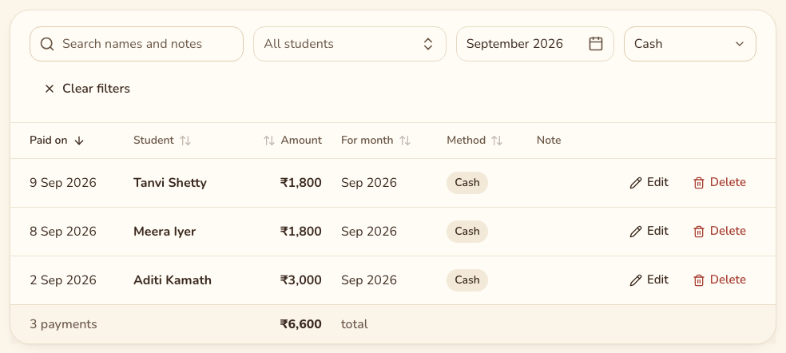

### What you can do

**Sort the list**
1. Click a column heading: **Paid on**, **Student**, **Amount**, **For month** or **Method**.
   An arrow shows which way it's sorted.
2. Click the same heading again to reverse the order. A third click goes back to newest first.
   **Paid on** starts newest first, so its first click shows the oldest first, and the next
   click goes back to newest first.

**Find a payment**
1. Type part of the student's name or the note into the search box, and/or choose a student,
   month or method.
2. To see everything again, click **Clear filters**.

**See the payments for a month, or in cash**
1. Choose the month under **All months** (and **Cash** under **All methods**, if you like).
2. Read the total in the last row.

The month filter goes by the month a payment is **for**, not the day it was paid. So
"September" plus "Cash" is the cash paid *for* September, even if some of it came in October,
and it leaves out cash paid in September for other months. It isn't a count of the cash you
received during September. The total adds up payments exactly as they were logged, so a
payment whose extra went to another month counts in full here; the Dashboard's **Collected**
counts that extra in the month it paid. With a month chosen, the last row says so: *"₹6,600
total (as logged; ₹1,500 of it paid other months)"*.

**Fix a payment**
1. Click **Edit** on its row. The [Edit payment](#log-payment-and-edit-payment) form opens.
2. Change what's wrong, and click **Save changes**.

**Delete a payment**
1. Click **Delete** on its row.
2. The app asks first, and says exactly what will go: *"₹1,800 from Tanvi Shetty for September
   2026, paid on 9 Sep 2026 by Cash, will be deleted. This can't be undone."*
3. Click **Delete payment** to confirm, or **Cancel**. You'll see *"Payment deleted"*.

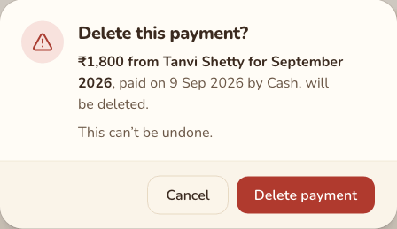

### Good to know

- **Amount** sorts largest first on the first click. **Student** sorts A to Z, and **Method**
  sorts Cash, Other, UPI.
- The browser's **Back** button remembers the student, month and method you picked, but not
  the search text.
- *"No payments match these filters."* means nothing fits; click **Clear filters**. *"No
  payments yet."* means nothing has been logged at all.
- A deleted payment can't be brought back from inside the app. If you delete one by mistake,
  just log it again (or see [backups](runbooks/backup-and-restore.md)).

For developers

- **Route:** `/payments`, with `?student=<id>&month=YYYY-MM&method=upi|cash|other` (and an
  optional starting `?q=`). `#unassigned-payments` is the Unassigned payments section.
- **Excel:** the page keeps the table's sort (`PaymentsTable`'s `sorting`), so **Download
  Excel** (`lib/downloads.ts`) asks `GET /api/export/payments.xlsx` for the same filters and
  order.
- **Components:** `frontend/src/pages/payments-page.tsx` (filters; the search is debounced
  250 ms and lives in page state), `components/payments-table.tsx` (TanStack Table v9 sorting,
  total footer, Edit/Delete, `ConfirmDialog`; **Paid on** has `sortDescFirst`, so its first
  click turns the starting newest-first order round; the "went to" line is `paymentUseText` in
  `lib/credit.ts`, from `extra_sent` and `extra_unused_paise`), `components/confirm-dialog.tsx`.
- **API:** `GET /api/payments?student_id=&month=&q=` (`listPayments`, default
  `sort=paid_on&order=desc`); `DELETE /api/payments/{id}` (`deletePayment`); Edit uses
  `updatePayment`. The **method** filter and the column **sorting** run in the browser over the
  list already loaded.
- **Backend:** `routers/payments.py` → `services/payments.list_payments` (accent- and
  case-insensitive `q` via `services/text.py`; where each payment's money went from
  `ledger.payment_uses`), `delete_payment`.
- **PRD:** stories P3, P4; ledger rules 3 and 10.
- **Tests:** `frontend/src/pages/payments-page.test.tsx` ("shows oldest first on the first
  click on Paid on…"); `frontend/e2e/fixes.spec.ts` → "the first click on "Paid on" shows the
  oldest payment first"; `backend/tests/test_api_payments.py`
  (`test_sorting`, `test_filters_and_search`, `test_default_sort_is_newest_paid_on_first`),
  `test_api_bounds.py` (`test_search_and_sort_ignore_case_and_accents`),
  `test_query_counts.py`, `test_allocation.py` (`test_the_payments_list_says_where_each_payment_went`);
  `pages/payments-page.test.tsx` ("says where money above a month's fee went").

---

## Students page

### What it's for

Seeing everyone in your classes, batch by batch: whether each of them is up to date, how long
they've been with you, and how much of each batch's fees has come in this month. And finding
any student in a moment.

### What you'll see

![The Students page on the All batches tab: Download Excel, Upload Excel and Download everything under the title; tabs across the top (All batches 24, Friday Beginners 3, Mon/Wed Evening 7, Saturday Morning 6, Sunday Seniors 4, Tue/Thu Juniors 4, and an arrow for more), the search box 'Search name, phone, parent or batch', the Batches heading with the month September 2026 between arrows and a New batch button, and a card for each batch, for example Mon/Wed Evening, Koramangala, Mon, Wed · 5:00–6:00 pm, 7 students · ₹10,800 this month, ₹8,550 of ₹10,800 paid, 79%.](images/feature-guide/students.png)

**Download Excel** and **Upload Excel**, under the title: the students shown (the batch tab
you're on, the **Show** choice and the search) as an Excel file, with each student's batch, and
adding students from one. See [Downloading and uploading Excel](#downloading-and-uploading-excel).

**The batch tabs** run across the top of the page, under the title. (The main menu is down the
left side, so the two never look alike.)

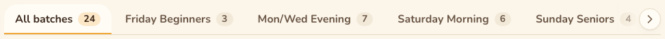

- **All batches** comes first: every batch at a glance, and every student.
- Then **one tab per batch**, A to Z (with numbers in order: *Batch 2* before *Batch 10*), each
  with how many students are in it now (not counting those who have left). A long name is cut
  short with *…*; hover to see it all.
- **No batch** comes last: the students who aren't in a batch yet.
- The tab you're on is white, with a marigold line under it. If there are more tabs than fit, a
  soft fade and an arrow at the edge show there are more: click the arrow, scroll sideways, or
  use the keyboard (see below).

On a narrow window (where the main menu moves to the top), the tabs become **one dropdown**
instead, so there's never a second row of tabs:

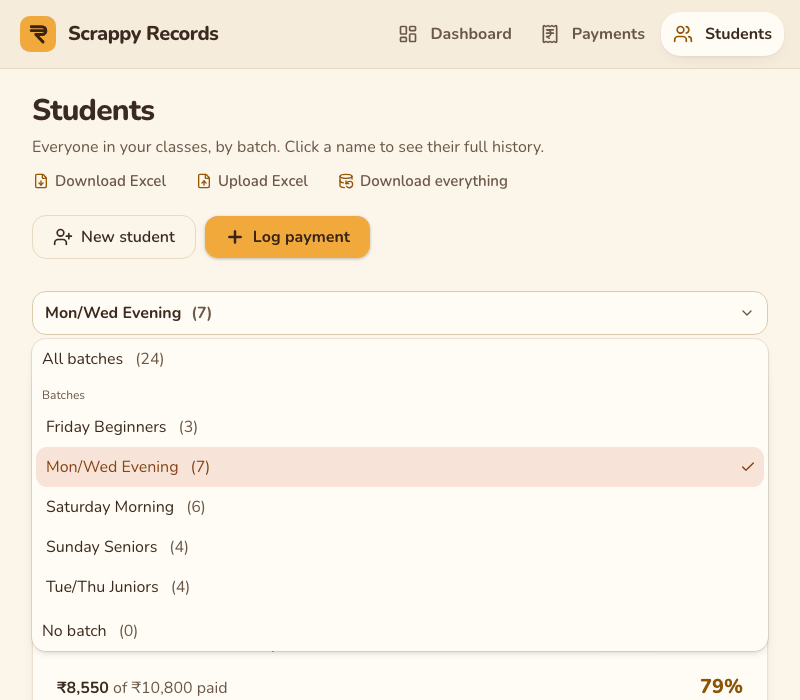

**The batch cards** (on *All batches*), one per batch, A to Z:

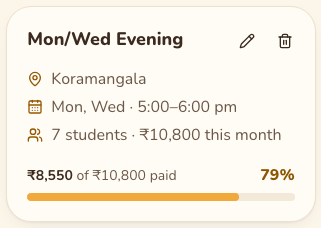

| Line | What it means |
|---|---|
| The name | The batch. Click anywhere on the card to open its tab |
| 📍 **Koramangala** | Where it happens, if you gave a location |
| 📅 **Mon, Wed · 5:00–6:00 pm** | The days and times, if you set them |
| 👥 **7 students · ₹10,800 this month** | How many students are in it now (not counting those who have left), and their fees for the month shown above the cards, added up. If not all of them have a fee that month (someone joining later, a month off), it says how many do: *"5 students (4 due this month)"* |
| **₹8,550 of ₹10,800 paid**, **79%** and the bar | How much of that month's fees is paid. The bar fills up as money comes in, and turns **green at 100%**, which only happens when every fee in the batch is paid in full. Below 100% it's marigold |

The numbers are for the month next to **Batches** (this month at first). Use its arrows to look
at another month, the same way as on the Dashboard; **Back to …** returns to this month. An
earlier month says *"counted by who is in each batch today"*: a student who moved batch counts
in the batch they're in now, past months included.

After the cards, a dashed **No batch** card counts the students not in any batch, if there are
any. With more than nine batches, only the first nine cards show, with **Show all 30 batches**
under them; the tabs always list every batch.

**All students** is the table under the cards: every student, to find anyone fast.

| Column | What it shows |
|---|---|
| **Name** | Their name, and *Parent: …* if you entered one. Click anywhere on the row to open their profile |
| **Batch** | Their batch (click it to open the batch's tab), with its days and times, or *No batch* |
| **Monthly fee** | Their fee this month (for someone who hasn't started yet, the fee they'll start on), or **No fee**. If a different fee is already set for a later month, a second line says so, e.g. *₹1,000 from Dec 2026* under *No fee* for someone coming back in December |
| **Status** | How they stand overall (see below) |
| **Member for** | How long they've been coming (see below) |

Click a column's name to sort by it; click again to reverse. An arrow shows which column and
which way.

**Status** is one coloured label, sometimes with a small note under it:
- **Owes ₹4,800** (red): some month up to this one isn't fully paid, even after any money paid
  above a fee has gone to the oldest months owed. The amount is what's left on all of those
  months together.
- **Credit ₹500** (teal): nothing is owed, and ₹500 was paid that no month needs (usually by
  someone who has left).
- **Up to date** (green, with a tick): nothing owed, nothing extra.
- Under it, a teal **Paid ahead ₹1,500** if some of what they paid is for months still to
  come.

**Member for:**
- **8 mo** or **1 yr 4 mo**, with *Since Jan 2026* under it: whole months since the month they
  joined. Someone who joined in August is "1 mo" in September.
- **New this month**: they joined this month.
- **Starts November 2026**: they join in a later month.
- **Leaving after Sep 2026** (under the time): they've been marked as leaving, and that month
  hasn't passed yet.
- **Left May 2026** (when showing who has left): their last month, the last one they owed for.

The dropdowns above the table (a dropdown you've changed is outlined in marigold):

| Dropdown | Choices |
|---|---|
| **Show** | **Active** (everyone still coming, including someone whose last month is this month or later), **Left** (everyone whose last month has passed) or **Everyone**, each with how many |
| **Sort by** | Name, Batch, Monthly fee, Status (who owes first), Owes most, or Member for |
| **Group by** | No groups, or under a heading per **Batch**, **Location**, **Day** or **Status**. Grouped by day, a student is under each day their batch meets (Monday *and* Wednesday). *No batch*, *No location* and *No day set* come last |
| **Batch** | All batches, one batch, or No batch |
| **Location** | All locations, one place (however it's spelled in each batch), or No location. Shown once any batch has a location |
| **Day** | Any day, or the students whose batch meets on that day |
| **Status** | Any status, Owes, Up to date or Has credit |

**Clear filters** appears when you've changed any of them, and puts them all back.

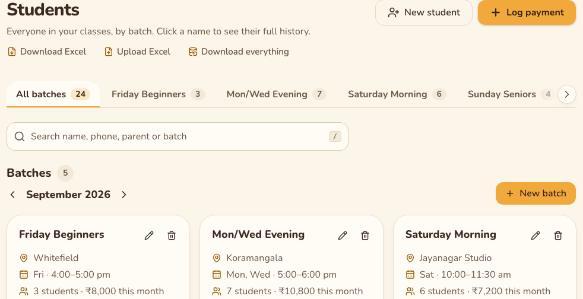

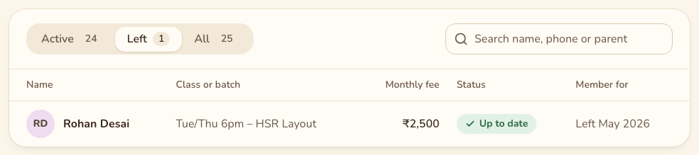

**A batch's tab** has the batch at the top and its students under it. See [Batches](#batches).

### What you can do

**Find a student fast**
1. On the Students page, just start typing: on a laptop-sized window the search box is ready as
   soon as the page opens. Anywhere else on the page, press **/** to jump to it.
2. Type part of their name, phone number, parent's name or batch. The list narrows with every
   letter. The words can be in any order (*menon arjun*), capitals, accents, apostrophes and
   hyphens don't matter (*emile* finds *Émile*, *obrien* finds *O'Brien*), and a phone number
   can be typed with or without its spaces or *+91*.
3. The first student in the list is highlighted, with **Enter opens** next to their name:
   press **Enter** to open them, or click any row. **Esc** empties the search.

On **All batches** the search box is at the top, above the batch cards. As soon as you type,
the cards fold away (*"5 batches folded away while you search"*), so the matches are right
under the search box; empty the box and they come back.

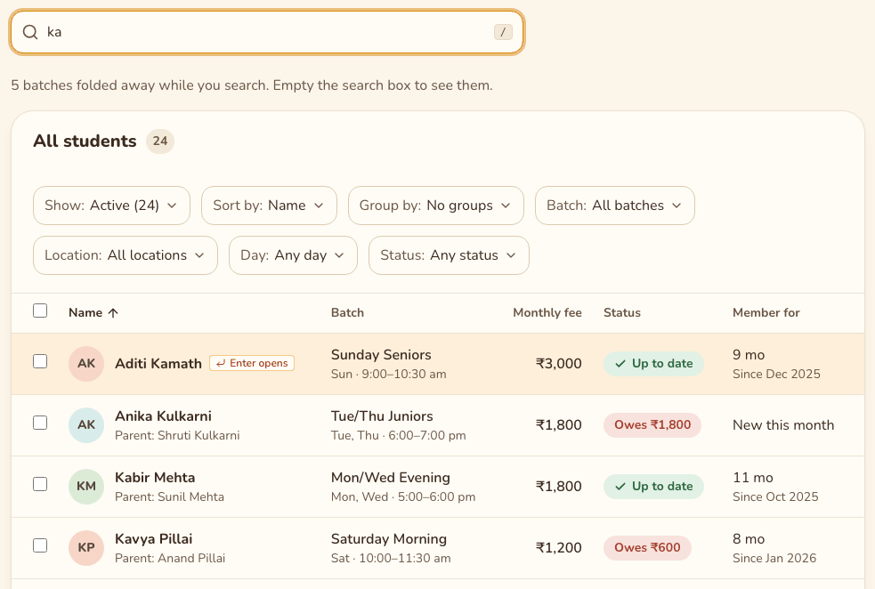

If the dropdowns hide someone who matches (someone who has left, while **Show** is
*Active*), a marigold line says so (*"1 more student matches "dev" but is hidden by the
filters."*), with **Show them** to see everyone. Enter only ever opens the highlighted row:
never someone the dropdowns hide.

**Move several students to a batch at once** (on **All batches** and **No batch**)
1. Tick the box at the start of each row. To tick a run of rows, tick the first, then hold
   **Shift** and tick the last. The box in the heading ticks everyone shown.
2. A marigold bar says how many are ticked. Click **Move to batch…**.
3. Choose the batch (or **No batch**) and click **Move to …**. They all move at once. Their
   fees don't change: to charge them the batch's usual fee, use **Edit batch** → **Also
   charge…**.

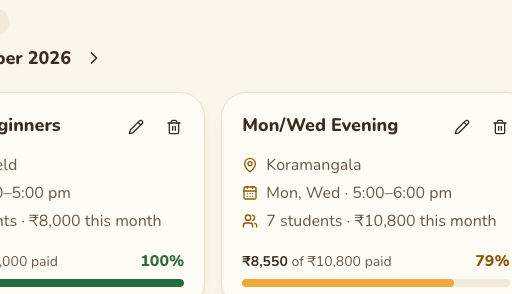

**Open a batch**
1. Click its tab at the top, or its card. On a narrow window, choose it in the dropdown.
2. With the keyboard: press **Tab** until a batch tab is highlighted, then **←** and **→** move
   between tabs, **Home** and **End** go to the first and last, and **Enter** opens one.
3. Your browser's **Back** button returns to the tab you were on. A batch's tab can be
   bookmarked.

**See who has left**
1. In the table, choose **Show: Left**.

**See who owes, batch by batch**
1. Choose **Group by: Batch** and **Status: Owes**. Or open a batch's tab and sort by
   **Status**.

**Add a student**
1. Click **New student** at the top, or **Add student** on a batch's tab (which puts them in
   that batch). See [New student](#new-student-and-edit-student).

**Add, change or delete a batch**
1. See [Batches](#batches).

### Good to know

- The **Status** is about all months up to this one, not just this month. To see only this
  month, use the Dashboard, or a batch's % paid.
- Money paid above a fee pays the oldest month still owed first, so a month paid twice
  instead of the next one shows **Up to date**, not **Owes**. A payment logged for a later month
  pays that month only, so paying ahead never hides a month that's still owed.
- A student marked as leaving stays under **Active** until their last month has passed, then
  moves to **Left** by themselves. They stay in their batch either way.
- The search is the same as the student list in [Log payment](#log-payment-and-edit-payment):
  whoever one finds, the other finds too.
- *"No students match …"* and *"No students match these filters."* mean the search or the
  dropdowns have nothing in them (**Clear search and filters** puts everything back). *"No
  students yet."* means nobody has been added.
- The batch cards and the Dashboard agree: every batch's *this month* and the No batch card add
  up to the Dashboard's *Expected*, *Collected* and *Still due* for the same month.

For developers

- **Routes:** `/students` (All batches), `/students/batch/:batchId` (a batch) and
  `/students/batch/none` (No batch), with `?month=YYYY-MM` for a month other than the server's
  current one; the month is kept when switching tabs. All three render `StudentsPage`.
- **Components:** `frontend/src/pages/students-page.tsx` (`AllBatches`, `OneBatch`,
  `BatchView`); `components/batches/batch-nav.tsx` (tabs at `lg` and up, a `Select` below;
  links with `aria-current="page"`, arrow keys, `scrollIntoView` of the open tab),
  `batch-card.tsx`, `paid-bar.tsx`, `month-nav.tsx`, `students-table.tsx` (search, sort,
  filters, groups; "/" and Enter); `lib/batches.ts` (`formatSchedule`, `matchesFilters`,
  `sortStudents`, `groupStudents`); `components/status.tsx`; `lib/labels.ts`.
- **API:** `GET /api/students?status=all` (`listStudents`) and `GET /api/batches`
  (`listBatches`) once; the table's search, filters, sorting and grouping happen in the browser.
  `GET /api/batches/summary?month=` (`getBatchOverview`) for the cards and % paid. The search is
  `studentMatches` in `lib/search.ts` (name, guardian, batch name, old label, phone). The
  server's `batch`, `location`, `status` and `q` filters aren't used by this page.
- **Backend:** `services/students.list_students`; `services/batches.overview` (each batch's
  students through `ledger.build_dashboard`, so the numbers are the Dashboard's own).
- **PRD:** scope items 6 and 8; ledger rules 6, 8 and 10; `tenure_months` in
  [data model](data-model.md#ledger-computation).
- **Download Excel:** `GET /api/export/students.xlsx?status=&q=&batch=` (the tab's batch, the
  table's *Show* and the search), whose search is `services/text.student_matches`, the same
  rules in Python.
- **Search and ticks:** on All batches the table's search box is rendered into a place above
  the cards (`searchHost`, a portal), and `onShownChange` tells the page what's typed (the
  cards fold away, and Download Excel follows it). Enter opens `data-next`, the first row on
  screen, and is ignored while `isComposing`. Tick boxes and `MoveDialog` are in
  `students-table.tsx`; `POST /api/batches/move` (`moveStudents`).
- **Tests:** `frontend/src/pages/students-page.test.tsx`, `pages/batches.test.tsx`,
  `lib/batches.test.ts`, `lib/search.test.ts`; `frontend/e2e/batches.spec.ts` → "filter and
  group every student on the All batches tab"; `frontend/e2e/fixes.spec.ts` → "Students search:
  phone without spaces, accents, and words in any order"; `frontend/e2e/records.spec.ts` →
  "mark as left shows the student under Left"; `backend/tests/test_api_students.py`,
  `test_api_batches.py` (`test_batches_add_up_to_the_dashboard`, `test_a_batch_summary`).

---

## Batches

### What it's for

Grouping students by the class they come to (a batch, like *Mon/Wed Evening* at one place), to
see each batch's fees at a glance, and to add a student to a batch with its usual fee filled in.
Each student is in **one batch, or none**.

### What you'll see

**A batch's tab** (click its tab or card on the Students page):

- At the top: the batch's **name**, then its **location**, **days and times** and **usual fee**,
  and its notes, if any.
- **Edit batch**, a **bin** (delete) and **Add student**.
- The **month**, with arrows, as on the Dashboard.
- **Students in September 2026**: how many in the batch are coming that month (with *"4 with
  a fee due"* under it if some of them have no fee that month).
- **Fees for September 2026**: their fees for that month, added up.
- **Collected** (**Paid ahead** for a month still to come): what pays that month so far.
- **Still to pay**: what's left, and how many students haven't paid in full (red while
  anything is left, green at ₹0).
- The **% paid** bar: *₹8,550 of ₹10,800 paid*, and the percentage, which is **100% only when
  everyone has paid** that month in full (it's rounded down, so 99.9% shows 99%).
- **Students in this batch**: the same table as on *All batches*, with its search, sorting and
  grouping, without the batch columns and dropdowns.

The **No batch** tab looks the same, for the students who aren't in a batch.

**New batch** and **Edit batch** use the same form:

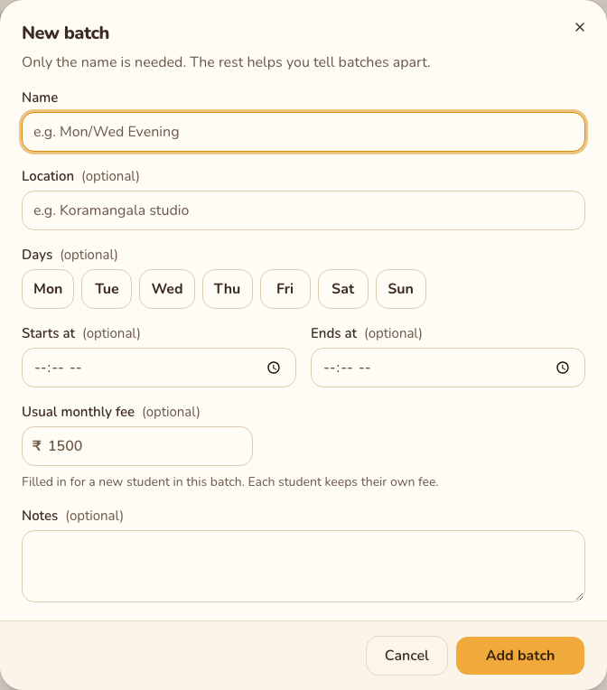

| Box | Needed? | Notes |
|---|---|---|
| **Name** | Yes | Each batch needs its own name. Two names that differ only in capitals or spaces count as the same: *"There's already a batch called Tue/Thu 5pm."* |
| **Location** | No | Free text. It suggests the places you've already typed, so the same place is spelled the same way |
| **Days** | No | Click each day it meets; a chosen day turns marigold |
| **Starts at**, **Ends at** | No | The end has to be after the start |
| **Usual monthly fee** | No | Filled in for a **new** student added to the batch. Up to ₹10,00,000 |
| **Notes** | No | |

**Changing the usual fee never changes what anyone pays by itself.** When you type a new usual
fee in **Edit batch**, a marigold box says so, and offers to charge it to its students too:

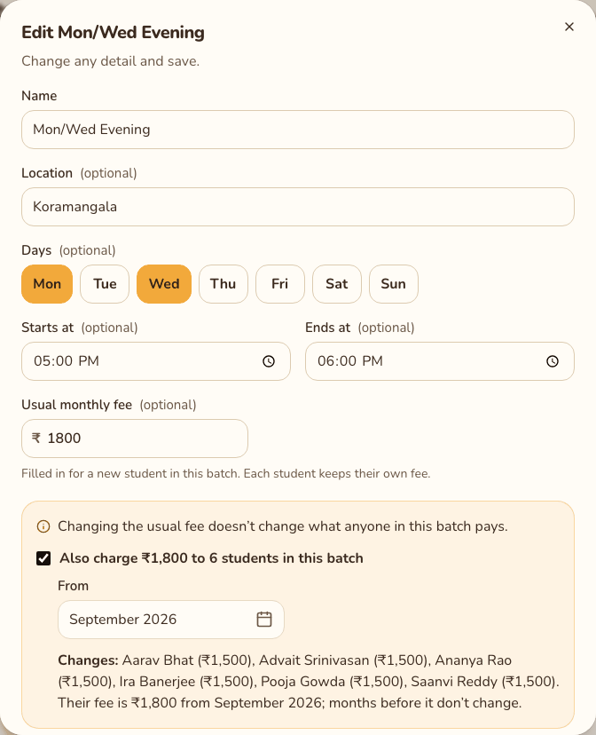

- **Also charge ₹1,800 to students in this batch**: only if you tick it. Then **From** (this
  month at first) and every student in the batch, each with a tick box and their fee now:
  - **On the usual fee**: every month that would change has the batch's old usual fee (or,
    for a batch that had none, the fee most of them pay). **Ticked** at first.
  - **Their own fee**: a discount, a sibling, a free place. **Not ticked**: tick them only if
    they should pay the new fee too.
  - **Has its own fee change — not changed unless you tick them**: someone with a fee change
    of their own from that month on: one set earlier (a discount for July and August, a ₹0
    month off, the fee they came back on) or one planned for later. A new fee from an earlier
    month would cut it short or replace it, so it's never changed unless you tick them.
  - Under every name: what ticking would do to *them*, in the same words as Edit student:
    *"From July 2026 they'll owe ₹1,800 a month, until September 2026, when ₹1,000 (already
    set) starts."*, and what it would replace (*"It replaces the no-fee month set for July
    2026."*).
  - Below them: who already pays the new fee, and who leaves before that month (neither
    changes).
- Only the ticked students change, each exactly like changing their fee from that month in
  **Edit student**, as the line under their name says: earlier months keep their fee. The line
  at the bottom, and the message after saving, say how many and who.
- Someone who joins after the chosen month gets the new fee from the month they join. If the
  month falls in their months away (after leaving and coming back), it starts from the month
  they came back, so no month away becomes owed.
- **A month already due** (before this month) warns in amber how many months already due
  change, and how much more (or less) the ticked students will owe for them in total: *"August
  2026 is before this month: 3 months already due (August–October 2026) change. The ticked
  students will owe ₹5,400 more for them in total."*

**Create batches from existing labels.** Before batches, each student had a free-text **Class
or batch** label (like *Tue/Thu 5pm – Indiranagar*). While some students have a label but no
batch, a **Create batches from existing labels** button sits next to **New batch**:

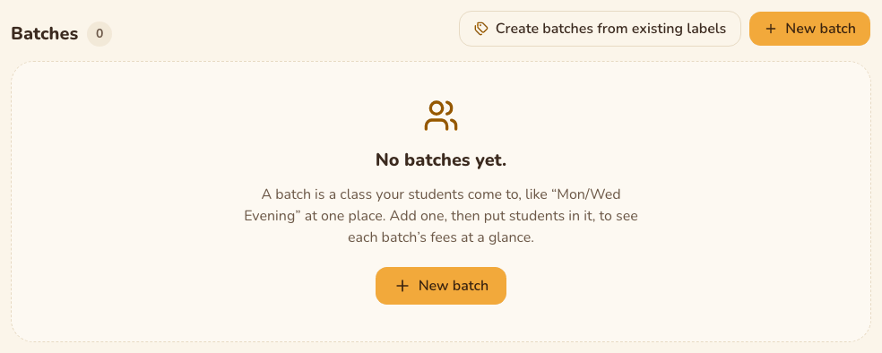

It shows exactly what it will do, and **does nothing until you click the button**:

- Labels that differ only in **capitals or spaces** make one batch (*Mon/Wed 5pm* and
  *mon/wed  5PM*). It's named after the spelling most students have.
- If you already have a batch with that name, the students go into it instead of a new one.
- When you click **Create … batches**, a backup of your records is saved first, then all the
  batches are made and every student is placed, all at once. The labels themselves stay exactly
  as they were typed, and no fee or payment changes.
- Students who have left are marked *(left)*. A batch where everyone has left says so: *"this
  batch would have nobody coming now"*.
- Clicking it again does nothing: those students are in a batch now. The button goes away.

**Deleting a batch** asks first, and says what happens to its students:

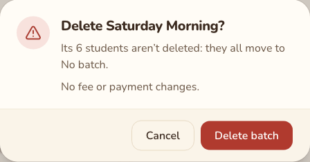

It counts everyone in the batch, those who have left included: *"Its 6 students, including 2
who have left, aren't deleted: they all move to No batch."*

### What you can do

**Set up your batches the first time**
1. Go to **Students**.
2. If your students have labels, click **Create batches from existing labels**, check the
   list, and click **Create … batches**. Otherwise click **New batch** for each batch.
3. Open each batch (its tab or card), click **Edit batch**, and add its **location**, **days**,
   **times** and **usual fee**.
4. Anyone left under **No batch**: on the **No batch** tab, tick them (Shift-click ticks a run),
   click **Move to batch…**, choose the batch, and click **Move to …**. One batch at a time,
   as many students as you like.

**Add a batch**
1. On the Students page, click **New batch**.
2. Type its **Name**, and anything else you know.
3. Click **Add batch**. Its tab opens, ready for students.

**Add a student to a batch**
1. Open the batch's tab and click **Add student**. The form has the batch chosen and its usual
   fee filled in (you can change the fee: a discount, say).
2. Type their name and click **Add student**.

**Move a student to another batch** (several at once: tick them on **All batches** and use
**Move to batch…**, see [Students page](#students-page))
1. Open their profile and click **Edit**.
2. In **Batch**, choose the new batch (or **No batch**). Their fee stays as it is; the form
   says if the new batch usually charges something else.
3. Click **Save changes**.

**Change a batch's details or usual fee**
1. Open the batch and click **Edit batch** (or the pencil on its card).
2. Change what you need. For a new usual fee, tick **Also charge…** only if its students should
   pay it too; check who is ticked, and choose from which month.
3. Click **Save changes**.

**Delete a batch**
1. Click the **bin** on its card, or on its tab.
2. Read what will happen, and click **Delete batch**. Its students move to **No batch**; none
   of them, and none of their payments, are deleted.

### Good to know

- A batch's numbers follow the same rules as the Dashboard: extra money pays the oldest month
  owed, a month off or a free place isn't counted, and a student who left isn't counted after
  their last month. All batches and **No batch** together add up to the Dashboard.
- Moving a student to another batch moves all their numbers with them, past months included:
  the batch is where they are now.
- The usual fee is only a starting point: each student has their own fee, changed in
  **Edit student** (or for many at once with **Also charge…**).
- A student is in one batch at a time. Being in two batches (and owing both fees) isn't possible
  yet.
- Names with numbers sort in number order: *Batch 2* comes before *Batch 10*.
- *"This batch doesn't exist any more."* means it was deleted (maybe in another window). Its
  students are under **No batch**.

For developers

- **Components:** `frontend/src/components/batches/batch-form.tsx` (`BatchFormDialog`; the
  "Also charge…" box shows `GET /api/batches/{id}/fee-plan` (`getFeePlan`), the server's own
  rule, and sends the ticked ids as `apply_fee.student_ids`, the ticked planned ones also as
  `confirm_planned`),
  `convert-labels.tsx` (`ConvertLabelsButton`, `ConvertLabelsDialog`), `batch-picker.tsx`
  (the student form's Batch), `paid-bar.tsx`; `pages/students-page.tsx` (`OneBatch`,
  `BatchView`, the delete `ConfirmDialog`).
- **API:** `GET/POST /api/batches` (`listBatches`, `createBatch`),
  `GET/PATCH/DELETE /api/batches/{id}` (`getBatch`, `updateBatch`, `deleteBatch`),
  `GET /api/batches/summary?month=` (`getBatchOverview`),
  `GET/POST /api/batches/from-labels` (`previewLabelConversion`, `convertLabels`). See
  [data model](data-model.md#batch-rules).
- **Backend:** `routers/batches.py`, `services/batches.py` (`fee_plan` and `_apply_fee` share
  `_plans`, which uses `services/students.set_fee_from`; `move_students`; `delete_batch`; `label_preview` and
  `convert_labels`, with a `pre-batches` backup); table `batches` and `students.batch_id`
  (migration `0005`).
- **PRD:** scope item 8; stories B1–B7; ledger rule 7 (a fee change from a month).
- **Tests:** `backend/tests/test_api_batches.py`; `frontend/src/pages/batches.test.tsx`,
  `lib/batches.test.ts`; `frontend/e2e/batches.spec.ts`.

---

## New student and Edit student

### What it's for

Adding a student with their fee and joining month, and changing their details later, including
a new fee from a chosen month, or the month they leave.

### What you'll see

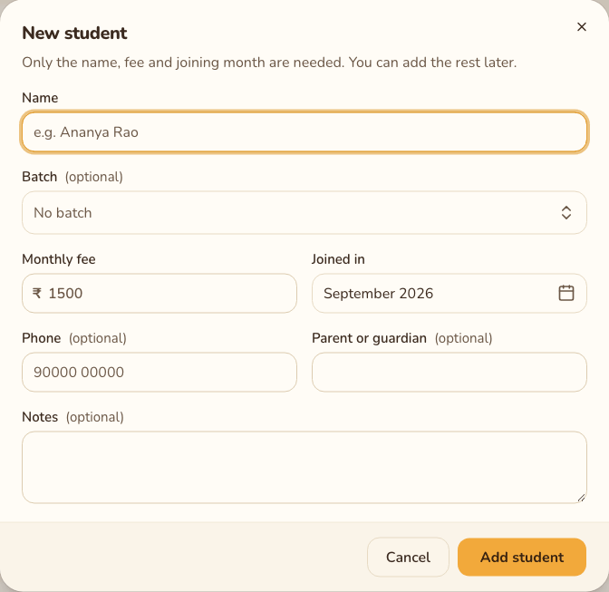

**New student** (*"Only the name, fee and joining month are needed. You can add the rest
later."*):

| Box | Needed? | Notes |
|---|---|---|
| **Name** | Yes | |
| **Batch** | No | The batch they're in, or **No batch** (see below) |
| **Monthly fee** | Yes | ₹0 is allowed (for a free place). Same typing rules as a payment amount, up to ₹10,00,000. Choosing a batch fills in its usual fee |
| **Joined in** | Yes | The first month they owe. Starts as this month; can be up to two years ahead |
| **Phone** | No | |
| **Parent or guardian** | No | |
| **Notes** | No | |

**Batch.** Click the box, or start typing: a list opens with **No batch** first, then every
batch with its days, times, place and usual fee (*Mon, Wed · 5:00–6:00 pm · Koramangala ·
₹1,500 a month*). Type part of a batch's name, place or day (*kora*, *sat*) to narrow it.

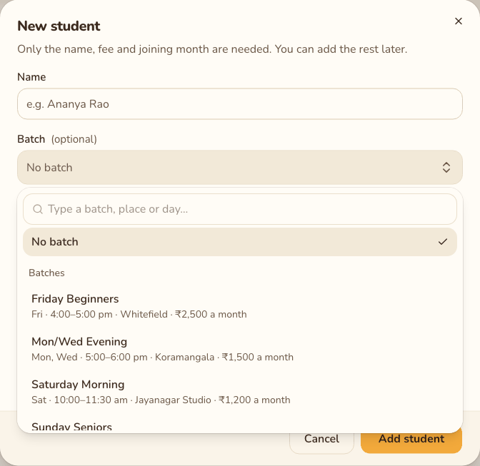

- For a **new** student, choosing a batch fills in the **Monthly fee** with the batch's usual
  fee, while the fee box is empty or still holds the fee the last batch filled in. A fee you
  typed is never replaced; the form says what the batch usually charges instead (*"Saturday
  Morning usually charges ₹1,200."*).
- **Add student** on a batch's tab opens this form with that batch chosen and its fee filled
  in:

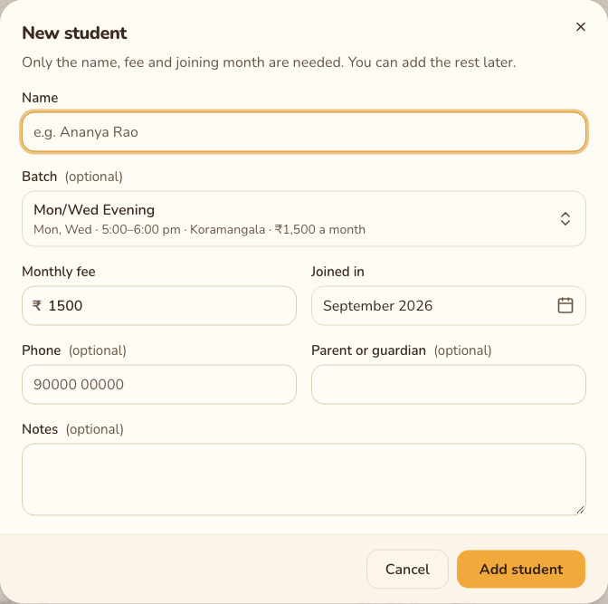

**Edit student** (*"Change any detail and save."*) has the same boxes, filled in, plus:

- **Batch** can be changed to move them to another batch (or **No batch**). Their fee stays as
  it is: if the new batch usually charges something else, the line under it says so (*"… usually
  charges ₹1,800. Their own fee stays as it is unless you change it."*).
- **Old class label** (only for someone who has one): the *Class or batch* text typed for them
  before batches, kept exactly as it was. The batch above is what counts; you can change or
  empty the label if you like.
- **Left in month** (optional): *"The last month they should pay for. Leave empty while they're
  still coming."* It shows **Still coming** when empty, and its calendar has a **Still coming**
  button to empty it again. Once their last month has passed, it can only be moved
  **earlier** here: later months are greyed out, the **Still coming** button isn't there, and
  the line says *"The last month they paid for. It can only move earlier here. Came back after
  all? Use Mark as coming again on their profile, then set a new Left month if needed."* That
  asks which month they're back from, so the months away aren't owed. If a new left month would
  make months away owed again, a box names them and asks for a tick first (see
  [Student profile](#student-profile)).
- **New fee applies from**: this appears, in a marigold box, as soon as you type a fee different
  from their current one. It's also there whenever they have a fee change that hasn't started
  yet (and once you've typed in the fee box, whenever they've had more than one fee), so you
  can set a fee from any month, even today's fee from a later month:

It starts on this month, and says in plain words what will happen, from their real fee
history:
- *"From September 2026 they'll owe ₹2,100 a month. Months before September 2026 don't
  change."*
- If a fee change is already set for a later month, the new fee lasts only until then:
  *"From September 2026 they'll owe ₹2,100 a month, until November 2026, when ₹2,000 (already
  scheduled) starts."* (In the picture, Kabir has a raise to ₹2,000 set for November.)
- If a fee is already set for the chosen month, it's replaced: *"It replaces the ₹2,000 already
  set for November 2026."*
- An earlier month changes past months too: *"… don't change, but the months since then do."*
- If the fee you typed is already their fee in the chosen month: *"That's already their fee in
  September 2026, so nothing changes."* Nothing is saved for the fee then.

### What you can do

**Add a student**
1. Go to **Students** and click **New student** (or, the first time, **New student** on the
   Dashboard).
2. Type their **Name** and **Monthly fee**.
3. Check **Joined in**. Change it if they started in another month.
4. Choose their **Batch** (the fee fills in), and anything else you like.
5. Click **Add student**. You'll see *"Ananya Rao added — ₹1,500 a month from September 2026"*.

**Put a student in a batch, or move them to another**
1. Open their profile and click **Edit**.
2. Choose the **Batch** (or **No batch**), and click **Save changes**. Their fee doesn't change.

**Change their details**
1. Open their profile and click **Edit**.
2. Change what you need.
3. Click **Save changes**. You'll see *"Changes saved"*.

**Change their fee from a certain month**
1. Open their profile and click **Edit**.
2. Type the new **Monthly fee**.
3. In **New fee applies from**, choose the first month of the new fee.
4. Read the sentence under it: it says from when, and until when if another fee is already set.
5. Click **Save changes**.

**Take back a fee change that hasn't started yet**
1. On their profile, find it in **Details → Fee history** (marked *not started yet*).
2. Click **Remove** next to it, and **Remove fee change** to confirm. See
   [Student profile](#student-profile).

**Set the month they leave** (the same as [Mark as left](#student-profile) on the profile)
1. Open their profile and click **Edit**.
2. In **Left in month**, choose the last month they should pay for.
3. Click **Save changes**.

**Say they're staying after all**
1. Before their last month has passed: on their profile, click **Mark as staying**. Or:
   **Edit**, open **Left in month**, click **Still coming**, and **Save changes**.
2. Once it has passed, click **Mark as coming again** on their profile instead. It asks which
   month they're back from (see [Student profile](#student-profile)).

### Good to know

- **Earlier months keep their fee.** The new fee applies from the "applies from" month until
  the next fee change you've already set for a later month, if there is one; that later change
  stays as it is, and the form's sentence names it. Their profile's *Details → Fee history*
  lists each fee and when it starts.
- Choosing an **earlier** month for a new fee changes those past months too. A month that was
  paid at the old fee then shows as **Partial** (if the fee went up); if it went down, the
  difference pays the oldest month still owed.
- Changing **Joined in** changes which months they owe. Moving it later than a payment makes
  all of that payment extra, so it pays the first month they owe; moving it earlier adds months
  they owe.
- **Joined in** can't move to or past a later fee change: *"The joined month can't be on or
  after a later fee change (April 2026). Change that fee first."*
- The form checks before saving and explains next to the box: *"Enter their name."*, *"Pick the
  month they joined."*, *"This can't be before the month they joined."*, *"The new fee can't
  start before the month they joined."*
- To cancel a raise you set for a later month, either **Remove** it from *Fee history* on the
  profile, or type today's fee here and choose that later month in **New fee applies from**.
- Months can be set at most two years ahead. Anything later is refused as a likely typo:
  *"… can't be later than September 2028 (two years from now)"*.
- You can't set a leaving month while adding a student; add them first, then **Edit**.

For developers

- **Components:** `frontend/src/components/student-form.tsx` (`StudentFormDialog` (with
  `batchId` for Add student on a batch's tab), `StudentForm`; `showFeeFrom` decides when
  "applies from" shows, `feeChanged` whether a fee change is sent; `prefill` fills in a batch's
  fee), `components/batches/batch-picker.tsx`, `lib/fees.ts` (`feeAt`, `newFeeSentence`: the sentence, from
  `fee_history`), `components/month-picker.tsx`, `lib/amount.ts`. Opened from
  `pages/students-page.tsx`, `pages/dashboard-page.tsx` (first run) and
  `pages/student-profile-page.tsx` (Edit).
- **API:** `POST /api/students` (`createStudent`); `PATCH /api/students/{id}`
  (`updateStudent`), sending only changed fields (`batch_id` to move them; a batch that no
  longer exists is a 422 on `batch_id`); `GET /api/batches` (`listBatches`) for the list; a fee change is `monthly_fee_paise` +
  `fee_effective_month`, sent only when the fee differs from the one in effect in that
  month; "Still coming" is `left_month: null` (not offered once `left_month` has passed). The
  current month comes from the student (`current_month`) or `useServerMonth()`
  (`getDashboard`).
- **Backend:** `services/students.create_student` (inserts the first fee change at
  `joined_month`), `update_student` and `set_fee_from` (upsert; nothing recorded if that fee is
  already in effect); limits in `services/bounds.py`. The edit rules are in
  [data model](data-model.md#api-all-under-api) ("Editing a student").
- **PRD:** stories S1, S2, S3; ledger rules 1, 2, 7 and 8.
- **Tests:** `frontend/src/pages/students-page.test.tsx` ("creates a student"),
  `pages/student-profile-page.test.tsx` ("changes the fee from a chosen month…", "with a fee
  change already scheduled", "doesn't offer "Still coming" in Edit once they have left", "shows
  the server's reason inline…", "marks a student as left"), `lib/fees.test.ts`;
  `backend/tests/test_api_students.py` (`test_patch_*`, `test_moving_joined_month_*`,
  `test_archive_and_unarchive`); `frontend/e2e/records.spec.ts` → "a new fee applies from the
  chosen month…", "a change the server refuses shows its reason next to the field";
  `frontend/e2e/fixes.spec.ts` → "a scheduled fee change shows in the message…", "a month off
  set in advance…".

---

## Student profile

### What it's for

Everything about one student in one place: whether they owe, month by month what was due and
what came in, every payment, and the buttons to edit, mark as left or delete them.

### What you'll see

**At the top:** **All students** (back to the list), their name, their **batch** (a link to the
batch's tab) with its days, times and place (or, for someone not in a batch, their old class
label), and a grey label
if they're leaving (**Leaving after September 2026**) or have left (**Left after May 2026**).

**The Balance card** is coloured by how they stand. The big headline is one of:

| Headline | Colour | When |
|---|---|---|
| **Owes ₹4,800 (Jun–Sep)** | Red | Some month up to this one isn't fully paid. The brackets say which: up to three months by name (*Jul, Aug*), a longer run as *Jun–Sep*, otherwise *(5 months)* |
| **Credit ₹500** | Teal | Nothing is owed, and ₹500 was paid that no month needs (every month they owe, up to when they leave or two years ahead, is paid) |
| **Up to date** | Green | Nothing owed, nothing extra |

Under the headline:
- a small teal note: **Paid ahead to Oct 2026** (every month up to then is paid in full;
  otherwise **Paid ahead ₹X**);
- one plain sentence: *"4 months not fully paid."*, *"Paid ₹500 more than every fee owed."*,
  *"Everything due is paid, and ahead to October 2026."* (a month with no fee in between
  doesn't stop the count) or *"Everything due so far has been paid."*;
- if a payment may be a slip of the finger (it pays 4 or more months ahead, or has money no
  month needs), an amber line for each, with the reason: *"Check: this ₹15,000 payment pays up
  to Jun 2027 — 9 months ahead"*, with **Edit payment**. (Money no month needs is shown in the
  credit box below instead.) Paying months still owed never gets one. If it's right, there's
  nothing to do;
- if they owe, an **Oldest unpaid** box (*June 2026 · ₹1,200 left*) with **Log payment**;
- if they have credit, a box **₹500 kept as credit** listing the payment it's in (*₹2,500 paid
  for Jul 2026, after they left · ₹500 of it not needed*), with **Edit payment**, and *"Extra
  money pays any month still owed first. Nothing is owed now for this to pay, so it's kept. If
  it was a mistake, change that payment."*;
- at the bottom, everything they've ever paid: *"₹8,400 paid in total, across 7 payments."*, or
  *"No payments yet."*

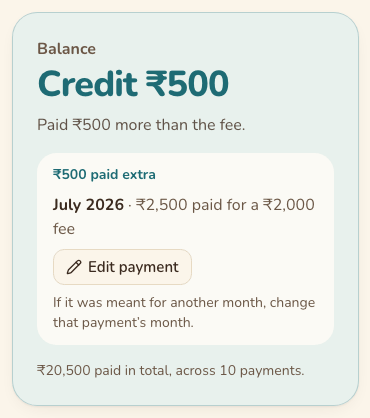

**The Details card:** **Monthly fee** (this month's, and the next one if it's already set:
*₹1,800, then ₹2,000 from November 2026*, or *No fee until December 2026, then ₹1,000*),
**Joined** (*October 2025 · member for 11 mo*, or *new this month*, *starts …*, or *left after
May 2026 (8 mo)*, counting both the first and the last month), **Fee history** (when their
fee has ever changed), **Batch** (a link to its tab, or *No batch*), **Old class label** (only
if one was typed before batches and it differs from the batch's name), **Phone**, **Parent or
guardian** and **Notes**
(*Not set* or *None* when empty).

**Fee history** lists every fee and the month it starts, oldest first. *No fee* is a ₹0 you
set (a month off, or a free place). **Away (no fee)** is the months away before they came back,
which the app writes and tidies up itself (if you change their left month, or they come back
again). A fee that starts after this month is marked *(not started yet)*, with a **Remove**
button, in case it was set by mistake or plans changed. Their first fee, and any fee that has
already started, can't be removed, so past months never change by accident. To undo a month
off that has already started, **Edit** and set their usual fee from that month. The fee they
came back on (the one right after *Away (no fee)*) has no **Remove** either: without it they'd
stay away for good. To change it, set a new fee with **Edit**.

**Month by month** (*"What was due each month, and what came in."*): one row per month, newest
first, from the month they joined to this month (and any later month they've paid ahead for,
directly or with extra money).

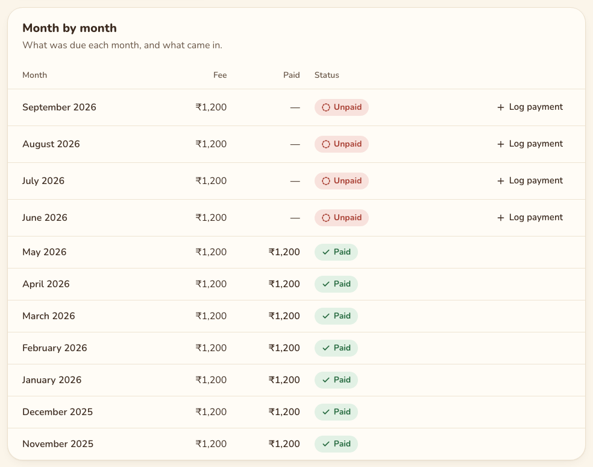

| Column | What it shows |
|---|---|
| **Month** | The month |
| **Fee** | The fee for that month (— if none was due) |
| **Paid** | Everything logged for that month, exactly as typed. A month paid only by another payment's extra shows it in teal, *₹1,500 (credit)*; one paid by both shows *+ ₹700 credit* under the amount; — if nothing |
| **Status** | A label (below), plus *₹600 left* for a part-paid month or *₹500 kept as credit*. Under it, a teal note for money that moved (see below) |
| *(button)* | **Log payment** on a month still owed; **Edit payment** on a month with money kept as credit |

**Extra money in the table.** When a payment is more than its month's fee, the extra pays the
oldest month still owed (see [extra money](#extra-money-pays-the-months-still-owed)), and both
months say so:
- the month it paid: **Paid** (or **Partial**, if it paid only part), with *₹2,000 credit from
  the 2 Sep 2026 payment (for Sep 2026)*: how much, which payment, and the month that payment
  was logged for (payments made the same day for the same month are added together). Its
  **Paid** column shows *₹2,000 (credit)* in teal;
- the month the payment was for: *₹2,000 extra → Aug 2026*, with months in a row as a range
  (*₹36,000 extra → Oct 2026 to Sep 2028*).

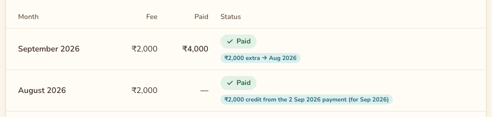

A payment for a month after they left, or while they were away, is all extra (no fee was due):
its month shows **No fee** with a note of where it went. If some of it wasn't needed by any
month, that month shows **Paid extra** with *₹500 kept as credit* and **Edit payment**:

The labels:
- **Paid** (green tick), **Partial** (amber), **Unpaid** (red): for this month and earlier,
  counting extra money from other payments (the note says which).
- **Paid extra** (teal +): some of the money logged for this month wasn't needed by any month,
  so it's kept as credit; the row is tinted teal.
- **Paid ahead** or **Part paid ahead** (teal ▸▸): a later month already paid (or partly), by a
  payment logged for it or by extra money, while they're still enrolled.
- **Not due yet** (grey): a later month not paid yet. It isn't owed.
- **No fee** (grey): a month with a ₹0 fee and nothing paid, such as a month off or the months
  away before they came back. It's never owed.

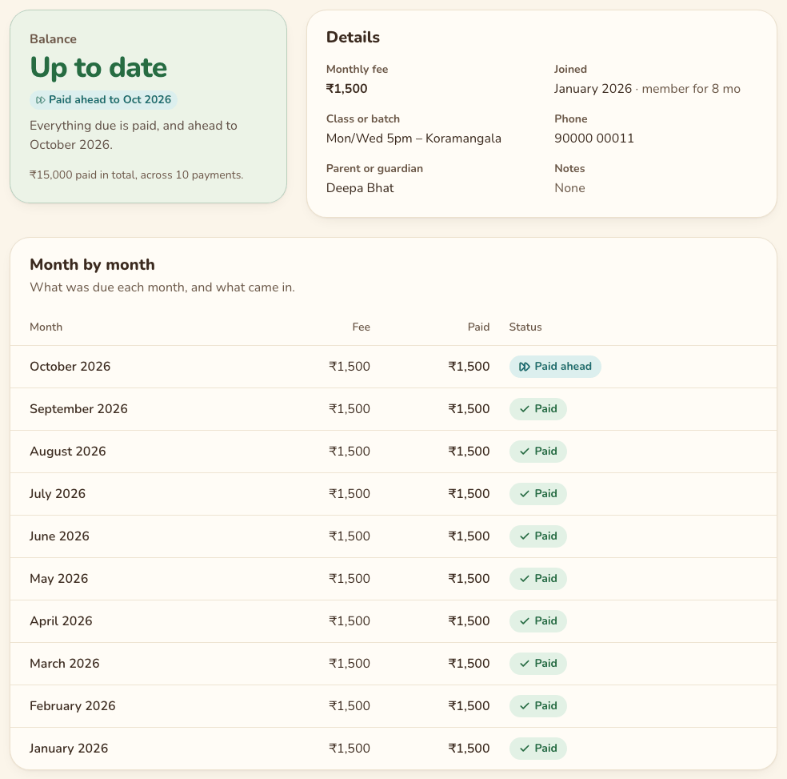

**Payments:** every payment from this student, with the same columns, sorting, total, **Edit**
and **Delete** as the [Payments page](#payments-page) (without the Student column). The number
by the heading is how many there are.

**The buttons at the top:**
- **Edit**: opens [Edit student](#new-student-and-edit-student).
- **Mark as left** (while they're coming), **Mark as staying** (marked as leaving, but that
  month hasn't passed) or **Mark as coming again** (after they've left; it asks which month
  they're back from).
- **Delete** (in red).
- **+ Log payment**, already filled in for this student.

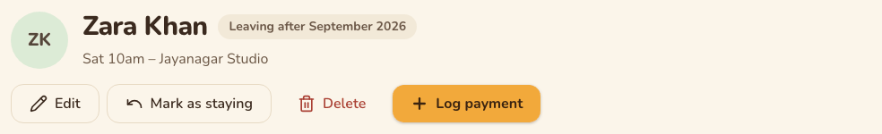

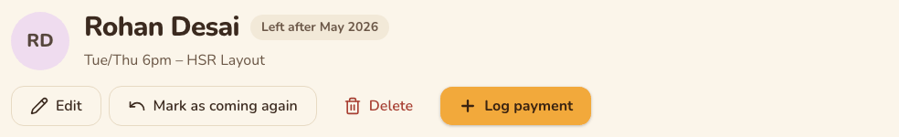

### What you can do

**Log a payment for them**
1. Click **+ Log payment** at the top (their next month is filled in), **Log payment** in the
   *Oldest unpaid* box, or **Log payment** on a month in *Month by month*.
2. Check the amount and click **Save payment**.

**Fix money kept as credit**
1. Click **Edit payment** next to that month (in the Balance card or in *Month by month*).
2. If there's one payment for that month, it opens straight away. If there are several, the
   *Payments* list below shows just that month's payments (click **Edit** on the right one; click
   **Show all** to see everything again).
3. Change the amount if it was typed wrong, and save.

Money above a fee that paid another month owed needs no fixing: nothing is wrong. (If it was
really meant for someone else, edit the payment's **Student**.)

**Mark them as left**
1. Click **Mark as left**.
2. Choose the **last month they should pay for** (this month is filled in).
3. If they came back once before and this month falls inside or before those months away, the
   box names them (*"April–June 2026 will be owed again…"*): tick **Yes, they owe those
   months** only if that's right.
4. Click **Mark as left**. You'll see *"Ananya Rao marked as left — Last month they pay for:
   September 2026"*.

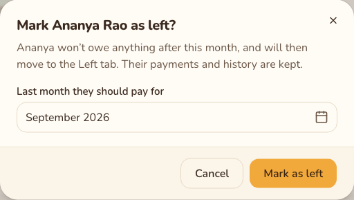

**Change your mind before they leave**
1. Click **Mark as staying** (their last month hasn't passed yet). They're a regular student
   again: *"… is staying"*.

**Mark them as coming again, after they've left**
1. Click **Mark as coming again**.
2. **Which month are they back from?** This month is filled in. You can pick any month after the
   one they left, up to two years ahead.
3. **Monthly fee from then** shows the fee they'll owe from that month: usually the fee they
   paid when they left (or a new fee you'd already set for a month while they were away).
   Change it if they're coming back on a different fee.
4. Read what will happen: the months away get **no fee**, so nothing is owed for them, and
   from the month they're back they owe that fee. If they had paid for a month while they were
   away, it says that payment will then be extra, and pay the oldest month they still owe (or
   their fee ahead). If you'd already set a month off for
   later, it names it and keeps it: *"No fee in November 2026 was set earlier, and stays. If
   that's wrong, remove it in Fee history afterwards."*
5. Click **Mark as coming again**. You'll see *"Rohan Desai is coming again — From September
   2026. Nothing is owed for June–August 2026."* Clicking twice still does it once.

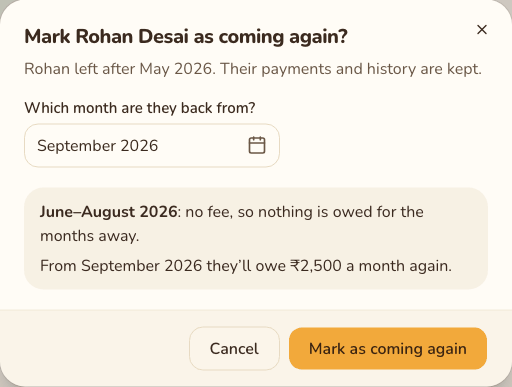

Afterwards, *Month by month* shows the months away as **No fee** (grey), never as unpaid, and
*Fee history* shows *Away (no fee) from Jun 2026* and their fee again from the month they're
back:

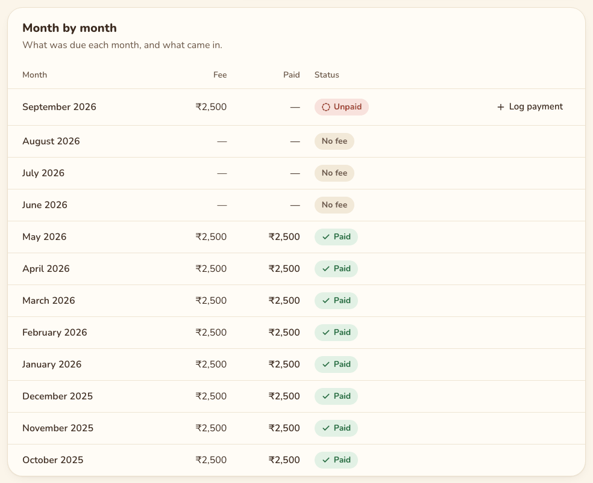

If you pick the month right after they left, nothing is skipped: every month counts, as if
they never left (use this if they were marked as left by mistake). If a month off you set
earlier is still to come, the box says so instead of "as if they never left".

**They came back after all, but left later than you'd set?** Once their last month has passed,
*Edit* only moves **Left in month** earlier. Instead: click **Mark as coming again** and pick
the month right after the one they left (so nothing is skipped), then click **Mark as left**
and choose their real last month.

**Setting a left month that makes months away owed again.** If they came back once, and the
left month you choose (in **Mark as left** or **Edit**) falls inside or before those months away,
the app says so before saving: *"April–June 2026 will be owed again, because they were marked
as away. Is that right?"* Tick **Yes, they owe those months** to go ahead (only if they really
were there then).

**Chose the wrong left month?** Say they left after March and came back in July (away April to
June), and you then marked them as left after May by mistake. To put it right:
1. **Edit** → **Left in month** → choose **March**, their real last month (an earlier month is
   always allowed), and save.
2. Click **Mark as coming again**, choose **July** (the month they came back), and save.

April to June are away again, with no fee, and nothing else changed. If you'd rather move the
left month later, the app refuses and gives these same steps.

If they come back in a later month, the profile's **Monthly fee** says so until then: *"No fee
until December 2026, then ₹1,000"*, and the Students page shows *No fee* with *₹1,000 from Dec
2026* under it.

**Remove a fee change that hasn't started yet**
1. In **Details → Fee history**, click **Remove** next to it.
2. The app says what their fee will be instead: *"After this, from November 2026 they'll owe
   ₹1,800 a month. Nothing else changes."* If removing it would leave them with no fee from then
   on (the fee that ends a month off, or the fee they come back on), it warns: *"After this,
   they'll have no fee from December 2026 onwards, with no end."*
3. Click **Remove fee change**. You'll see *"Fee change removed"*.

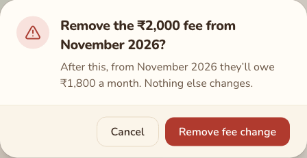

**Delete them** (only for someone added by mistake)
1. Click **Delete**.
2. The app says what will go with them: *"This also deletes 12 payments (₹18,000). This can't
   be undone."*, and suggests **Mark as left** instead if they've just stopped coming.
3. Click **Delete student** to confirm. You'll see *"… deleted"* and go back to the Students
   page.

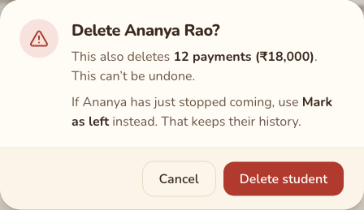

### Good to know

- **Owes always comes first.** If any due month is short, the headline says **Owes**, however
  much was paid ahead. Money paid above a fee pays the oldest month still owed first, so it
  never sits as credit while a month is owed. Payments themselves are always kept exactly as
  you typed them: the notes only show where their money counts.
- **Mark as coming again** never makes the months away owed: they get a ₹0 fee (**No fee**),
  and their fee carries on from the month they're back. It's usually the fee they paid when
  they left. If a new fee had already been set for a month while they were away, they come back
  on that one. A fee change already set for after they're back stays as it is.
- **Paid ahead is good news**, not a problem: nothing to fix.
- **Delete** removes the student and all their payments for good. **Mark as left** keeps
  everything, and is almost always what you want.
- Months after they left with nothing paid aren't listed in *Month by month*. A month after they
  left that *has* a payment is listed, with a note of where its money went (usually their last
  month owed).
- If a profile's address points at someone who was deleted, you'll see **Student not found**
  and a link to the Students page.

For developers

- **Route:** `/students/:id`.
- **Components:** `frontend/src/pages/student-profile-page.tsx` (`Profile`, `BalanceCard`,
  `DetailsCard`, `FeeHistory`, `MonthHistory`, `fixMonth`), `components/mark-left-dialog.tsx`,
  `components/come-back-dialog.tsx` (`ComeBackDialog`; the fee box starts from
  `lib/fees.ts` `returnFee`, which skips an earlier return's ₹0 months), `components/fee-now.tsx`
  ("No fee until …, then …", from `next_fee_change`),
  `components/confirm-dialog.tsx`, `components/payments-table.tsx` (`showStudent={false}`),
  `components/status.tsx` (`MonthStatusBadge`, `PaidAheadNote`, `CreditNote`),
  `lib/credit.ts` (`creditSourceText`, `extraSentText`), `lib/status.ts`, `lib/labels.ts`
  (`tenurePhrase`).
- **API:** `GET /api/students/{id}` (`getStudent`) → `StudentDetail` (`months[]`,
  `fee_history[]`, `payment_count`, `total_paid_paise`); `GET /api/payments?student_id=`
  (`listPayments`); `PATCH /api/students/{id}` (`updateStudent`) for Mark as left and Mark as
  staying (`left_month`); `POST /api/students/{id}/return` (`returnStudent`, body
  `{from_month}`) for Mark as coming again; `DELETE /api/students/{id}/fee-changes/{fee_change_id}`
  (`deleteFeeChange`) for Remove in Fee history; `DELETE /api/students/{id}`
  (`deleteStudent`).
- **Backend:** `services/students.get_student` / `student_detail` → `ledger.student_ledger`
  (`history_range`, `month_line`, `standing_status`, `owed`, `credit`, `paid_ahead`, all from
  `allocate`);
  `services/students.return_student` (one transaction that takes the write lock first,
  `app.db.lock_for_writing`, so a double click can't apply it twice: a ₹0 fee change after
  `left_month`,
  the gap's fee changes removed, the fee carried on from `from_month`, `left_month` cleared;
  see [data model](data-model.md#coming-back-after-leaving)), `delete_fee_change` (never the
  first fee, never one that has started), `delete_student` (payments cascade).
- **Display rules:** the headline comes from `status` + `owed_paise` / `credit_paise`, never
  `balance_paise`. "Paid ahead to …" is the last contiguous fully-paid month after the current
  one, before `left_month`. The notes come from `credit_sources` and `extra_sent`; the credit
  box and **Edit payment** from `extra_unused_paise`. A month after `left_month` with a payment
  counts as due for the badge (`afterLeft`).
- **PRD:** stories S2, S3, S4, S5, S6; ledger rules 4, 5, 6, 7, 10 and 11.
- **Tests:** `frontend/src/pages/student-profile-page.test.tsx` ("Mark as coming again", "lists
  the fee history and removes a scheduled change…", "can come back on a different fee…"),
  `lib/fees.test.ts` (`returnFee`); `backend/tests/test_api_fee_schedule.py`,
  `test_api_fee_schedule_edges.py` (leaving and coming back twice, two clicks at once, a
  clash is a 409);
  `frontend/e2e/fixes.spec.ts` → "coming back after leaving asks the month…", "a scheduled fee
  change shows in the message and can be removed…";
  `backend/tests/test_api_students.py` (`test_detail_ledger_with_payments`,
  `test_balance_status_credit`, `test_delete_cascades_to_payments`); `test_ledger.py`
  (`test_paying_ahead_never_hides_months_owed`, `test_paying_a_month_twice_pays_the_month_missed`,
  `test_a_payment_for_a_month_after_leaving_pays_what_is_owed_never_paid_ahead`);
  `test_allocation.py` (every case of the rule, and property tests);
  `pages/student-profile-page.test.tsx` ("uses a payment for two months to pay the month
  missed…", "shows extra money no month needed as credit…"); `frontend/e2e/records.spec.ts` →
  "money paid too much pays the next month owed…", "deleting a student asks first…", "a month
  paid twice instead of the next one pays the month missed", "moving the joined month past a
  payment uses it for the first month owed", "a payment for a month after leaving pays the month
  owed…"; `frontend/e2e/credit.spec.ts`.

---

## Downloading and uploading Excel

### What it's for

Taking your records out of the app as an Excel file (to keep a copy, to send to someone, or to
move to a new laptop), and bringing students and payments in from an Excel file (a list you
kept before, or a file downloaded from this app) without typing them in one by one.

### What you'll see

**Download Excel** and **Upload Excel**, under the title of the **Students** and **Payments**
pages (and, on Students, **Download everything**):

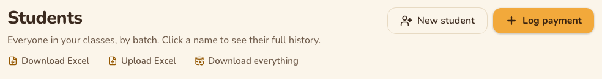

**Download everything**, under *Your data* at the bottom of the side menu (see
[Getting around](#getting-around)).

**The Upload Excel box.** It opens with a place to drop the file, a **Choose a file** button,
and a **Download a blank template** link:

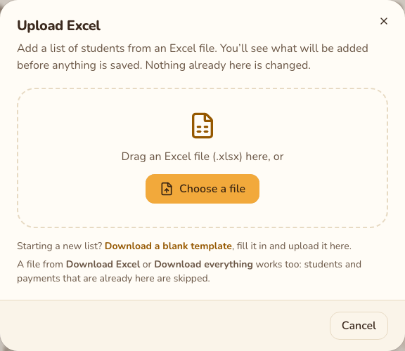

**The preview.** Once you've chosen a file, the box shows what adding it *would* do, row by
row. **Nothing is saved yet.**

![The preview of new-students-september.xlsx: 'Will add 2 students and 2 payments. 2 payments will be kept as unassigned, to give to a student later. 1 already exists and will be skipped. 2 need you to choose. 1 has a problem and will be skipped.' Tabs All rows, To choose (2), Skipped (2). A Students table with Row, Name, Phone, Monthly fee, Joined and What happens: Ananya Rao 'Already exists', Kiara Sethi and Rahul Iyer 'New', Meera Iyer 'Looks similar: Same name as Meera Iyer (90000 00003), but a different phone' with a Skip choice, and Tara Menon 'Problem: Monthly fee is missing'. Buttons Choose another file, Cancel and Add.](images/feature-guide/excel-upload-preview.png)

- **The summary** at the top says it in one go, for example *"Will add 12 students and 140
  payments. 3 already exist and will be skipped. 2 need you to choose."* It changes as you make
  choices.
- **All rows**, **To choose** and **Skipped** show every row, only the rows that need a choice
  from you, or only the rows that will be left out.
- **Students** (row number, name, phone, monthly fee, joined month) and **Payments** (row
  number, the student as written, amount and method, paid on, for month), each with **What
  happens**: a coloured label, why, and a choice where one is needed.

**What each label means, for a student:**

| Label | Colour | Why | What happens |
|---|---|---|---|
| **New** | Green | Nobody like them is in the app yet | Added |
| **Already exists** | Grey | Someone with the same name and phone is already in the app (or the same name, and neither has a phone), or it repeats an earlier row of the file. It says who: *"Already here: Ananya Rao (90000 00001)"* | Skipped. Nothing about the student already here is changed |
| **Looks similar** | Amber | The same name but a different phone, the same phone but a different name, a name a letter or two apart (*Ananyaa Rao* and *Ananya Rao*) or shortened (*Ananya R*), as someone already here or an earlier row of the file; or more than one student here has this name and phone (the app never picks one for you); or an earlier row has the same name and neither has a phone; or the row has someone's Student ID but another name or phone (a row copied in Excel with a new name typed in: **Add as new** makes them a new student, with an ID of their own) | You choose: **Skip** (already chosen for you) or **Add as new**. When it's only the same phone as an earlier row of the file (*"perhaps a brother or sister"*), **Add as new** is chosen for you |
| **Problem** | Red | Something in the row can't be used. The reason says what, such as *"Monthly fee is missing"* or *"Joined month “13/2026” isn't a month"* | Skipped. Fix it in the file and upload it again: the rows already added then show as *Already exists* |

**…and for a payment:**

| Label | Colour | Why | What happens |
|---|---|---|---|
| **Will be added** | Green | Its student was found (*To Ananya Rao*), or is a new student in the same file (*To Kiara Sethi (new, row 3)*) | Added |
| **Needs a student** | Amber | No student has that name, more than one does, it has someone's Student ID but a different name, or it has someone's phone but a different name (*"Same phone as Kabir Mehta, but the name is “Sunil Mehta”"*: perhaps a parent). A payment only goes to a student by itself when the name matches, or when the row has just a phone number | You choose: **Keep as unassigned** (already chosen), **Skip**, or who paid: the likely students are listed first, and **Another student…** lets you search |
| **Goes with its student** | Amber | Its student is a *Looks similar* row in the same file | Added to them if you choose **Add as new** for that row; otherwise kept as unassigned |
| **Unassigned** | Grey | From the *Unassigned payments* sheet of a **Download everything** file | Kept as unassigned (you can still pick a student) |
| **Already exists** | Grey | That student already has exactly this payment (the same amount, day, month, method and note), or an earlier row of the file does | Skipped. Choose **Add anyway** if it really was paid twice (two instalments on one day) |
| **Possible duplicate** | Amber | The same amount, day and month for that student as a payment already here (or an earlier row), but paid another way or with another note | Skipped unless you choose **Add anyway** |
| **Problem** | Red | Something can't be used, such as *"Paid-on date can't be in the future"* | Skipped |

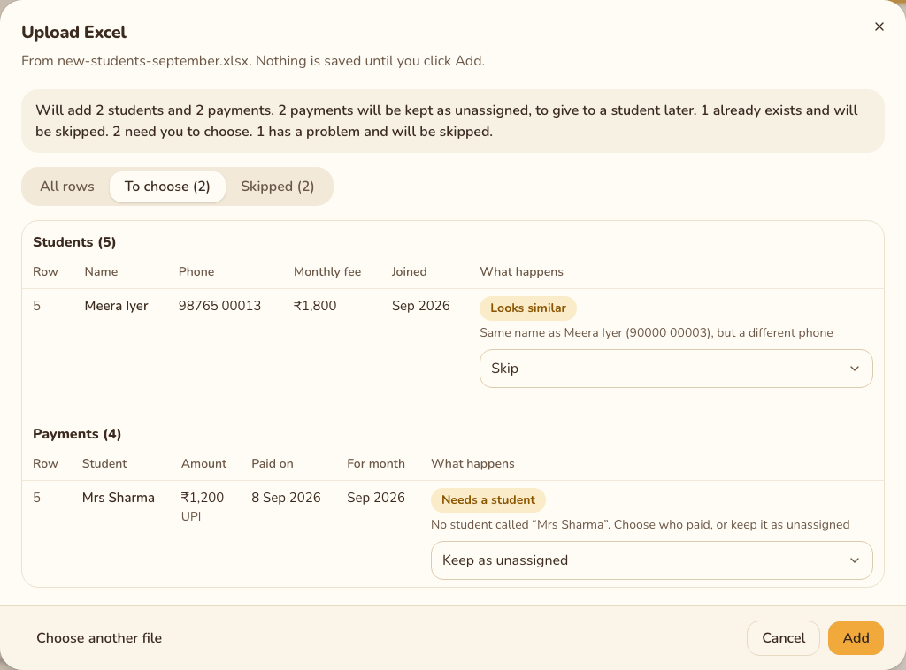

*Unassigned* payments wait at the top of the Payments page until you say whose they are: see
[Unassigned payments](#unassigned-payments).

**Batches in an upload.** A **Batch** column (or *Class/batch*, *Class*, *Group*) on a students
sheet puts each new student in the batch of that name, ignoring capitals and spaces. The
preview lists every batch the file names, under **Batches**:

| Label | What happens |
|---|---|
| **Will be added** | From the file's **Batches** sheet (a Download everything file), and not in the app yet: added, with its details |
| **Already here** | Its students go into it. The batch itself isn't changed |
| **Batch not found, will be left without a batch** | Only named in the Batch column, and not in the app: those students are added without a batch, and the name is kept in their *old class label* (next to any old label the row has: *"Wednesday Club · Wed 5pm"*). Tick **Create it** to add the batch (just its name) and put them in it. It's never created unless you tick it, and only offered when a student being added goes in it |
| **Problem** | A Batches sheet row that can't be used (*"Days “Someday” isn't a list of days"*, or a batch listed twice) |

Names match ignoring capitals, spaces, hyphens and punctuation: *SUNDAY-SENIORS* finds
*Sunday Seniors*. Students who are already in the app are never moved to another batch by an
upload.

**Afterwards**, a message says what was added:

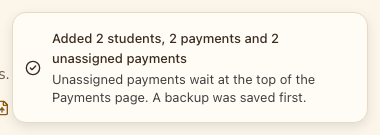

### What you can do

**Download what's on the page**
1. Go to **Students** or **Payments**, and choose the tab, search or filters you want. (On
   Payments you can also click a column heading to sort.)
2. Click **Download Excel**. The file goes to your *Downloads* folder, named like
   `scrappy-records-students-2026-09-15.xlsx`.

It has exactly the students or payments the page shows, in the same order:
- Students: *Name, Phone, Parent/guardian, Batch, Old class label, Monthly fee ₹ (current),
  Joined (month), Left (month), Status, Owes ₹, Notes*. On a batch's tab it has just that
  batch's students (on **No batch**, those in none).
- Payments: *Student, Phone, Amount ₹, Paid on, For month, Method, Note*.

**Download everything**
1. Click **Download everything**: under the title of the **Students** page, or at the bottom
   of the side menu.
2. One file, `scrappy-records-everything-2026-09-15.xlsx`, with five sheets: **Students** (with
   each student's **Batch**), **Batches** (each batch's name, location, days, start and end
   times, usual fee and notes), **Fee history** (every fee each student has had, months away
   included), **Payments** and **Unassigned payments**.

The grey **Student ID (for restoring)** column links the sheets together, and stays with each
student for good. Leave it as it is: uploading this file into an empty app brings back every
record exactly, every Dashboard number included. Two students with the same name (or brothers
and sisters sharing a phone) stay two students, because their IDs are different, and two
identical payments on one day both come back. The batches come back too, with every detail,
and each student in theirs. Uploading it again later (into this app, or the one it was restored
into) finds every student by that ID, even if their phone has changed since, and adds nothing
twice.

**Upload a file**
1. On **Students** or **Payments**, click **Upload Excel**. (Either page takes both students
   and payments.)
2. Click **Choose a file** and pick an Excel file (`.xlsx`), or drag it onto the box.
3. Read the summary, and look through the rows. **To choose** shows only the ones that need
   you.
4. For each **Looks similar** student, **Needs a student** payment and **Possible duplicate**,
   choose what to do, or leave what's already chosen.
5. Click **Add**. Or click **Cancel** (or **Choose another file**): nothing is saved.

**Start a list from a blank template**
1. In the Upload Excel box, click **Download a blank template**. (On Students it's a students
   list; on Payments, a payments list.)
2. Fill in one student (or payment) per row, under the headings. The second sheet, *How to fill
   this in*, explains each column. For **Batch**, write the name of one of your batches.
3. Save it, and upload it as above.

### Good to know

- **An upload only adds.** It never changes or overwrites anything already in the app.
- **Uploaded payments count like any other:** money above a month's fee pays the oldest month
  still owed, and the profile and Dashboard say so (*"₹1,500 credit from the … payment"*).
- **Uploading the same file twice is safe:** everything that was added the first time shows as
  *Already exists*.
- **A backup is saved just before anything is added** (`records-pre-import-…` in your backups
  folder). To undo a whole upload, see [backups](runbooks/backup-and-restore.md#undo-an-excel-upload).
- **The headings it understands** (capitals don't matter, and they can be under a title row):
  *Name* or *Student*; *Fee* or *Monthly fee*; *Joined*; *Left*; *Phone* or *Mobile*;
  *Parent/guardian*; *Class/batch*; *Notes*; *Amount*; *Date* or *Paid on*; *Month* or *For
  month*; *Method* or *Mode*; *Note*.
- **Dates** can be real dates, or written like *5 Oct 2026* or *05/10/2026*: **day first**, as
  in India, so 05/10/2026 is 5 October (a time after it, like *10:30*, is ignored). **Months**
  like *Oct 2026*, *October 2026*, *2026-10* or *10/26*. **Money** like *1500*, *₹1,500* or
  *1500/-*. Two numbers in one cell (*₹500 700*) is a **Problem**, never ₹5,00,700.
- **A list of payments with headings like** *Name, Date, Fees, Mode* is read as payments (a
  date or a payment method means payments), with *Fees* as the amount.
- **Hidden sheets aren't read**, and the preview names them. Show them in Excel first to add
  them. **Merged cells** count on every row they cover (a name merged down three rows is the
  name for all three).
- A payment with no month counts for the month it was paid in. A payment with no method (or
  one the app doesn't know, like *Cheque*) is **Other**; *GPay*, *PhonePe* and *Paytm* are
  **UPI**. A student with no joined month joins this month.
- **Names match however they're written:** capitals, accents, apostrophes and word order don't
  matter (*rao ananya* is Ananya Rao), a hyphen counts as a space (*Mary-Jane* is *Mary Jane*),
  and phone numbers match with or without spaces or *+91*.
- **The same rules as typing it in:** a fee or payment of at most ₹10,00,000, no month more
  than two years ahead, no paid-on date in the future.
- **Up to 5 MB, and 5,000 rows a sheet** for a list you made. A **Download everything** file
  just has to be under 5 MB (years of records are). A long file lists every row that needs a
  choice from you and the first few of the rest; the summary counts them all.
- **A list of students with a date** (*Name, Mobile, Fee, Date*) is read as students. A list
  with an amount or a payment method, or a date and no phone, is read as payments.
- **An older download uploaded again** adds nothing that's already here, even if a phone number
  has changed since.
- **Add adds exactly the file you saw.** If the file is changed (or saved again) after the
  preview, the app notices and asks you to upload it again.
- Only Excel workbooks (`.xlsx`). An old-style `.xls` file: open it in Excel, choose **File →
  Save As → Excel Workbook**, and upload that. Google Sheets: **File → Download → Microsoft
  Excel**.
- The downloaded files are ordinary Excel workbooks (`.xlsx`). Dates are real dates,
  amounts have a ₹ sign, and the headings stay in view as you scroll.

For developers

- **Components:** `frontend/src/components/excel-buttons.tsx` (the two buttons under the
  title), `components/excel-upload-dialog.tsx` (pick, preview, choices, Add), `lib/upload.ts`
  (the summary's counts and sentences), `lib/downloads.ts` (the download links: what the page
  shows), `components/layout/app-shell.tsx` (*Your data*). The file is sent as the request
  body, as it is (`usePreviewImport`).
- **API:** `GET /api/export/students.xlsx` (`exportStudents`), `GET /api/export/payments.xlsx`
  (`exportPayments`), `GET /api/export/everything.xlsx` (`exportEverything`),
  `GET /api/import/template.xlsx` (`importTemplate`), `POST /api/import/preview`
  (`previewImport`), `POST /api/import/commit` (`commitImport`). The rules are in the
  [data model](data-model.md#excel-download-and-upload).
- **Backend:** `routers/excel.py` → `services/exports.py` (downloads, `openpyxl`),
  `services/spreadsheet.py` (reading a file: headings, dates, months, ₹), `services/imports.py`
  (classify, preview, and `commit`: checked again, `backup("pre-import")`, one transaction),
  `services/text.py` (`name_key`, `phone_digits`, `student_matches`: the Students search, in
  Python), `services/matching.py` (indexes by name, phone, word and near-miss name, so
  thousands of rows take seconds).
- **PRD:** scope item 7; stories X1 and X2.
- **Tests:** `backend/tests/test_excel_import.py` (every status, duplicates, checked again,
  rollback, the backup, bad files), `test_excel_export.py` (the round trip into an empty app,
  what each download holds, and look-alikes kept apart on a restore), `test_excel_review.py`
  (stale sheet sizes, hidden sheets, merged cells, near-miss names, possible duplicates, speed),
  `test_spreadsheet_cells.py` (cells, and the matcher against `search.test.ts`'s examples),
  `test_fuzz_excel.py`;
  `frontend/src/components/excel-upload-dialog.test.tsx`, `lib/downloads.test.ts`;
  `frontend/e2e/excel.spec.ts`.

---

## Unassigned payments

### What it's for

Keeping every payment from an uploaded file, even when the app can't tell which student paid,
until you say whose it is. Nothing is lost, and nothing is counted for the wrong person.

### What you'll see

**At the top of the Payments page**, only while there are any:

Each one shows the name (and phone) **as written in the file**, the amount, the month it's for,
the day it was paid, how, any note, which file it came from, and *Maybe: …* when some students
look likely. Beside it: a box to choose the student, **Assign** and **Delete**.

**On the Dashboard**, a line at the top while any are waiting, with a link to them:

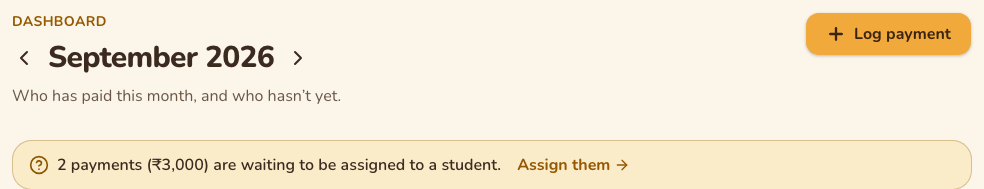

### What you can do

**Give a payment to a student**
1. Click **Choose the student**. The likely ones are at the top, under *Likely*. Type to find
   anyone else.
2. Click **Assign**. It becomes that student's payment (*"Payment assigned"*), and their
   profile, the Payments list and the Dashboard count it straight away.

If that student already has the same payment (the same amount, paid on the same day, for the
same month), the app says so and keeps it here. It's probably the same one: delete this copy.
If they really paid twice, log the second one with **+ Log payment**, then delete this one.

**Delete one**
1. Click **Delete**. The app asks first, and says exactly which payment will go.
2. Click **Delete payment**.

### Good to know

- **Unassigned payments count nowhere:** not in any student's balance, and not in the
  Dashboard's *Collected* or *Still due*. Once assigned, they count like any other payment
  (extra money in one pays the oldest month still owed).
- **Download everything** includes them (the *Unassigned payments* sheet), so they come back
  after moving to a new laptop.
- **The monthly report** says how much for its month is still waiting, in a line under
  *Collected* (and in its printout and Excel file).
- Uploading the same file again doesn't add them twice.
- They only come from uploads. A payment typed in with **+ Log payment** always has a student.

For developers

- **Components:** `frontend/src/components/unassigned-payments.tsx` (the section, on
  `pages/payments-page.tsx`), `components/unassigned-banner.tsx` (on the Dashboard),
  `components/student-combobox.tsx` (`suggestedIds`: the *Likely* group).
- **API:** `GET /api/unassigned-payments` (`listUnassignedPayments`, with
  `suggested_student_ids`), `POST /api/unassigned-payments/{id}/assign`
  (`assignUnassignedPayment`), `DELETE /api/unassigned-payments/{id}`
  (`deleteUnassignedPayment`).
- **Backend:** `routers/unassigned.py` → `services/unassigned.py`. Assigning takes the write
  lock, checks for the same payment, adds it and deletes the unassigned row in one transaction.
  The table is `unassigned_payments` (migration `0003`, added only); the ledger never reads it.
- **PRD:** story X3.
- **Tests:** `backend/tests/test_unassigned.py`, `test_migration_unassigned.py`;
  `frontend/src/components/unassigned-payments.test.tsx`; `frontend/e2e/excel.spec.ts` → "a
  payment for someone not found waits as unassigned, then is given to a student".

---

## What the words and colours mean

The same word always has the same colour, everywhere in the app.

| Word | Colour | Where you'll see it | Exactly when |
|---|---|---|---|
| **Paid** | Green, with a tick (no tick on the Monthly report) | Profile, *Month by month*; Monthly report *Status* | This month or an earlier one, and the whole fee is paid: by payments for it, by extra money from another payment (a teal note says which), or both. On the Monthly report, **Paid** means paid by money logged for that month, and it's also used for a later month paid ahead in full |
| **Paid (from extra)** | Green | Monthly report *Status* | The whole fee is paid, and some of it came from money paid above the fee in another month (the *Paid from another payment's extra* column says which payment) |
| **Partial** | Amber | Dashboard *Yet to pay*; *Earlier months still owed* (as "· part paid"); profile; Monthly report | This month or an earlier one, and some but not all of the fee is paid |
| **Unpaid** | Muted red | Dashboard *Yet to pay*; *Earlier months still owed* (a red month label); profile; Monthly report | This month or an earlier one, a fee was due, and nothing pays it |
| **Short** | Red (Unpaid) or amber (Partial) amount | Monthly report column | What's still left to pay for that month |
| **Owes anything** / **Still owes for … or earlier** / **Short this month** | — (a list choice) | Monthly report | *Owes anything*: owes money today for any month, the list to chase. On an earlier month's report it's *Still owes for Aug 2026 or earlier*: still owes for that month or before it. *Short this month*: something left to pay for the month at the top |
| **Kept as credit** | Teal | Monthly report, profile, Dashboard | Money paid that no month needs (every month owed is already paid). Only this is called credit on the Monthly report; money that paid another month is "extra" |
| **Total owed now** | Muted red amount | Monthly report column | Everything they owe today, all months together: the same as **Owes ₹X** |
| **… credit from the … payment (for …)** | Teal note | Profile *Month by month*; the Log payment form | Extra money from another month's payment that pays this month: "₹2,000 credit from the 2 Sep 2026 payment (for Sep 2026)" |
| **… extra → …** | Teal note | Profile *Month by month* | Where this month's money above its fee went: "₹2,000 extra → Aug 2026" |
| **… went to …** | Teal line | Payments page and the profile's *Payments*; "Now: …" in Edit payment | Where a payment's money above its month's fee went: "₹2,000 went to Aug 2026" |
| **Extra money used** | Teal arrow (→ Aug 2026) | The Dashboard section of that name | Money that paid a different month than it was logged for, into or out of the month you're looking at |
| **Check: this ₹X payment …** | Amber | Profile Balance card; Dashboard *Extra money used* | A payment that pays 4 or more months ahead, or has money no month needs, with the reason ("pays up to Jun 2027 — 9 months ahead", "₹500 isn't needed by any month"): worth a glance in case of a typo. Paying months owed never gets one. Nothing to do if it's right |
| **Overpaid** | — | Not shown as a word. The app says **Paid extra** or **kept as credit** instead | Some of a month's money wasn't needed by any month (the rules' name for it) |
| **Paid extra** | Teal, with a + | Profile *Month by month* | A month holding money that no month needed: it's kept as credit (the row also says "₹500 kept as credit") |
| **Extra kept as credit** | Teal amounts (+₹500) | The Dashboard section of that name (shown only when there is some) | Every month holding credit, up to the one you're looking at |
| **Paid ahead** | Teal, with ▸▸ | Profile *Month by month* and Balance card ("Paid ahead to Oct 2026"); Students page ("Paid ahead ₹1,500"); the Dashboard's second box for a later month | A month that hasn't started yet, already paid while they're still enrolled then: by a payment for it, or by extra money once every month due is paid. **Part paid ahead** means only part of that month's fee |
| **Owes ₹X** | Muted red | Students page *Status*; profile Balance headline | Any month up to this one is Unpaid or Partial. ₹X is what's left on all of them |
| **Credit ₹X** | Teal | Students page; profile Balance headline | Nothing is owed, and ₹X was paid that no month needs: every month they owe, up to when they leave (or two years ahead), is already paid. Usually someone who left and paid a little extra |
| **Up to date** | Green, with a tick | Students page; profile Balance headline | Nothing owed and nothing extra |
| **Not due yet** | Grey | Profile *Month by month*; Dashboard for a later month (labels and the third box); Monthly report for a later month | A month that hasn't started, not paid yet (on the Monthly report: not fully paid ahead yet). Nothing is owed until it comes |
| **No fee** | Grey | Profile *Month by month* and *Fee history*; Monthly report | A month whose fee is ₹0, with nothing paid: a free place, a month off, or the months away before they came back. Never owed. On the Monthly report, the line under it can say **Away** or **Not joined yet** |
| **Active** | — (a *Show* choice) | Students page | Still coming: no leaving month, or it's this month or later |
| **Left** | Grey | Students page (*Show: Left*); "Left May 2026" under *Member for*; "Left after May 2026" on the profile; the **Left** group when choosing a student; Monthly report *Status* | Their last month has passed. They owe nothing after it, and their history is kept. On the Monthly report ("Left", with "after May 2026" under it): they had left by that month, and are listed because they still owe, have credit, or money was paid for that month |
| **—** | Grey | Monthly report, and the Dashboard's last box for a month with nobody in it | Nothing: ₹0, or no number to show |
| **Leaving after …** | Grey | Profile label; under *Member for* | They've been marked as leaving, and that last month hasn't passed yet. They still show as Active |
| **New this month** | — (plain text) | Students page *Member for*; profile *Joined* ("new this month") | They joined this month |
| **Starts …** | — (plain text) | Students page *Member for*; profile *Joined* | They join in a later month |
| **Batch** | — | Students page tabs, cards and table; profile; student form; Log payment | A class students come to (a name, and optionally a place, days, times and a usual fee). Each student is in one batch or none |
| **No batch** | — (a tab) | Students page | Students who aren't in a batch yet |
| **Usual fee** | — | Batch tab and form; the student form's batch list | A batch's usual monthly fee: it fills in the fee of a new student in the batch. It never changes anyone's own fee by itself |
| **% paid** | Marigold bar; **green at 100%** | Batch cards and a batch's tab | How much of that month's fees in the batch is paid: *₹8,550 of ₹10,800 paid*, 79%. 100% only when every fee in it is paid in full |
| **Old class label** | — | Profile; Edit student; Excel | The *Class or batch* text typed for a student before batches existed, kept as it was (also a batch name an upload didn't find) |
| **Batch not found** | Amber | The Upload Excel preview | A batch named in the file that isn't in the app: those students come in without a batch unless you tick **Create it** |
| **Unassigned** | Amber (the section and the Dashboard line) | Top of the Payments page; the Dashboard; the upload preview | A payment from an uploaded file whose student wasn't clear. Counted for no one until you give it to a student |
| **New**, **Already exists**, **Looks similar**, **Problem**, **Will be added**, **Needs a student** | Green, grey, amber, red | The Upload Excel preview | What adding that row would do: see [the tables](#downloading-and-uploading-excel) |

**The colours themselves:** green for paid, amber for partly paid, a soft muted red for owed,
teal for extra or ahead, and grey for anything not due. Marigold is the app's own colour, used
for the main buttons and highlights, never for a status.

**The hints in the Log payment form** (*Oldest unpaid*, *Due now*, *All paid up*) are explained
in [Log payment](#log-payment-and-edit-payment).

---

## Everyday situations

### A new student joins

1. Go to **Students** and click **New student**.
2. Type their **Name** and **Monthly fee**. **Joined in** is this month; change it if they
   started earlier.
3. Choose their **Batch** (its usual fee fills in; change it for a discount). Add their phone
   and parent's name if you like.
4. Click **Add student**. They now appear in the Dashboard's *Yet to pay* for their first month.

Quicker, if you know their batch: open the batch's tab on the Students page and click **Add
student**: the batch and its fee are already filled in.

### A parent pays by UPI or cash

1. Click **+ Log payment** (or **Log payment** next to the student in the Dashboard's *Yet to
   pay*).
2. Type the student's name and press **Enter** (skip this if it's already filled in).
3. Check the **Amount** and **For month**. The form picks the oldest month they owe.
4. Click **UPI** or **Cash**.
5. Press **Enter** (or click **Save payment**). Made a slip? Click **Undo** in the message at
   the top.

### A parent pays for two months at once

Just **log it once**, with the whole amount:
1. Click **Log payment** as usual. Leave **For month** on the month the form suggests (or the
   month they said it's for).
2. Type the whole amount, for example ₹3,000 for two ₹1,500 months. The teal line under it
   says where the extra goes: *"₹1,500 more than the September fee: it will pay August 2026
   (unpaid)."*
3. Click **Save payment**.

Both months now show **Paid**; the one paid with the extra says which payment it came from. See
[extra money](#extra-money-pays-the-months-still-owed) below.

### Extra money pays the months still owed

Whenever a payment is more than what's left of its month's fee, the extra isn't lost and
doesn't need fixing:

1. The payment first pays **the month it was logged for**.
2. The extra pays **the oldest month still owed**, then the next, and so on, whether those
   months are before or after the month it was logged for.
3. When nothing is owed any more, it pays **later months ahead** (up to when they leave, or
   two years ahead): **Paid ahead**.
4. Anything still left is kept as **credit** (*Credit ₹X*): nothing needs it.

Months with no fee (a month off, the months away) are skipped. If a student made several such
payments, the one paid first is used first.

Nothing you typed is changed: the payment still shows the amount and month you logged it with.
The app works this out again every time, so if you edit or delete that payment, the months it
paid change straight away. You can always see where the money went: the month it paid says
*"₹1,500 credit from the 5 Sep 2026 payment (for Sep 2026)"*, the month it was for says
*"₹1,500 extra → Aug 2026"*, the payment says *"₹1,500 went to Aug 2026"*, and the Dashboard
lists it under **Extra money used**.

A payment logged for a *later* month pays that month (up to its fee) before anything else: it
never pays an older month unless it's more than that month's fee.

### A parent pays part now and part later

1. Log what they paid now, for that month. The month shows **Partial**, and the student stays
   in *Yet to pay* with what's left (*₹750 left, ₹750 of ₹1,500 paid*).
2. When they pay the rest, click **Log payment** on their row. The rest is filled in.
3. Click **Save payment**. The month is now **Paid**, and they leave the list.

Tip: a **Note** such as *"Balance after the 15th"* helps you remember.

### I typed the wrong month or amount

- **Just now?** Click **Undo** in the *"Payment saved"* message (it stays for 10 seconds), and
  log it again.
- **Later?**
  1. Go to **Payments**, find it (search the name, or choose the month), and click **Edit**.
  2. Fix the **Amount** or **For month**.
  3. Click **Save changes**.

### A payment was logged against the wrong student

1. Go to **Payments**, find the payment and click **Edit**.
2. Click the **Student** box and choose the right student.
3. Check **For month** (it isn't changed for you), and click **Save changes**. Both students'
   pages update straight away.

### The fee goes up from next month

1. Open the student's profile (**Students** → their name) and click **Edit**.
2. Type the new **Monthly fee**.
3. In **New fee applies from**, choose **next month**.
4. Click **Save changes**. This month and earlier keep the old fee. *Details → Fee history*
   now shows both fees, for example *₹1,500 from Oct 2025* and *₹1,800 from Oct 2026 (not
   started yet)*.

Changed your mind before it starts? Click **Remove** next to it in *Fee history*.

Doing this for many students means repeating it for each one; there's no "raise everyone's fee"
button yet.

### A student stops coming, or said they'd stop but is staying

**They're stopping:**
1. Open their profile and click **Mark as left**.
2. Choose the **last month they should pay for**, and click **Mark as left**.
3. Until that month has passed, their profile says *Leaving after …* and they still show as
   **Active**. After it, they show as **Left**. They still appear in *Earlier months still
   owed* if they left owing something.

**They changed their mind before leaving:** open their profile and click **Mark as staying**.

**They came back after leaving:**
1. Open their profile (on Students, type their name and press **Enter**) and click **Mark as
   coming again**.
2. Choose the month they're back from (this month is filled in), and click **Mark as coming
   again**.
3. The months they were away show **No fee** and are never owed. They owe their fee again from
   the month they're back, and they're on the **Active** tab.

### A student added by mistake

1. Open their profile and click **Delete** (in red).
2. Read what will be deleted (their payments go too), and click **Delete student**.

If they were a real student who has stopped coming, use **Mark as left** instead, so their
history is kept.

### Checking who hasn't paid last month

1. On the **Dashboard**, click the **left arrow** once.
2. *Yet to pay* lists everyone who still hasn't paid that month in full, with how much is left.
3. Click **Back to** *this month* to return.

Or stay on this month and look at **Earlier months still owed**: it lists every earlier month
still owed, by student.

### At month end, I want a list of who paid what

1. On the **Dashboard**, make sure the month at the top is the one you want (use the arrows).
2. Click **Monthly report** at the top right. Every student for that month is listed: who
   hasn't paid first, then who paid part, then who has paid, with how much each paid, any
   extra, what's short and what they owe in total.
3. To keep a copy, click **Download Excel** (a file in your Downloads folder, named with the
   month) or **Print** (A4, sideways).
4. Want a list of whom to chase? Choose **Owes anything** in the list next to the search box:
   everyone who owes money, for this month or an earlier one. Then **Print** or **Download
   Excel**: both have just those students. (**Short this month** is narrower: only what's
   left for this month.)

The total at the bottom matches the Dashboard: *Fee* is **Expected**, *Short* is **Still
due**, and the **Collected** line under it is **Collected**. See
[Monthly report](#monthly-report).

### Set up my batches the first time

1. Go to **Students**.
2. If you typed a class for your students before (*Tue/Thu 5pm – Indiranagar*), click **Create
   batches from existing labels**. Check the list: each batch, and who goes in it. Click
   **Create … batches**. A backup is saved first, and nothing else changes.
3. Otherwise, click **New batch** for each batch, and give it a name.
4. For each batch, click the pencil on its card (or **Edit batch** on its tab) and add its
   **location**, **days**, **times** and **usual fee**.
5. Open the **No batch** tab. Tick everyone who goes in the same batch (Shift-click ticks a run
   of rows), click **Move to batch…**, choose it, and click **Move to …**. Repeat for the next
   batch.

From then on, **Add student** on a batch's tab puts a new student straight in it, with its fee.

### A student moves to another batch

1. Open their profile (type their name on the Students page and press **Enter**).
2. Click **Edit**, choose the new **Batch**, and click **Save changes**.
3. Their fee stays the same. If the new batch charges a different fee, the form says so: type
   the new **Monthly fee** and choose the month it **applies from** (see
   [The fee goes up from next month](#the-fee-goes-up-from-next-month)).

Their payments and history go with them; nothing is lost.

### Which batch hasn't paid this month

1. Go to **Students**. Each batch card shows *₹X of ₹Y paid* and a percentage for this month:
   green at **100%** means everyone in it has paid; marigold means someone hasn't.
2. Click a batch that isn't at 100%. Its **Still to pay** says how much is left for this month,
   and from how many students.
3. To see who: on the **Dashboard**, *Yet to pay* lists everyone who hasn't paid this month,
   with their batch under each name. Or open the **Monthly report**, choose the batch in its
   **Batch** list and **Short this month**: just that batch's students with something left for
   this month.

To see last month instead, click the left arrow next to the month above the cards (or on the
batch's tab).

### Seeing a student's full history

1. Go to **Students**, type their name and press **Enter** (it finds them even if they've
   left).
2. **Month by month** shows every month since they joined: the fee, what was paid and the
   status.
3. **Payments** at the bottom lists every payment, with the day paid, amount, month, method and
   note.

To see their payments alongside everyone else's, go to **Payments** and choose them under **All
students**.

### A student takes a month off

**There's no "on a break" button yet**; it's planned (see
["Excused / on break" months](product/future-features.md#1-business-structure-locations--batches--students)
in the future features). Until then, set their fee to ₹0 for the month off, with two fee
changes. This works before the month off, during it, or after it:

1. Open their profile and click **Edit**.
2. Type **0** as the **Monthly fee**, set **New fee applies from** to the month off, and click
   **Save changes**. (The form warns *"They'll have no fee from December 2026 onwards, with no
   end."* Step 3 gives it an end.)
3. Click **Edit** again. Type their usual **Monthly fee** (it may already be there), set **New
   fee applies from** to the month after the break, and check the sentence: *"From January 2027
   they'll owe ₹1,500 a month."* Click **Save changes**.
4. Check **Details → Fee history**: *No fee from Dec 2026*, then *₹1,500 from Jan 2027*.

The month off now shows **No fee**, and every other month keeps its fee. Don't skip step 3:
until it's done, they have no fee from the month off onwards. Made a mistake with a month that
hasn't started yet? **Remove** it from *Fee history* and start again.

If they had already paid for the month off, that payment is now extra, and pays the next month
they owe (see [extra money](#extra-money-pays-the-months-still-owed)): nothing to fix.

Or simply leave the month as it is and add a note (**Edit** → **Notes**, e.g. *"No fee for
December, away"*); the month then keeps showing as owed.

(This is for a break while they're still coming. For someone who was marked as **left** and has
come back, use **Mark as coming again** instead: it does this for you.)

### Moving to a new laptop

1. On the old laptop, go to **Students** and click **Download everything** (it's also at the
   bottom of the side menu). Copy the file from *Downloads* to a USB stick (or email it to
   yourself). Don't change it.
2. Install Scrappy Records on the new laptop.
3. Go to **Students** → **Upload Excel**, and choose the file.
4. Every student shows as **New**, even two with the same name, and every payment as **Will be
   added**. Click **Add**. Every student, fee (months away included), payment and unassigned
   payment is back, and the Dashboard shows the same numbers for every month.

(Copying the backup file instead also works: see
[backups](runbooks/backup-and-restore.md#moving-to-a-new-laptop).)

### Adding a batch of new students from a list

1. Go to **Students** → **Upload Excel** → **Download a blank template**. (Or use your own
   list: it needs headings like *Name* and *Monthly fee* in the first row.)
2. Type (or paste) one student per row: at least **Name** and **Monthly fee**, and the
   **Joined** month if it isn't this month. A phone helps tell apart two students with the same
   name.
3. Save it, then **Upload Excel** → **Choose a file**.
4. Check the preview: **New** ones will be added; anyone **Already exists** is skipped; for
   **Looks similar**, choose **Add as new** only if it really is a different person. Fix any
   **Problem** rows in the file and upload it again later.
5. Click **Add**. The message says how many were added.

### A payment came in and I don't know whose it is

If it's in an uploaded file (a bank list, say), the upload keeps it as **unassigned**:
1. Go to **Payments**. It's at the top, under **Unassigned payments**, with the name as it was
   written.
2. When you find out who paid, choose them in the box (the likely ones are at the top), and click
   **Assign**. It now counts for them.
3. If it wasn't a fee payment at all, click **Delete**.

(Something typed in with **+ Log payment** always needs a student. If you don't know whose it is
yet, write it down and log it once you do.)

### Sending the list of payments to someone

1. Go to **Payments** and choose what to send: a month under **All months**, say, or **Cash**.
2. Click **Download Excel**. The file in *Downloads* has just those payments, with the total
   easy to add up in Excel. Attach it to an email or a WhatsApp message.

### It says someone owes but I know they paid

Open their profile and look at **Month by month** to see which month shows as owed, then:

1. **Was the payment logged for a later month?** A payment for a later month pays that month
   (paid ahead), not an older one still owed. If it was really meant for the older month, edit
   it on the **Payments** page and change its **For month**. (Money *above* a month's fee pays
   the oldest month owed by itself: see [extra money](#extra-money-pays-the-months-still-owed).)
2. **Was it logged for someone else?** Search their name on the **Payments** page. If it isn't
   there, search the other student's name, then **Edit** the payment and change the **Student**.
3. **Was the amount typed wrong?** Edit it on the **Payments** page.
4. **Is the fee right?** Check **Details → Monthly fee** and **Fee history**. A fee change from
   an earlier month than meant can make old months **Partial**.
5. **Did they leave and come back?** If they were marked as left and the months away show as
   owed, check *Fee history*: after **Mark as coming again** those months have *No fee*.
6. **Is the joined month right?** If **Joined** is earlier than they really started, the first
   months show as owed. **Edit** → **Joined in**.
7. **Not logged at all?** Log it now with the right **Paid on** date.

---

## Your data and safety

- **Everything stays on this laptop.** Your records are kept in one file on the laptop itself
  (the [backups page](runbooks/backup-and-restore.md) says where). Nothing is sent anywhere, and
  no account is needed.
- **It works offline.** After installing, the app never needs the internet. Only installing
  and updating download something.
- **Automatic backups.** A copy is saved every day to **Documents\ScrappyRecords Backups**
  (Documents/ScrappyRecords Backups on a Mac), and the last 30 days are kept. Another copy is
  saved before every update, before the app upgrades its records to a new layout, and before
  an Excel upload is added. Those are kept until you delete them.
- **Restoring a backup** (after a big mistake, or on a new laptop) is a few steps in File
  Explorer. See [Backups and restore](runbooks/backup-and-restore.md).
- **Updating.** Paste the same one line you installed with. The installer closes the app, saves
  a backup, swaps in the new version and opens it. Your data is never touched, and if the new
  version needs to upgrade the records it takes one more backup first. An update only ever adds
  to how records are kept: what you typed in is never changed or removed, and before each new
  version is released it's checked against records saved by every earlier version. See
  [Updating](runbooks/update.md). The version you have is at the bottom of the side menu.

  > **After the update that brings "extra money pays the months still owed":** nothing you
  > typed changes, but money already recorded above a month's fee now pays the oldest months
  > still owed, by itself. So some students' status may change (for example from **Owes** to
  > **Up to date**). Glance at the Students page afterwards. If you had already sorted out a
  > "Paid too much" by hand (by editing the payment), it stays as you left it.
- **Your records as an Excel file.** **Download everything** (at the bottom of the side menu)
  saves every student, fee and payment in one file you can keep, open in Excel, or upload into
  the app on another laptop. See [Downloading and uploading Excel](#downloading-and-uploading-excel).
- **Uploads only add.** Uploading an Excel file never changes anything already in the app, and
  a backup is saved just before anything from it is added.
- **Deleting is for good.** Deleted payments and students can't be brought back from inside
  the app, which is why it always asks first. The daily backup is the safety net: see
  [troubleshooting](runbooks/troubleshooting.md#i-deleted-something-by-mistake).
- **Something wrong?** See [troubleshooting](runbooks/troubleshooting.md).
- **For whoever looks after the app:** the [real-laptop release check](runbooks/release-acceptance-test.md)
  walks through installing, the Desktop shortcut, backups, a restart and an update on a real
  Windows laptop. It's done before the first install, and after any release that changes the
  installer, the launcher or backups.

---

## For developers: feature map

| Feature | UI files (`frontend/src/`) | API endpoint (operationId) | Backend service | Tests |
|---|---|---|---|---|
| App shell, version, unreachable banner | `components/layout/app-shell.tsx`, `lib/errors.ts` | `GET /api/health` (`getHealth`) | `routers/health.py` | `App.test.tsx`, `pages/dashboard-page.test.tsx`, `backend/tests/test_health.py` |
| + Log payment on every page | `components/layout/page-header.tsx`, `components/log-payment.tsx` | — | — | `App.test.tsx` |
| Dashboard summary and lists | `pages/dashboard-page.tsx` | `GET /api/dashboard` (`getDashboard`) | `services/dashboard.get_dashboard` → `ledger.build_dashboard` | `pages/dashboard-page.test.tsx`, `test_api_dashboard.py`, `test_ledger.py` |
| Monthly report: every student for a month, filters, sort, totals | `pages/report-page.tsx`, `lib/report.ts`, `components/month-switcher.tsx`; the link in `pages/dashboard-page.tsx` | `GET /api/report` (`getReport`) | `services/report.get_report` → `ledger.build_report` | `test_report.py`, `lib/report.test.ts`, `pages/report-page.test.tsx`, `e2e/report.spec.ts` |
| Monthly report: Download Excel | `pages/report-page.tsx`, `lib/report.ts` (`reportDownloadUrl`) | `GET /api/report.xlsx` (`downloadReport`) | `services/report_xlsx.workbook` (openpyxl) | `test_report.py` (`test_excel_*`), `e2e/report.spec.ts` |
| Monthly report: Print | `pages/report-page.tsx` (`window.print()`), `index.css` (`@media print`), `print:hidden` in `components/layout/` | — | — | `pages/report-page.test.tsx`, `e2e/report.spec.ts` (print media) |
| First run | `pages/dashboard-page.tsx` (`FirstRun`) | `GET /api/students` (`listStudents`) | `services/students.list_students` | `pages/dashboard-page.test.tsx` |
| Log payment prefill and hints | `components/log-payment.tsx` | `GET /api/students/{id}/suggest-payment` (`suggestPayment`), `GET /api/students/{id}` (`getStudent`) | `services/students.suggest_payment` → `ledger.suggest_payment` | `components/log-payment.test.tsx`, `test_ledger.py`, `test_api_students.py` |
| Extra money covers unpaid months (credit allocation) | `lib/allocation.ts` (preview), `lib/credit.ts` (the words), `components/log-payment.tsx`, `pages/student-profile-page.tsx`, `components/payments-table.tsx`, `pages/dashboard-page.tsx` (`CreditMoves`, `Credit`) | `LedgerMonth` (`getStudent`), `PaymentRead` (`listPayments`), `DashboardResponse.credit_moves` (`getDashboard`) | `ledger.allocate`, `ledger.payment_uses` | `test_allocation.py`, `test_ledger_on_v0_1_0_data.py`, `lib/allocation.test.ts`, `lib/credit.test.ts`, `e2e/credit.spec.ts` |
| Save, edit, undo a payment | `components/log-payment.tsx` | `POST /api/payments` (`createPayment`), `PATCH /api/payments/{id}` (`updatePayment`), `DELETE /api/payments/{id}` (`deletePayment`) | `services/payments.create_payment`, `update_payment`, `delete_payment`; `services/bounds.py` | `components/log-payment.test.tsx`, `test_api_payments.py`, `test_api_bounds.py`, `e2e/records.spec.ts` |
| Amount rules and ₹10,00,000 cap | `lib/format.ts` (`rupeesToPaise`, `parseRupees`), `lib/amount.ts` | (all amount fields) | `app/schemas.py` (`MAX_AMOUNT_PAISE`) | `lib/format.test.ts`, `lib/amount.test.ts`, `test_api_payments.py::test_amount_cap` |
| Payments list, filters, sort, total | `pages/payments-page.tsx`, `components/payments-table.tsx` | `GET /api/payments` (`listPayments`) | `services/payments.list_payments` | `pages/payments-page.test.tsx`, `test_api_payments.py` |
| Students page: batch tabs, cards, the table (search, sort, filter, group), status, tenure | `pages/students-page.tsx`, `components/batches/` (`batch-nav.tsx`, `batch-card.tsx`, `students-table.tsx`, `paid-bar.tsx`, `month-nav.tsx`), `lib/batches.ts`, `components/status.tsx`, `lib/status.ts`, `lib/labels.ts` | `GET /api/students` (`listStudents`), `GET /api/batches` (`listBatches`), `GET /api/batches/summary` (`getBatchOverview`) | `services/students.list_students` → `ledger.student_ledger`; `services/batches.overview` → `ledger.build_dashboard` | `pages/students-page.test.tsx`, `pages/batches.test.tsx`, `lib/batches.test.ts`, `test_api_students.py`, `test_api_batches.py`, `e2e/batches.spec.ts` |
| Batches: new, edit (and charge the usual fee), delete | `components/batches/batch-form.tsx`, `pages/students-page.tsx` | `POST /api/batches` (`createBatch`), `PATCH /api/batches/{id}` (`updateBatch`), `DELETE /api/batches/{id}` (`deleteBatch`), `GET /api/batches/{id}` (`getBatch`) | `services/batches.create_batch`, `update_batch` (`_apply_fee` → `students.set_fee_from`), `delete_batch` | `pages/batches.test.tsx`, `test_api_batches.py`, `e2e/batches.spec.ts` |
| Move students to a batch at once | `components/batches/students-table.tsx` (tick boxes, `MoveDialog`) | `POST /api/batches/move` (`moveStudents`) | `services/batches.move_students` | `pages/students-page.test.tsx`, `test_api_batches.py`, `e2e/batches.spec.ts` |
| A new usual fee for chosen students | `components/batches/batch-form.tsx` (`ApplyFeeBox`) | `GET /api/batches/{id}/fee-plan` (`getFeePlan`), `PATCH /api/batches/{id}` with `apply_fee` | `services/batches.fee_plan`, `_apply_fee` (one rule: `_plans`) | `pages/batches.test.tsx`, `test_api_batches.py` |
| Batches in Excel (download, upload, Download everything) | `components/excel-upload-dialog.tsx`, `lib/downloads.ts`, `lib/upload.ts` | `GET /api/export/students.xlsx?batch=`, `GET /api/export/everything.xlsx`, `POST /api/import/preview`, `POST /api/import/commit` (`create_batches`) | `services/exports.py`, `services/imports.py` (`_plan_batches`), `services/spreadsheet.py` (`days`, `clock_time`) | `test_excel_batches.py`, `test_excel_export.py`, `components/excel-upload-dialog.test.tsx` |
| The monthly report by batch | `pages/report-page.tsx`, `lib/report.ts` (`groupRows`) | `GET /api/report`, `GET /api/report.xlsx?batch=&group=batch` | `services/report.shown`, `services/report_xlsx.workbook` | `pages/report-page.test.tsx`, `lib/report.test.ts`, `test_excel_batches.py`, `e2e/report.spec.ts` |
| Create batches from existing labels | `components/batches/convert-labels.tsx` | `GET /api/batches/from-labels` (`previewLabelConversion`), `POST /api/batches/from-labels` (`convertLabels`) | `services/batches.label_preview`, `convert_labels` (`pre-batches` backup) | `pages/batches.test.tsx`, `test_api_batches.py`, `e2e/batches.spec.ts` |
| A student's batch (form, profile, Log payment) | `components/batches/batch-picker.tsx`, `components/student-form.tsx`, `pages/student-profile-page.tsx` (`BatchLine`), `components/student-combobox.tsx` | `batch_id` on `POST`/`PATCH /api/students`; `batch_id`, `batch_name` on `StudentRead` | `services/students.check_batch` | `pages/students-page.test.tsx`, `pages/batches.test.tsx`, `test_api_batches.py` |
| Student search (Students page and Log payment) | `lib/search.ts` (`studentMatches`), `pages/students-page.tsx`, `components/student-combobox.tsx` | — (in the browser) | — | `lib/search.test.ts`, `pages/students-page.test.tsx`, `components/log-payment.test.tsx`, `e2e/fixes.spec.ts` |
| New / edit student, fee change | `components/student-form.tsx`, `lib/fees.ts` | `POST /api/students` (`createStudent`), `PATCH /api/students/{id}` (`updateStudent`) | `services/students.create_student`, `update_student`, `set_fee_from` | `pages/students-page.test.tsx`, `pages/student-profile-page.test.tsx`, `lib/fees.test.ts`, `test_api_students.py`, `e2e/fixes.spec.ts` |
| Fee history, remove a fee change that hasn't started | `pages/student-profile-page.tsx` (`FeeHistory`), `components/confirm-dialog.tsx` | `DELETE /api/students/{id}/fee-changes/{fee_change_id}` (`deleteFeeChange`) | `services/students.delete_fee_change` | `pages/student-profile-page.test.tsx`, `test_api_fee_schedule.py`, `e2e/fixes.spec.ts` |
| Profile balance, month by month | `pages/student-profile-page.tsx` | `GET /api/students/{id}` (`getStudent`), `GET /api/payments?student_id=` (`listPayments`) | `services/students.get_student` → `ledger.student_ledger` | `pages/student-profile-page.test.tsx`, `test_api_students.py`, `test_ledger.py` |
| Mark as left / staying | `components/mark-left-dialog.tsx`, `pages/student-profile-page.tsx` | `PATCH /api/students/{id}` (`updateStudent`) | `services/students.update_student`; `ledger.has_left` | `pages/student-profile-page.test.tsx`, `test_api_students.py`, `e2e/records.spec.ts` |
| Mark as coming again ("Which month are they back from?") | `components/come-back-dialog.tsx`, `pages/student-profile-page.tsx` | `POST /api/students/{id}/return` (`returnStudent`) | `services/students.return_student` | `pages/student-profile-page.test.tsx`, `test_api_fee_schedule.py`, `e2e/fixes.spec.ts` |
| Delete student | `pages/student-profile-page.tsx`, `components/confirm-dialog.tsx` | `DELETE /api/students/{id}` (`deleteStudent`) | `services/students.delete_student` | `pages/student-profile-page.test.tsx`, `test_api_students.py`, `e2e/records.spec.ts` |
| Download Excel, Download everything | `components/excel-buttons.tsx`, `lib/downloads.ts`, `components/layout/app-shell.tsx` | `GET /api/export/students.xlsx` (`exportStudents`), `GET /api/export/payments.xlsx` (`exportPayments`), `GET /api/export/everything.xlsx` (`exportEverything`) | `services/exports.py` | `lib/downloads.test.ts`, `test_excel_export.py`, `e2e/excel.spec.ts` |
| Upload Excel (preview, choices, Add), blank templates | `components/excel-upload-dialog.tsx`, `lib/upload.ts` | `POST /api/import/preview` (`previewImport`), `POST /api/import/commit` (`commitImport`), `GET /api/import/template.xlsx` (`importTemplate`) | `services/spreadsheet.py`, `services/imports.py`, `services/matching.py`, `services/text.py`; `backup.py` (`pre-import`) | `components/excel-upload-dialog.test.tsx`, `test_excel_import.py`, `test_excel_review.py`, `test_spreadsheet_cells.py`, `test_fuzz_excel.py`, `e2e/excel.spec.ts` |
| Unassigned payments, the Dashboard line | `components/unassigned-payments.tsx`, `components/unassigned-banner.tsx`, `components/student-combobox.tsx` | `GET /api/unassigned-payments` (`listUnassignedPayments`), `POST /api/unassigned-payments/{id}/assign` (`assignUnassignedPayment`), `DELETE /api/unassigned-payments/{id}` (`deleteUnassignedPayment`) | `services/unassigned.py` | `components/unassigned-payments.test.tsx`, `test_unassigned.py`, `test_migration_unassigned.py`, `e2e/excel.spec.ts` |

Test paths without a folder are in `frontend/src/` (`*.tsx`, `*.ts`) or `backend/tests/`
(`test_*.py`); end-to-end tests are in `frontend/e2e/` (`records.spec.ts`, `fixes.spec.ts`,
`credit.spec.ts`, `report.spec.ts`, `excel.spec.ts` and `batches.spec.ts`).

### How a number is calculated: "Still due"

Following the red **₹8,450** in the Dashboard's *Still due* box from the database to the screen:

1. **Stored.** Only facts are stored: `students` (with `joined_month`, `left_month`),
   `fee_changes` (a fee from a month on) and `payments` (amount, `for_month`). Nothing derived
   is stored, so nothing can drift out of sync ([data model](data-model.md)).
2. **Loaded.** `GET /api/dashboard?month=2026-09` (`getDashboard`) →
   `routers/dashboard.py` → `services/dashboard.get_dashboard`, which loads every student and
   turns each into a pure `ledger.StudentRecord` (`services/students.to_record`).
3. **Calculated** in `services/ledger.build_dashboard`, for each student:
   - `is_active(M)`: `joined_month ≤ M` and no `left_month`, or `M ≤ left_month` (PRD rule 1);
   - `month_line(student, M)`: `expected` is the fee in effect for M (rule 2); what pays it is
     the student's payments for M up to the fee, plus extra money from their other payments
     (`ledger.allocate`, rule 10); `remaining = max(0, expected − what pays it)`;
   - `still_due += remaining` for every active student. (One student's extra money never pays
     another student's months.)
4. **Sent** as `summary.still_due_paise` (integer paise, e.g. `845000`) in `DashboardResponse`.
5. **Shown** by `useDashboard()` (`src/api/queries.ts`) → `SummaryCards` in
   `pages/dashboard-page.tsx` → `formatRupees(845000)` = **₹8,450** (`src/lib/format.ts`), red
   while above 0. After any change, `invalidateRecords()` refetches it.

With the demo data: Anika ₹1,800 + Arjun ₹1,200 + Ira ₹1,500 + Pooja (₹1,500 − ₹750) ₹750 +
Riya ₹1,200 + Siddharth ₹2,000 = ₹8,450, the same six students listed in *Yet to pay*.

The other headline numbers follow the same path: a student's **Owes** is `ledger.owed` (the
same `remaining`, summed over every due month), **Credit** is `ledger.credit` (money no month
needed, after `allocate`), and **Paid ahead** is `ledger.paid_ahead` (what pays months after
the current one). The current month always comes from the server
(`app.clock`), never from the browser.

### Open questions found while writing this guide

The four found while writing this guide (the first click on **Paid on**, the Students
search, setting a scheduled fee back, and the months away after **Mark as coming again**) were
fixed before v0.1.0, along with Enter after clicking a method button and the cap message for
amounts written with `/-`. So was the Dashboard counting someone with no fee that month in
*"from 24 students"*. None are open now.

---

## Keeping this guide up to date

*For developers.* This guide describes what's really built, so it has to change with the app.

- **Any PR that changes what the user sees or can do** (screens, wording, flows, or API
  behaviour the UI shows) must update this guide in the same PR, including the pictures when a
  screen changed noticeably. See [CONTRIBUTING](../CONTRIBUTING.md#keep-the-feature-guide-up-to-date).
- **CI checks it.** The *Feature guide updated* check (a required check) fails a PR that
  changes the screens (`frontend/src/` other than tests and mocks, `frontend/index.html`,
  `frontend/public/`), the API (`backend/app/routers/`, `services/`, `schemas.py`), startup,
  backups or the date (`main.py`, `launcher.py`, `backup.py`, `clock.py`, `months.py`) or the
  installers, without changing this file. A PR that only regenerates `schema.d.ts` or only
  touches `components/ui/` passes. A PR that truly doesn't affect the user (a refactor, a
  speed-up) can carry the `no-guide-change` label instead. The list is in
  `scripts/ci/check_feature_guide.py`.
- **Pictures:** `make guide-screenshots` retakes every picture in `images/feature-guide/`
  against the real app with fresh demo data, and shrinks them. "Today" is frozen at
  15 September 2026 (`GUIDE_TODAY` in `frontend/scripts/feature-guide-screenshots.mjs`, applied
  to the server by `scripts/guide_server.py` and to the browser by Playwright), so the pictures
  and the numbers quoted in this guide don't drift. If you change that date or the demo data
  (`backend/app/seed.py`), refresh the numbers in the text too. Look through the diff and commit
  the pictures that changed. Keep each under about 150 KB.
- **Keep the parts in step:** a new screen gets its own section with the same five headings; a
  new word or colour goes in [the table](#what-the-words-and-colours-mean); a new everyday task
  goes in [Everyday situations](#everyday-situations) and, if it's common, in
  [daily-use.md](runbooks/daily-use.md); and the [feature map](#for-developers-feature-map)
  gets a row.
